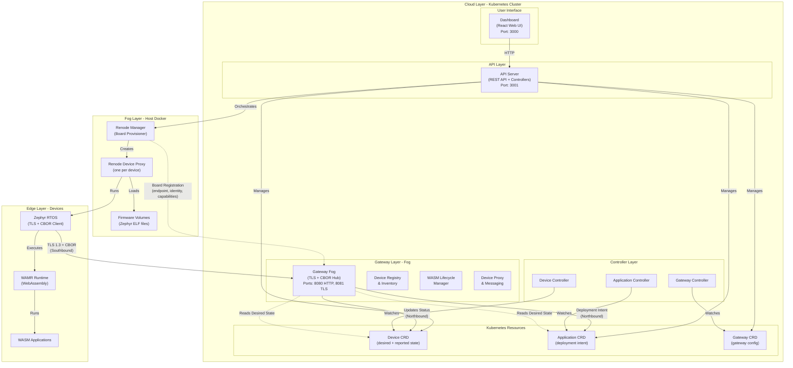
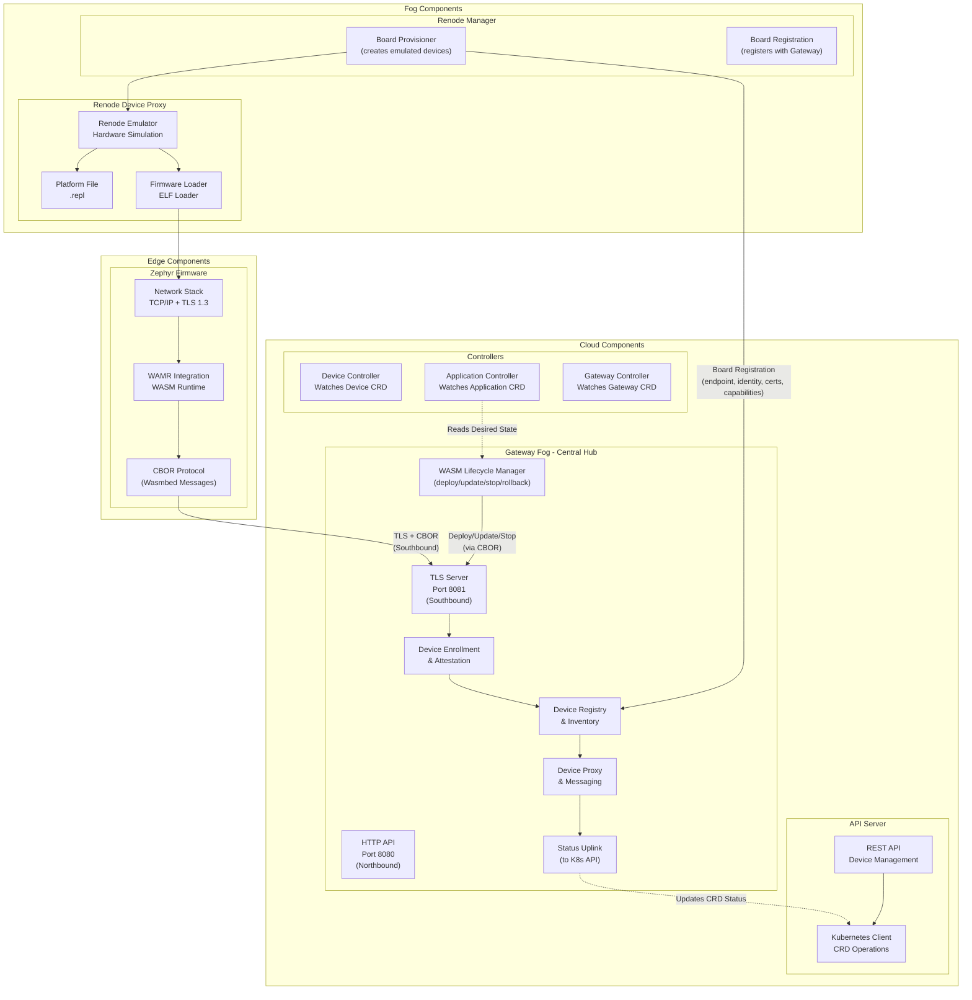
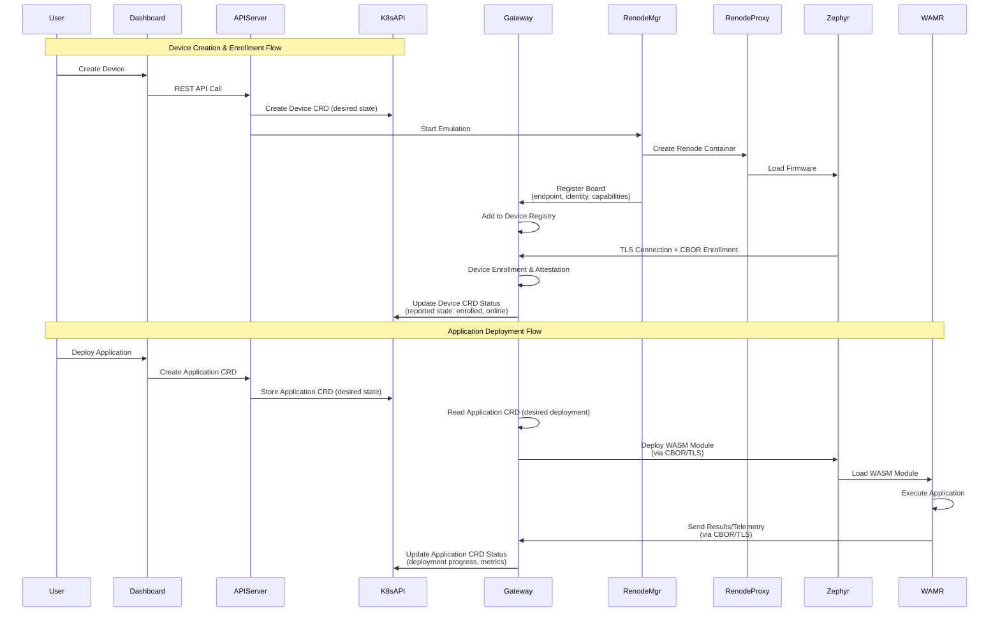

# RETROSPECT - Wasmbed Platform

**RETROSPECT** (secuRE inTegration middlewaRe fOr cpS comPutE ConTinuum) is a Kubernetes-native platform for deploying and managing WebAssembly applications on embedded devices using Renode emulation and Zephyr RTOS.

## Table of Contents

- [Overview](#overview)
- [Architecture](#architecture)
- [Repository Structure](#repository-structure)
- [Deployment Locations](#deployment-locations)
- [Quick Start](#quick-start)
- [Documentation](#documentation)
- [Components](#components)
- [Technologies](#technologies)
- [Development Status](#development-status)
- [License](#license)

## Overview

RETROSPECT is a complete platform that enables:

- **Device Emulation**: Full hardware emulation of ARM Cortex-M embedded devices using Renode
- **WebAssembly Deployment**: Compile and deploy WebAssembly applications to emulated devices
- **Secure Communication**: TLS 1.3 with mutual authentication between devices and gateway
- **Kubernetes Orchestration**: Complete lifecycle management using Kubernetes Custom Resources
- **Real-time Monitoring**: Web dashboard for system monitoring and device management

The platform is designed for the **Cloud-Fog-Edge** computing continuum, with components deployed across different layers:

- **Cloud Layer**: Kubernetes cluster hosting control plane services (API Server, Gateway, Dashboard, Controllers)
- **Fog Layer**: Renode emulation containers running on cluster nodes (device emulation)
- **Edge Layer**: Zephyr RTOS firmware running inside emulated devices (application execution)

## Architecture

### Architectural Vision

RETROSPECT follows a **Gateway-Centric Architecture** where the Gateway Fog component serves as the single point of communication between devices (physical or emulated) and the Kubernetes cluster:

- **Southbound (Device ↔ Gateway)**: TLS 1.3 transport with CBOR-based application protocol
- **Northbound (Gateway ↔ Cluster)**: Kubernetes API and CRD operations
- **Gateway as Hub**: Centralized device attachment, enrollment, inventory, health monitoring, and WASM lifecycle management

### High-Level Architecture



### Detailed Component Architecture



### Communication Flow Architecture



### Architecture Principles

#### Gateway as Central Hub

The **Gateway Fog** component is the single point of communication between devices and the cluster:

1. **Device Attachment & Enrollment**
   - Registers devices when they connect (physical or emulated)
   - Associates identity, certificates, metadata (model, capabilities, firmware version)
   - Maintains device registry (in-memory or via CRD)
   - Performs lightweight attestation

2. **Device Messaging & Proxy**
   - Maintains device sessions (multiplexing, keepalive, retry)
   - Exposes uniform device model to cluster
   - Translates between:
     - **Southbound**: CBOR messages over TLS
     - **Northbound**: Kubernetes API/CRD operations

3. **WASM Lifecycle Manager**
   - Receives deployment instructions from cluster (reads Application CRD)
   - Sends to device: deploy/update/stop/rollback commands + WASM module
   - Manages acknowledgments, progress, failures, rollback
   - Maintains state: "desired vs reported"

4. **Kubernetes Integration**
   - Updates Device CRD status (reported state: online/offline, health, last_seen)
   - Updates Application CRD status (deployment progress, per-device state)
   - Reads desired state from CRDs (deployment intent, policies)

#### Communication Protocols

- **Southbound (Device ↔ Gateway)**: TLS 1.3 + CBOR application protocol
  - TLS provides secure transport
  - CBOR provides structured, compact message format
  - Protocol includes: message types, correlation IDs, acknowledgments, retry logic

- **Northbound (Gateway ↔ Cluster)**: Kubernetes API
  - Gateway updates CRD status (reported state)
  - Controllers/API Server manage desired state
  - Gateway reads desired state for deployment orchestration

#### Renode Manager Integration

The **Renode Manager** (Board Provisioner) must collaborate with the Gateway:

- Creates and starts emulated device containers
- Registers emulated boards with Gateway:
  - Board endpoint (TCP bridge address)
  - Board identity and certificates
  - Board capabilities (MCU type, network interfaces, firmware version)
  - Boot state and readiness

This ensures emulated devices are treated identically to physical devices from the Gateway's perspective.

#### Component Responsibilities

**Device / Zephyr (Edge)**
- Maintains TLS connection to Gateway
- Speaks CBOR-based protocol
- Exposes capabilities: enrollment, attestation, WASM reception, telemetry

**Gateway (Fog)**
- Device attachment and enrollment
- Device messaging and proxy
- WASM lifecycle management
- Kubernetes status updates

**Renode Manager (Fog)**
- Board provisioning (creates emulated devices)
- Board registration with Gateway
- Device proxy management

**API Server + Controllers (Cloud)**
- Manages desired state via CRDs
- Orchestrates Renode Manager
- Provides REST API for dashboard

## Repository Structure

```
retrospect/
├── crates/                          # Rust workspace components
│   ├── wasmbed-api-server/          # REST API server and orchestrator
│   ├── wasmbed-gateway/             # TLS gateway for device communication
│   ├── wasmbed-qemu-manager/        # Renode container management
│   ├── wasmbed-device-controller/   # Kubernetes Device CRD controller
│   ├── wasmbed-application-controller/  # Kubernetes Application CRD controller
│   ├── wasmbed-gateway-controller/  # Kubernetes Gateway CRD controller
│   ├── wasmbed-protocol/            # CBOR communication protocol
│   ├── wasmbed-types/               # Shared type definitions
│   ├── wasmbed-k8s-resource/        # Kubernetes CRD definitions
│   ├── wasmbed-cert/                # TLS certificate management
│   ├── wasmbed-config/              # Configuration management
│   └── ...                          # Supporting libraries
│
├── zephyr-app/                      # Zephyr RTOS firmware
│   ├── src/                         # Firmware source code
│   │   ├── main.c                   # Entry point
│   │   ├── network_handler.c/h      # Network stack management
│   │   ├── wamr_integration.c/h     # WAMR runtime integration
│   │   └── wasmbed_protocol.c/h    # Wasmbed protocol handler
│   ├── prj.conf                     # Zephyr build configuration
│   └── CMakeLists.txt               # Build system
│
├── zephyr-workspace/                # Zephyr RTOS workspace (cloned)
│   └── build/                       # Compiled firmware binaries
│       ├── stm32f746g_disco/        # STM32F746G Discovery firmware
│       ├── frdm_k64f/               # FRDM-K64F firmware
│       └── ...                      # Other board firmware
│
├── dashboard-react/                 # React web dashboard
│   ├── src/                         # React source code
│   │   ├── components/              # React components
│   │   │   ├── Dashboard.js         # Main dashboard
│   │   │   ├── DeviceManagement.js  # Device management UI
│   │   │   ├── ApplicationManagement.js  # Application management UI
│   │   │   ├── GatewayManagement.js # Gateway management UI
│   │   │   ├── Monitoring.js        # System monitoring
│   │   │   ├── NetworkTopology.js   # Network visualization
│   │   │   └── Terminal.js          # System terminal
│   │   └── App.js                   # Main application
│   └── build/                       # Built static files
│
├── k8s/                             # Kubernetes manifests
│   ├── crds/                        # Custom Resource Definitions
│   │   ├── device-crd.yaml         # Device CRD schema
│   │   ├── application-crd.yaml    # Application CRD schema
│   │   └── gateway-crd.yaml        # Gateway CRD schema
│   ├── deployments/                 # Component deployments
│   │   ├── api-server-deployment.yaml
│   │   ├── dashboard-deployment.yaml
│   │   └── wasmbed-deployments.yaml
│   ├── rbac/                        # Role-Based Access Control
│   │   ├── api-server-rbac.yaml
│   │   ├── device-controller-rbac.yaml
│   │   ├── application-controller-rbac.yaml
│   │   └── gateway-controller-rbac.yaml
│   └── namespace.yaml               # Wasmbed namespace
│
├── scripts/                         # Deployment and utility scripts
│   ├── deploy-k3s.sh               # Complete K3S deployment
│   ├── cleanup-k3s.sh             # System cleanup
│   └── README.md                   # Scripts documentation
│
├── doc/                             # Documentation
│   ├── ARCHITECTURE.md             # Detailed architecture
│   ├── DEPLOYMENT.md               # Deployment guide
│   ├── K3S_DEPLOYMENT.md           # K3S-specific deployment
│   ├── FIRMWARE.md                 # Firmware documentation
│   ├── MCU_SUPPORT.md              # Supported MCU types
│   ├── TLS_CONNECTION.md           # TLS connection details
│   ├── SEQUENCE_DIAGRAMS.md        # Communication flows
│   ├── DEVELOPMENT_STATUS.md       # Current development status
│   └── REAL_DEVICE_INTEGRATION.md  # Real device integration guide
│
├── config/                          # Configuration files
│   └── wasmbed-config.yaml         # Main configuration
│
├── certs/                           # TLS certificates
│   ├── ca-cert.pem                 # Certificate Authority
│   ├── server-cert.pem             # Server certificate
│   └── server-key.pem              # Server private key
│
├── Dockerfile.*                     # Dockerfiles for components
│   ├── Dockerfile.api-server
│   ├── Dockerfile.gateway
│   ├── Dockerfile.dashboard
│   └── ...
│
├── Cargo.toml                       # Rust workspace configuration
├── Cargo.lock                       # Rust dependency lock file
└── LICENSE                          # AGPL-3.0 license
```

## Deployment Locations

### Cloud Layer (Kubernetes Cluster)

Components deployed in the **Cloud Layer** run as Kubernetes Pods in the `wasmbed` namespace:

#### API Server (`wasmbed-api-server`)
- **Location**: Kubernetes Pod
- **Purpose**: Central orchestrator for the entire platform
- **Responsibilities**:
  - REST API for device, application, and gateway management
  - Kubernetes CRD operations
  - Renode container orchestration
  - Firmware deployment coordination
- **Why Cloud**: Centralized control plane, scalable, accessible from anywhere

#### Gateway (`wasmbed-gateway`)
- **Location**: Kubernetes Pod (Fog Layer - bridges Cloud and Edge)
- **Purpose**: Central hub for device communication and WASM lifecycle management
- **Responsibilities**:
  - Device attachment, enrollment, and registry management
  - Device messaging proxy (CBOR southbound ↔ K8s northbound)
  - WASM lifecycle management (deploy/update/stop/rollback)
  - Kubernetes CRD status updates
  - TLS 1.3 server for secure device connections
- **Why Fog**: Proximity to edge devices, efficient message routing, single point of device management

#### Dashboard (`wasmbed-dashboard`)
- **Location**: Kubernetes Pod
- **Purpose**: Web-based user interface
- **Responsibilities**:
  - Device management UI
  - Application deployment interface
  - System monitoring and visualization
  - Real-time status updates
- **Why Cloud**: Centralized access, no local installation required

#### Controllers
- **Device Controller**: Watches Device CRDs, manages device lifecycle
- **Application Controller**: Watches Application CRDs, manages application deployment
- **Gateway Controller**: Watches Gateway CRDs, manages gateway instances
- **Why Cloud**: Kubernetes-native controllers, integrated with cluster

### Fog Layer (Host Docker)

Components in the **Fog Layer** run as Docker containers on Kubernetes cluster nodes:

#### Renode Containers
- **Location**: Host Docker (one container per emulated device)
- **Purpose**: Hardware emulation for embedded devices
- **Responsibilities**:
  - CPU, memory, and peripheral emulation
  - Zephyr firmware execution
  - Network interface emulation (Ethernet/WiFi)
  - UART analyzer for logs
- **Why Fog**: Close to edge devices, efficient resource usage, isolated per device

#### Renode Manager (Board Provisioner)
- **Location**: Runs inside API Server Pod, manages Docker containers
- **Purpose**: Board provisioning and registration for emulated devices
- **Responsibilities**:
  - Create/start/stop Renode containers (one per emulated device)
  - Configure network interfaces and TCP bridges
  - Load firmware into containers
  - Generate Renode platform scripts
  - **Register emulated boards with Gateway**: Endpoint, identity, certificates, capabilities
  - Coordinate board lifecycle with Gateway (attach/detach)
- **Why Fog**: Direct Docker API access, efficient container management, close to edge emulation

### Edge Layer (Emulated Devices)

Components in the **Edge Layer** run inside Renode emulated devices:

#### Zephyr RTOS Firmware
- **Location**: Runs inside Renode container, on emulated ARM Cortex-M MCU
- **Purpose**: Real-time operating system for embedded device
- **Responsibilities**:
  - Network stack initialization (TCP/IP, TLS)
  - Gateway endpoint reading from memory
  - TLS connection establishment
  - Device enrollment and heartbeat
  - WASM module reception and execution coordination
- **Why Edge**: Represents actual embedded device behavior, constrained resources

#### WAMR Runtime
- **Location**: Runs inside Zephyr firmware, on emulated MCU
- **Purpose**: WebAssembly execution engine
- **Responsibilities**:
  - WASM module loading and validation
  - WASM function execution
  - Memory management
  - System call interface
- **Why Edge**: Executes applications in constrained environment, isolated execution

#### WASM Applications
- **Location**: Loaded into WAMR runtime, executed on emulated MCU
- **Purpose**: User-defined application logic
- **Responsibilities**:
  - Application-specific functionality
  - Communication with gateway via protocol
  - Resource-constrained execution
- **Why Edge**: Actual application execution, represents edge computing workload

## Quick Start

### Prerequisites

- **K3S** Kubernetes cluster (or compatible Kubernetes 1.24+)
- **Docker** installed and running
- **kubectl** configured
- **Rust** toolchain 1.70+ (for building components)
- **Zephyr SDK** 0.16.5+ (for firmware compilation, optional)

### Installation

1. **Install K3S** (if not already installed):
```bash
curl -sfL https://get.k3s.io | sh -s - --write-kubeconfig-mode 644
mkdir -p ~/.kube
sudo cp /etc/rancher/k3s/k3s.yaml ~/.kube/config
sudo chown $(id -u):$(id -g) ~/.kube/config
```

2. **Clone Repository**:
```bash
git clone <repository-url>
cd retrospect
```

3. **Deploy System**:
```bash
./scripts/deploy-k3s.sh
```

This script will:
- Build all Docker images
- Set up local Docker registry
- Deploy all Kubernetes components
- Generate TLS certificates
- Create initial Gateway CRD

4. **Access Dashboard**:
```bash
kubectl port-forward -n wasmbed svc/wasmbed-dashboard 3000:3000
# Open http://localhost:3000 in browser
```

5. **Access API Server**:
```bash
kubectl port-forward -n wasmbed svc/wasmbed-api-server 3001:3001
# API available at http://localhost:3001
```

### Create Your First Device

1. **Via Dashboard**:
   - Navigate to "Device Management"
   - Click "Create Device"
   - Select MCU type (e.g., `Stm32F746gDisco`)
   - Select target gateway
   - Click "Create"

2. **Via API**:
```bash
curl -X POST http://localhost:3001/api/v1/devices \
  -H "Content-Type: application/json" \
  -d '{
    "name": "my-device",
    "deviceType": "MCU",
    "mcuType": "Stm32F746gDisco",
    "gatewayId": "gateway-1"
  }'
```

3. **Start Emulation**:
```bash
curl -X POST http://localhost:3001/api/v1/devices/my-device/renode/start
```

## Documentation

Complete documentation is available in the [`doc/`](doc/) directory:

### Core Documentation

- **[Architecture](doc/ARCHITECTURE.md)**: Detailed system architecture, component descriptions, and deployment locations (Cloud-Fog-Edge)
- **[Deployment](doc/DEPLOYMENT.md)**: Deployment guide and configuration instructions
- **[K3S Deployment](doc/K3S_DEPLOYMENT.md)**: K3S-specific deployment instructions and troubleshooting
- **[Development Status](doc/DEVELOPMENT_STATUS.md)**: Current development status, known issues, and next steps

### Component Documentation

- **[Firmware](doc/FIRMWARE.md)**: Zephyr RTOS firmware documentation, build instructions, and component details
- **[MCU Support](doc/MCU_SUPPORT.md)**: Complete list of supported MCU types, network capabilities, and compilation instructions
- **[TLS Connection](doc/TLS_CONNECTION.md)**: TLS connection flow, implementation details, and troubleshooting

### Integration Documentation

- **[Real Device Integration](doc/REAL_DEVICE_INTEGRATION.md)**: Step-by-step guide for integrating real hardware devices with the platform
- **[Sequence Diagrams](doc/SEQUENCE_DIAGRAMS.md)**: Communication flow diagrams for all major workflows

### Reference Documentation

- **[Wasmbed Capabilities](doc/WASMBED_CAPABILITIES.md)**: Detailed capabilities and features of the platform

### Quick Navigation

**For New Users:**
1. Start with this README for overview
2. Read [Architecture](doc/ARCHITECTURE.md) to understand the system
3. Follow [K3S Deployment](doc/K3S_DEPLOYMENT.md) for deployment
4. Check [Development Status](doc/DEVELOPMENT_STATUS.md) for current status

**For Developers:**
1. [Architecture](doc/ARCHITECTURE.md) - System architecture
2. [Firmware](doc/FIRMWARE.md) - Firmware development
3. [Sequence Diagrams](doc/SEQUENCE_DIAGRAMS.md) - Communication flows
4. [Development Status](doc/DEVELOPMENT_STATUS.md) - Current issues and next steps

**For Hardware Integration:**
1. [Real Device Integration](doc/REAL_DEVICE_INTEGRATION.md) - Complete integration guide
2. [MCU Support](doc/MCU_SUPPORT.md) - Supported hardware
3. [TLS Connection](doc/TLS_CONNECTION.md) - Network configuration

## Components

### Core Services

#### API Server (`wasmbed-api-server`)
- **Language**: Rust
- **Deployment**: Kubernetes Pod
- **Port**: 3001
- **Source**: `crates/wasmbed-api-server/`
- **Dockerfile**: `Dockerfile.api-server`
- **Responsibilities**:
  - REST API endpoints (45+ endpoints)
  - Kubernetes CRD management
  - Renode container orchestration
  - Application compilation (Rust to WASM)

#### Gateway (`wasmbed-gateway`) - Central Hub
- **Language**: Rust
- **Deployment**: Kubernetes Pod (Fog Layer)
- **Ports**: 8080 (HTTP - Northbound), 8081 (TLS - Southbound)
- **Source**: `crates/wasmbed-gateway/`
- **Dockerfile**: `Dockerfile.gateway`
- **Responsibilities**:
  - **Device Attachment & Enrollment**: Register devices, manage identity and certificates, perform attestation
  - **Device Registry & Inventory**: Maintain device registry with metadata (model, capabilities, firmware version, health)
  - **Device Messaging & Proxy**: Manage device sessions, translate CBOR (southbound) ↔ K8s API (northbound)
  - **WASM Lifecycle Manager**: Deploy/update/stop/rollback WASM modules, manage deployment state (desired vs reported)
  - **Kubernetes Integration**: Update CRD status (Device, Application), read desired state for orchestration
  - **TLS 1.3 Server**: Secure southbound communication with devices
  - **HTTP API**: Northbound API for cluster communication

#### Dashboard (`dashboard-react`)
- **Language**: JavaScript (React)
- **Deployment**: Kubernetes Pod (serves static files)
- **Port**: 3000
- **Source**: `dashboard-react/`
- **Dockerfile**: `Dockerfile.dashboard`
- **Responsibilities**:
  - Web UI for system management
  - Device and application management
  - Real-time monitoring
  - Network topology visualization

### Controllers

#### Device Controller (`wasmbed-device-controller`)
- **Language**: Rust
- **Deployment**: Kubernetes Pod
- **Source**: `crates/wasmbed-device-controller/`
- **Responsibilities**: Watches Device CRDs, manages device lifecycle

#### Application Controller (`wasmbed-application-controller`)
- **Language**: Rust
- **Deployment**: Kubernetes Pod
- **Source**: `crates/wasmbed-application-controller/`
- **Responsibilities**: Watches Application CRDs, manages application deployment

#### Gateway Controller (`wasmbed-gateway-controller`)
- **Language**: Rust
- **Deployment**: Kubernetes Pod
- **Source**: `crates/wasmbed-gateway-controller/`
- **Responsibilities**: Watches Gateway CRDs, manages gateway instances

### Supporting Libraries

- **wasmbed-protocol**: CBOR-based communication protocol
- **wasmbed-types**: Shared type definitions
- **wasmbed-k8s-resource**: Kubernetes CRD definitions
- **wasmbed-cert**: TLS certificate management
- **wasmbed-config**: Configuration management
- **wasmbed-qemu-manager**: Renode container management (library)

### Firmware

#### Zephyr RTOS Firmware (`zephyr-app`)
- **Language**: C
- **RTOS**: Zephyr RTOS v4.3.0
- **Source**: `zephyr-app/`
- **Build Output**: `zephyr-workspace/build/<board>/zephyr/zephyr.elf`
- **Components**:
  - Network stack (TCP/IP, TLS 1.3)
  - WAMR runtime integration
  - Wasmbed protocol handler
  - Gateway endpoint reader

## Technologies

### Core Technologies

- **Kubernetes**: Container orchestration and lifecycle management
- **Renode**: Hardware emulation for ARM Cortex-M devices
- **Zephyr RTOS**: Real-time operating system for embedded devices
- **WAMR**: WebAssembly Micro Runtime for WASM execution
- **Rust**: Primary language for cloud components
- **React**: Frontend framework for dashboard
- **TLS 1.3**: Secure communication protocol
- **CBOR**: Compact Binary Object Representation for message serialization

### Build Tools

- **Cargo**: Rust package manager and build system
- **West**: Zephyr meta-tool for project management
- **CMake**: Build system for Zephyr firmware
- **Docker**: Containerization for all components
- **Ninja**: Build system (used by Zephyr)

### Network Protocols

- **TCP/IP**: Network transport
- **TLS 1.3**: Secure transport layer
- **CBOR**: Message serialization
- **HTTP/REST**: API communication
- **WebSocket**: Real-time updates

## Implementation Roadmap

This section outlines the implementation tasks required to achieve the Gateway-Centric Architecture described above.

### Phase 1: Gateway Enhancement

#### A. Device Registry & Inventory
- [ ] Implement in-memory device registry in Gateway
- [ ] Add device metadata storage (model, capabilities, firmware version, certificates)
- [ ] Implement device lookup by identity/public key
- [ ] Add device health tracking (last heartbeat, connection state)
- [ ] Optional: Persist device registry to database or CRD

#### B. Device Messaging & Proxy
- [ ] Implement device session management (multiplexing, keepalive, retry)
- [ ] Add uniform device proxy model for cluster access
- [ ] Implement CBOR message routing and validation
- [ ] Add message correlation IDs and acknowledgment handling
- [ ] Implement retry logic for failed messages

#### C. WASM Lifecycle Manager
- [ ] Implement deployment state machine (desired vs reported)
- [ ] Add WASM module storage and versioning
- [ ] Implement deploy/update/stop/rollback commands via CBOR
- [ ] Add deployment progress tracking (per-device state)
- [ ] Implement failure handling and automatic rollback
- [ ] Add deployment acknowledgment and status reporting

#### D. Kubernetes Integration
- [ ] Implement K8s client in Gateway (or via API Server)
- [ ] Add Device CRD status updates (reported state)
- [ ] Add Application CRD status updates (deployment progress)
- [ ] Implement desired state reading from Application CRD
- [ ] Add Gateway CRD status updates (health, devices attached)

### Phase 2: Renode Manager Integration

#### A. Board Registration Protocol
- [ ] Define board registration API between Renode Manager and Gateway
- [ ] Implement board registration endpoint in Gateway
- [ ] Add board metadata transmission (endpoint, identity, capabilities)
- [ ] Implement board readiness notification
- [ ] Add board removal/cleanup on container stop

#### B. Renode Manager Updates
- [ ] Refactor Renode Manager to register boards with Gateway
- [ ] Add board identity generation (certificates, UUID)
- [ ] Implement board capability detection (MCU type, network interfaces)
- [ ] Add board endpoint calculation and reporting
- [ ] Implement board lifecycle coordination with Gateway

### Phase 3: CBOR Protocol Formalization

#### A. Protocol Definition
- [ ] Document complete CBOR message format specification
- [ ] Define message types (enrollment, deployment, telemetry, heartbeat)
- [ ] Add message correlation IDs for request/response matching
- [ ] Define acknowledgment and retry semantics
- [ ] Add message versioning and compatibility

#### B. Protocol Implementation
- [ ] Update Zephyr firmware CBOR message handling
- [ ] Update Gateway CBOR message parsing and validation
- [ ] Add message routing based on type
- [ ] Implement idempotency for deployment commands
- [ ] Add protocol-level error handling

### Phase 4: Deployment Flow Refactoring

#### A. Application Deployment Chain
- [ ] Refactor: Application CRD → Gateway reads desired state
- [ ] Implement: Gateway → Device (deploy/update/stop via CBOR/TLS)
- [ ] Add: Gateway → K8s (status updates)
- [ ] Remove: Direct API Server → Device communication
- [ ] Ensure: Gateway is single deployment channel

#### B. Device Enrollment Flow
- [ ] Refactor: Device → Gateway (TLS + CBOR enrollment)
- [ ] Implement: Gateway → K8s (Device CRD status update)
- [ ] Add: Gateway device registry update
- [ ] Ensure: Enrollment is Gateway-managed only

### Phase 5: Architecture Diagrams & Documentation

#### A. Diagram Updates
- [ ] Update architecture diagrams to show Gateway as hub
- [ ] Add Renode Manager ↔ Gateway connection
- [ ] Explicitly show southbound (TLS + CBOR) and northbound (K8s API)
- [ ] Add device registry and lifecycle manager components
- [ ] Update sequence diagrams for new flows

#### B. Documentation
- [ ] Update architecture documentation with Gateway-Centric model
- [ ] Document CBOR protocol specification
- [ ] Add board registration protocol documentation
- [ ] Update deployment guides with new flows
- [ ] Add troubleshooting guide for Gateway issues

### Phase 6: Testing & Validation

#### A. Integration Testing
- [ ] Test end-to-end device enrollment via Gateway
- [ ] Test WASM deployment flow: CRD → Gateway → Device
- [ ] Test status updates: Device → Gateway → CRD
- [ ] Test board registration: Renode Manager → Gateway
- [ ] Test failure scenarios and rollback

#### B. Performance Testing
- [ ] Test Gateway with multiple concurrent devices
- [ ] Test message throughput (CBOR messages per second)
- [ ] Test deployment scalability (multiple devices, multiple apps)
- [ ] Test Gateway resource usage under load

### Implementation Notes

**Kubernetes Integration Decision**:
- **Option A (Recommended)**: Gateway communicates with API Server (HTTP/gRPC), API Server handles K8s API
  - Better separation of concerns
  - Gateway doesn't need K8s permissions
  - Easier to test and maintain

- **Option B (Edge-Native)**: Gateway has direct K8s client and updates CRDs
  - More direct, fewer hops
  - Gateway needs K8s RBAC permissions
  - Can run as Pod or external with kubeconfig

**CBOR Protocol Considerations**:
- CBOR is a format, not a complete protocol
- Need to define: message routing, correlation IDs, acknowledgments, retry, idempotency
- Consider existing protocols (CoAP over CBOR, or custom Wasmbed protocol)

**Migration Strategy**:
- Implement Gateway enhancements incrementally
- Maintain backward compatibility during transition
- Add feature flags for new Gateway features
- Gradually migrate existing flows to Gateway-Centric model

## Development Status

For detailed information about the current development status, known issues, and planned features, see [DEVELOPMENT_STATUS.md](doc/DEVELOPMENT_STATUS.md).

### Quick Status Summary

**Working**:
- Kubernetes deployment on K3S
- All core services (API Server, Gateway, Dashboard, Controllers)
- Device CRD creation and management
- Renode container orchestration
- MCU type support (13 MCU types)
- Dashboard UI and API integration
- Basic TLS connection between devices and Gateway
- Basic device enrollment

**In Progress**:
- Gateway-Centric Architecture implementation (see Roadmap above)
- End-to-end WASM deployment workflow
- CBOR protocol formalization
- Real hardware device integration

**Known Issues**:
- See [DEVELOPMENT_STATUS.md](doc/DEVELOPMENT_STATUS.md) for detailed list

## License

AGPL-3.0

See [LICENSE](LICENSE) file for details.

## Contributing

This project is part of the RETROSPECT research project. For contributions, please contact the project maintainers.

## Contact

For questions or issues:
- Check documentation in [`doc/`](doc/)
- Review [DEVELOPMENT_STATUS.md](doc/DEVELOPMENT_STATUS.md) for known issues
- Check component logs: `kubectl logs -n wasmbed <pod-name>`
