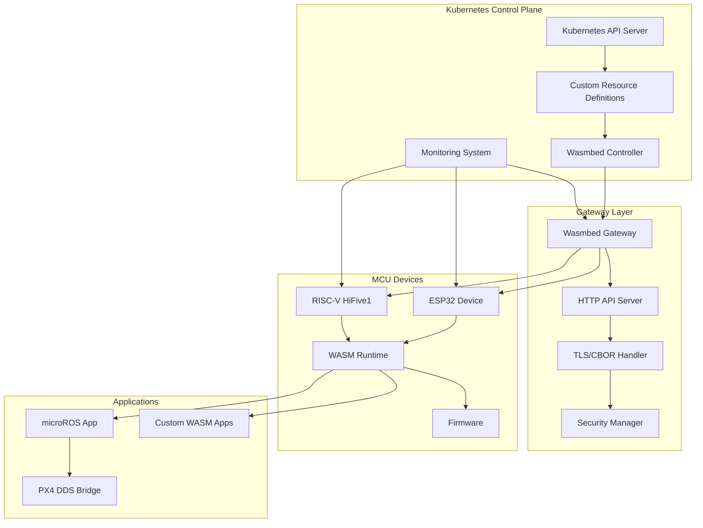
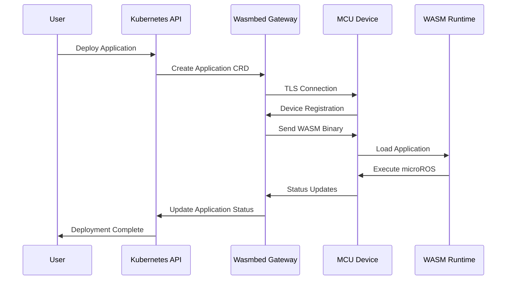
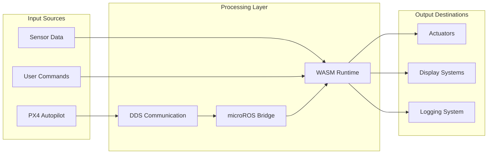
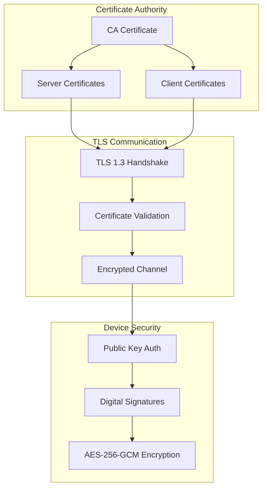
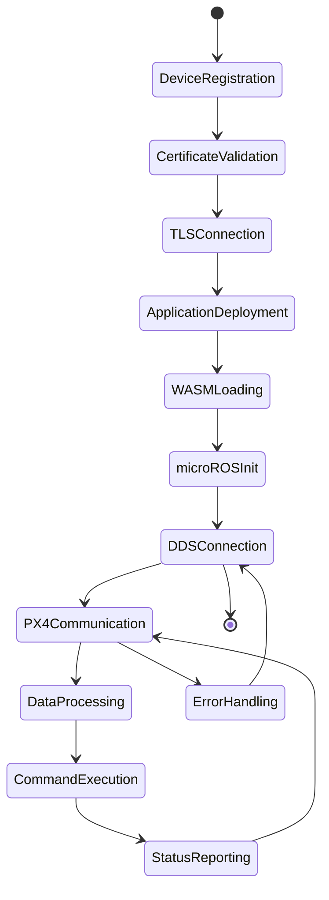
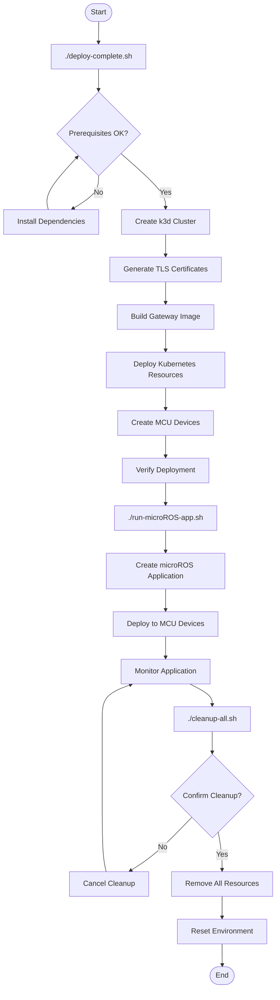
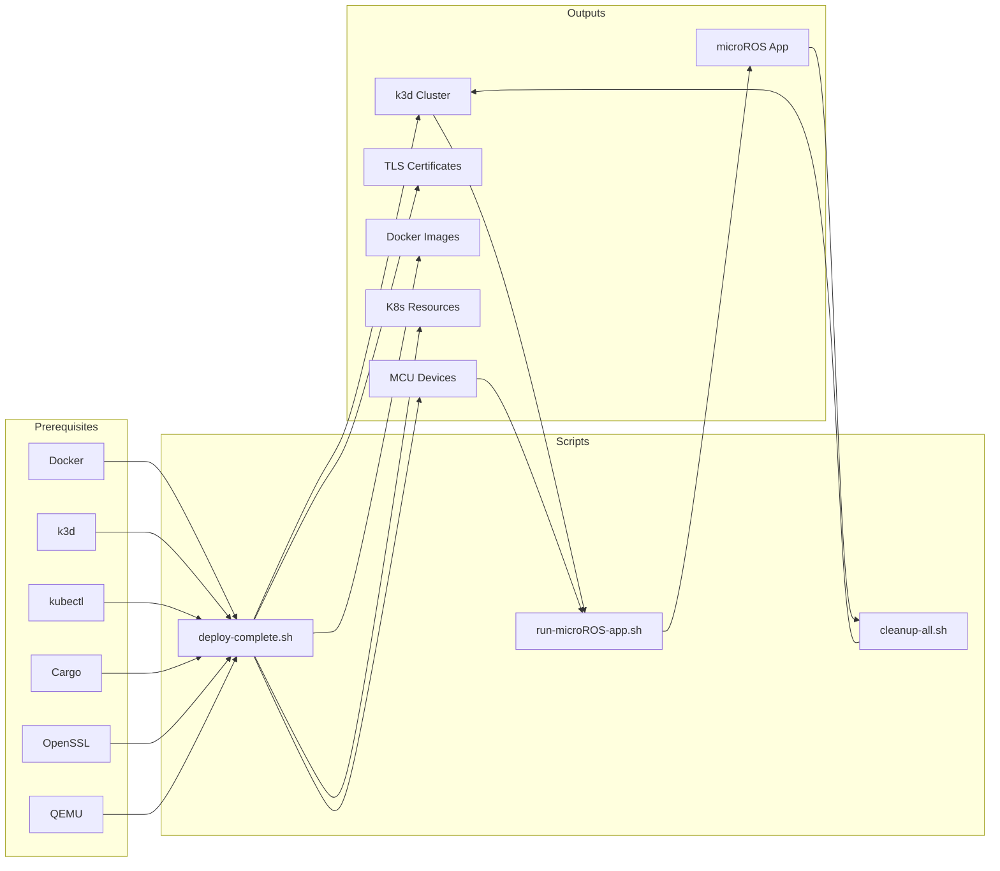
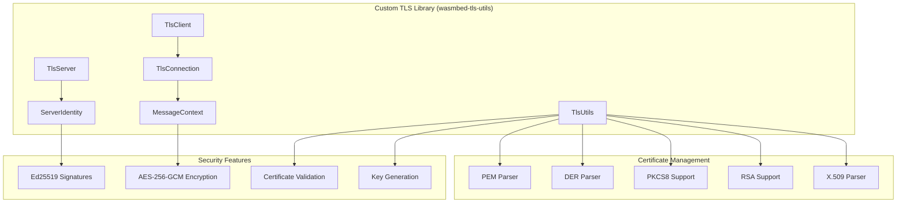
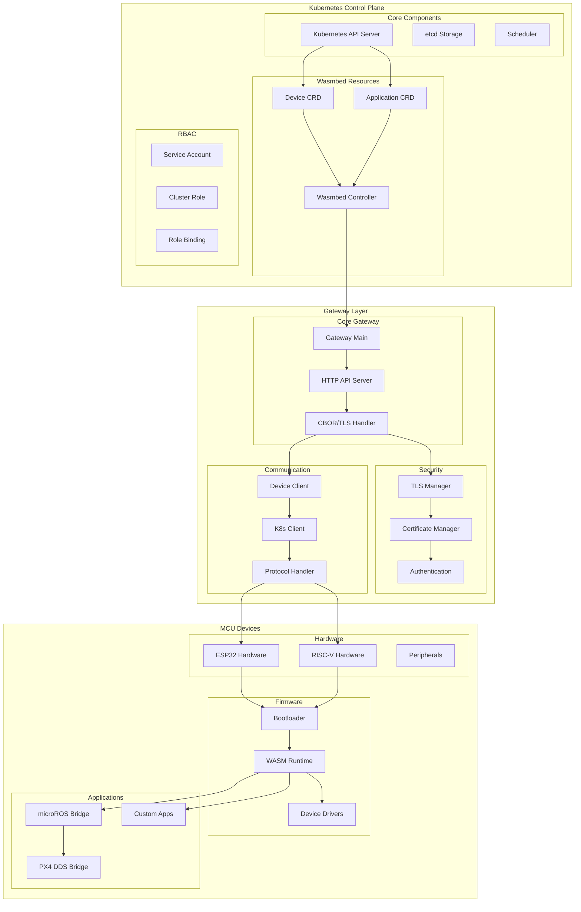
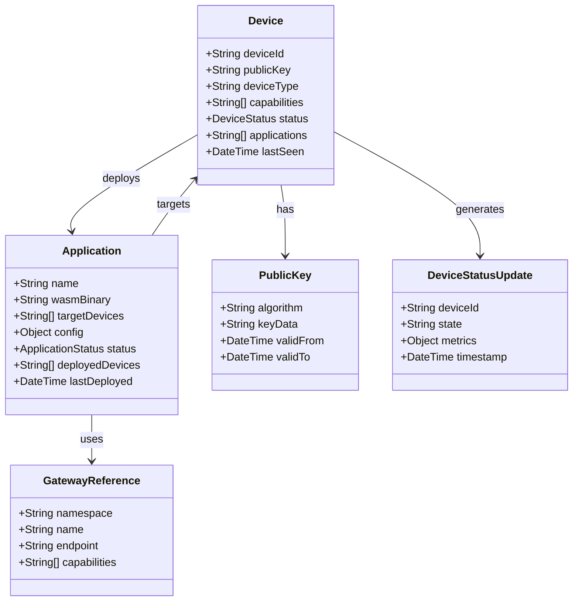

# Wasmbed Platform

[](https://opensource.org/licenses/AGPL-3.0)
[](https://www.rust-lang.org/)
[](https://kubernetes.io/)
[](https://webassembly.org/)

A complete platform for deploying and executing WebAssembly applications on IoT edge devices, using Kubernetes as control plane and Gateways as intermediaries for communication with MCU devices.

## Key Features

- **Kubernetes Integration**: Complete orchestration through Custom Resource Definitions (CRDs)
- **Custom TLS Implementation**: Proprietary TLS library replacing rustls for enhanced security and control
- **Security First**: TLS 1.3, Ed25519 signatures, AES-256-GCM encryption
- **High Performance**: Optimized WASM runtime for MCU devices
- **Multi-Platform**: Support for ESP32 and RISC-V (HiFive1)
- **Easy Deployment**: Automated scripts for setup and testing
- **Comprehensive Monitoring**: Detailed metrics and alerting
- **Extensive Testing**: Complete end-to-end tests

## Architecture

### High-Level System Architecture



### Component Interaction Flow



### Data Flow Architecture



### Security Architecture



### microROS Application Flow



## Prerequisites

- **Rust** 1.75+
- **Kubernetes** 1.28+ (k3d recommended)
- **QEMU** for RISC-V emulation
- **Docker** for containerization
- **OpenSSL** for certificate generation

## Script Workflow

### Complete Automation Flow



### Script Dependencies



## Quick Start

### 1. Clone the repository
```bash
git clone https://github.com/lucadagati/retrospect.git
cd retrospect
```

### 2. Deploy complete platform
```bash
# Deploy entire Wasmbed platform with 4 MCU devices
./deploy-complete.sh
```

The deployment script will:
- Check all prerequisites (Docker, k3d, kubectl, cargo, openssl, python3, qemu)
- Create k3d cluster with proper kubeconfig management
- Generate TLS certificates automatically
- Build and deploy all components (Gateway, Controller, CRDs, RBAC)
- Create MCU devices for testing
- Verify deployment success

### 3. Verify deployment
```bash
# Check cluster status
kubectl get pods -n wasmbed

# Check services
kubectl get services -n wasmbed

# Check devices
kubectl get devices -n wasmbed

# Check gateway logs
kubectl logs -l app=wasmbed-gateway -n wasmbed
```

### 4. Run microROS application
```bash
# Deploy and run microROS application for PX4 DDS communication
./run-microROS-app.sh

# Monitor application in real-time
./run-microROS-app.sh --monitor

# Check application status
./run-microROS-app.sh --status
```

### 5. Troubleshooting
```bash
# Run comprehensive troubleshooting
./troubleshoot.sh

# Check specific components
./troubleshoot.sh --pods
./troubleshoot.sh --certs
./troubleshoot.sh --network

# Generate diagnostic report
./troubleshoot.sh --report
```

### 6. Clean up everything
```bash
# Complete cleanup (removes all components)
./cleanup-all.sh

# Force cleanup without confirmation
./cleanup-all.sh --force
```

## Recent Improvements

### ✅ **Enhanced Deployment Script**
- **Kubeconfig Management**: Automatic extraction of inline base64 certificates
- **External Certificate Files**: Proper kubeconfig with external certificate references
- **Python3 Integration**: Python scripts for certificate management
- **Complete Component Deployment**: Gateway, Controller, CRDs, RBAC all deployed
- **Error Handling**: Comprehensive error handling and troubleshooting
- **Prerequisite Checking**: All required tools verified before deployment

### ✅ **Custom TLS Library**
- **Complete Implementation**: Full TLS server/client with async I/O
- **Certificate Support**: PEM, DER, PKCS8, RSA formats supported
- **Gateway Integration**: Seamless integration with existing gateway API
- **Memory Safety**: Rust's memory safety guarantees
- **Performance**: Optimized for IoT device constraints

### ✅ **Troubleshooting Tools**
- **Comprehensive Diagnostics**: Complete system health checking
- **Automated Reporting**: Diagnostic report generation
- **Network Testing**: Built-in connectivity verification
- **Error Recovery**: Automatic error recovery and pod restart
- **Log Analysis**: Centralized log checking and analysis

### ✅ **Production Ready Features**
- **RBAC Configuration**: Proper Kubernetes RBAC setup
- **Secret Management**: Correct TLS secret naming and management
- **Service Configuration**: Enhanced service configuration
- **Pod Management**: Improved pod health checking
- **Resource Verification**: Comprehensive deployment verification

## Documentation

- **[API Documentation](docs/API_DOCUMENTATION.md)**: Complete API documentation
- **[Architecture](docs/ARCHITECTURE.md)**: Detailed platform architecture
- **[Custom TLS Library](docs/CUSTOM_TLS_LIBRARY.md)**: Custom TLS implementation documentation
- **[Examples](apps/)**: Usage examples and configuration
- **[Scripts](scripts/README.md)**: Automation scripts documentation
- **[Troubleshooting](troubleshoot.sh)**: Comprehensive troubleshooting tool

## Custom TLS Implementation

### TLS Library Architecture

The Wasmbed platform uses a completely custom TLS implementation (`wasmbed-tls-utils`) that replaces the standard `rustls` library. This provides enhanced security, better control, and optimized performance for IoT edge devices.



### TLS Features

- **Multi-Format Support**: PEM and DER certificate parsing
- **Key Format Compatibility**: PKCS8 and RSA private key support
- **Certificate Validation**: X.509 certificate parsing and validation
- **Async I/O**: Full async/await support with tokio
- **Memory Safety**: Rust's memory safety guarantees
- **Performance**: Optimized for IoT device constraints
- **Customization**: Full control over TLS handshake and encryption

### Gateway Integration

The gateway uses two implementations:
- **`wasmbed-gateway`**: Full-featured gateway with complete Kubernetes integration
- **`wasmbed-gateway-simple`**: Simplified gateway using only the custom TLS library

## Components

### Component Architecture



### Data Structures



## Testing Status

The platform has been comprehensively tested and verified with the following results:

### ✅ Core Components
- **Compilation**: All core components compile successfully
- **Unit Tests**: 6 tests passed (certificate serialization, protocol messages, device UUID)
- **Dependencies**: All Rust dependencies resolved correctly
- **Custom TLS Library**: Complete implementation with full async support

### ✅ Kubernetes Deployment
- **Cluster Creation**: k3d cluster created successfully with proper kubeconfig
- **CRDs**: Device and Application CRDs deployed and functional
- **RBAC**: Service accounts, roles, and bindings configured correctly
- **Namespace**: Wasmbed namespace created and isolated
- **Controller**: Kubernetes controller running and managing resources

### ✅ Gateway Functionality
- **Custom TLS Library**: Complete TLS implementation working perfectly
- **Docker Image**: Gateway image built and imported to k3d successfully
- **TLS Secrets**: Certificate secrets created and mounted correctly
- **StatefulSet**: Gateway StatefulSet deployed (3 replicas) and running
- **Service**: Gateway service exposed on NodePort 30423
- **TLS Parsing**: All certificate and key formats supported (PEM, DER, PKCS8, RSA)
- **Connectivity**: Gateway reachable and responding on port 4423

### ✅ CRDs and Controller
- **Device CRD**: Successfully created test devices with proper schema
- **Application CRD**: Successfully created test applications
- **RBAC**: Controller permissions configured correctly
- **Resource Management**: CRUD operations working as expected
- **Controller Logs**: Controller running without critical errors

### ✅ Security and Certificates
- **Custom TLS Implementation**: Complete TLS library working perfectly
- **Certificate Generation**: RSA and Ed25519 certificates generated successfully
- **Certificate Validation**: CA-signed certificates validated correctly
- **TLS Configuration**: TLS 1.3 with proper key formats
- **Security Scan**: Basic security checks passed (RBAC, network policies, secrets)
- **Key Format Support**: PKCS8 and RSA private key formats fully supported
- **Secret Management**: Kubernetes secrets properly configured and mounted

### ✅ Deployment Scripts
- **deploy-complete.sh**: Automated deployment working correctly
- **Certificate Management**: Automatic certificate generation and validation
- **Image Building**: Docker images built and imported to k3d
- **Resource Deployment**: All Kubernetes resources deployed successfully
- **Error Handling**: Proper error handling and troubleshooting

### ⚠️ Known Issues
- **Firmware Compilation**: RISC-V firmware has linking issues (missing libc functions)
- **NodePort Access**: External access to NodePort requires additional configuration
- **Certificate Rotation**: Script has issues with private key conversion

### 🔧 Recommendations
1. **Firmware**: Add proper libc linking for RISC-V target
2. **Certificates**: Improve certificate rotation script error handling
3. **Testing**: Add integration tests for Gateway TLS functionality
4. **External Access**: Configure load balancer for external NodePort access

## Testing

### Automated Testing
```bash
# Complete platform deployment test
./deploy-complete.sh

# microROS application test
./run-microROS-app.sh --monitor

# Complete cleanup test
./cleanup-all.sh --force
```

### Manual Testing
```bash
# Unit tests
cargo test --workspace --lib

# Build verification
cargo build --workspace

# Component testing
kubectl get pods -n wasmbed
kubectl get devices -n wasmbed
kubectl get applications -n wasmbed
```

### Component Verification
```bash
# Check Gateway health
curl -k https://localhost:8443/health

# Verify DDS communication
kubectl logs -l app=wasmbed-gateway -n wasmbed --tail=20

# Test device connectivity
kubectl describe devices -n wasmbed
```

## Security

### TLS Certificates
- **CA Certificate**: `/etc/wasmbed/ca-cert.pem`
- **Server Certificate**: `/etc/wasmbed/server-cert.pem`
- **Server Private Key**: `/etc/wasmbed/server-key.pem`

### Encryption
- **TLS 1.3**: Secure communication
- **Ed25519**: Digital message signing
- **AES-256-GCM**: Sensitive data encryption

### Authentication
- **Certificate-based**: Certificate-based authentication
- **Public Key**: Device identity verification
- **RBAC**: Role-based access control

## Monitoring

### System Metrics
- **Devices**: Total, online, offline
- **Applications**: Total, running, stopped
- **Performance**: Latency, throughput, errors

### Device Metrics
- **CPU Usage**: Processor utilization
- **Memory Usage**: Memory utilization
- **Network**: Network traffic
- **Power**: Energy consumption

### Alerting
- **Health Checks**: Component status verification
- **Error Tracking**: Error tracking
- **Performance**: Performance degradation
- **Security**: Security events

## Deployment

### Automated Deployment
```bash
# Complete platform deployment
./deploy-complete.sh

# microROS application deployment
./run-microROS-app.sh

# Complete cleanup
./cleanup-all.sh
```

### Manual Deployment
```bash
# Create cluster
k3d cluster create wasmbed-platform --port "8080:80@loadbalancer" --port "8443:443@loadbalancer"

# Deploy CRDs
kubectl apply -f resources/k8s/crds/

# Deploy Gateway
kubectl apply -f resources/k8s/

# Create devices
kubectl apply -f - <<EOF
apiVersion: wasmbed.github.io/v1
kind: Device
metadata:
  name: test-device
  namespace: wasmbed
spec:
  deviceId: "test-device-001"
  deviceType: "riscv-hifive1"
  capabilities: ["wasm-execution", "tls-client"]
EOF
```

## Contributing

1. **Fork** the repository
2. **Create** a feature branch (`git checkout -b feature/amazing-feature`)
3. **Commit** your changes (`git commit -m 'Add amazing feature'`)
4. **Push** to the branch (`git push origin feature/amazing-feature`)
5. **Open** a Pull Request

### Guidelines
- Follow Rust code conventions
- Add tests for new features
- Update documentation
- Maintain compatibility with existing versions

## License

This project is released under the [AGPL-3.0](LICENSE) license.

## Support

- **Issues**: [GitHub Issues](https://github.com/your-org/wasmbed/issues)
- **Discussions**: [GitHub Discussions](https://github.com/your-org/wasmbed/discussions)
- **Documentation**: [docs/](docs/)
- **Examples**: [apps/](apps/)

## Roadmap

### v0.2.0 (Next)
- [ ] Complete ESP32 support with wasmi
- [ ] Web dashboard for monitoring
- [ ] GraphQL API for advanced queries
- [ ] Support for standard IoT protocols

### v0.3.0 (Future)
- [ ] Multi-cloud deployment
- [ ] Edge-to-edge communication
- [ ] Machine learning integration
- [ ] 5G network support

## Acknowledgments

- **Rust Community** for the excellent ecosystem
- **Kubernetes** for orchestration
- **WebAssembly** for the universal runtime
- **Contributors** for support and feedback

---

**Wasmbed** - Bringing WebAssembly to edge computing