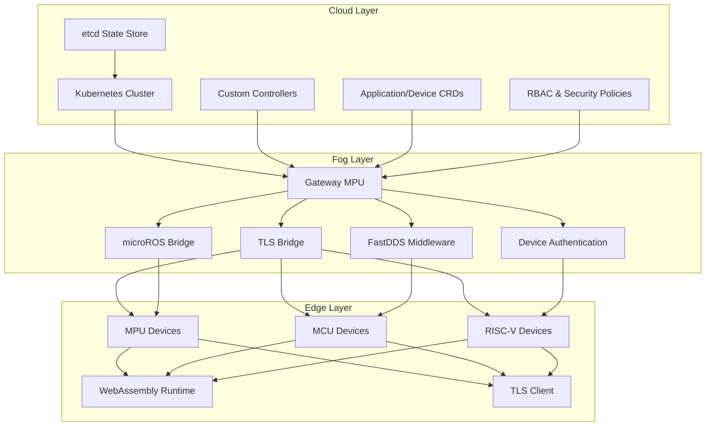
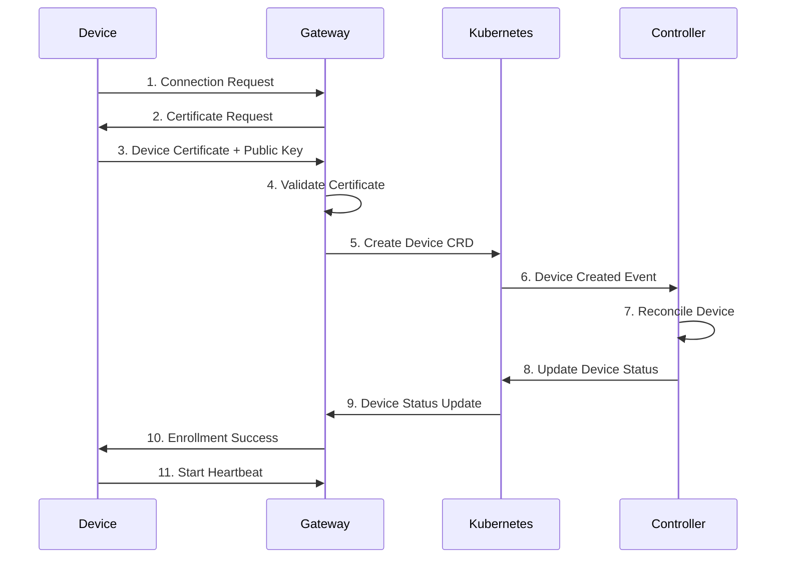
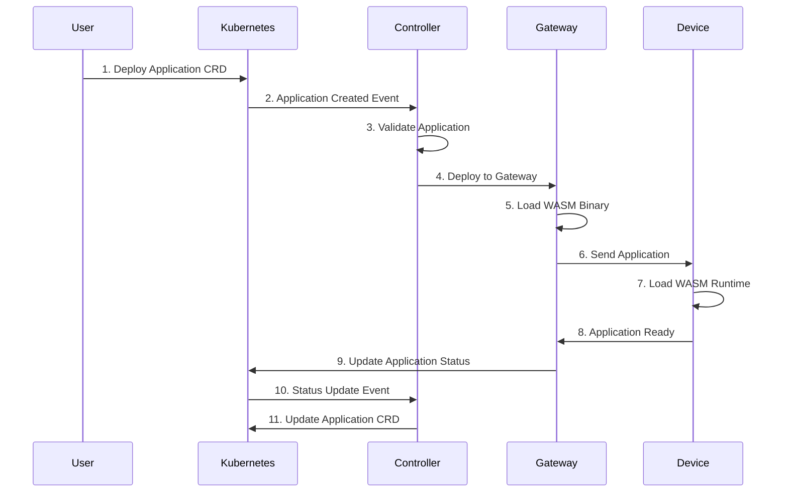
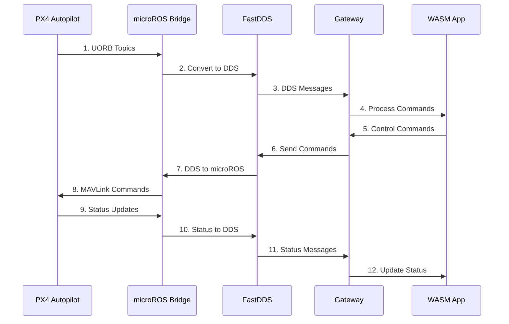

# Wasmbed Platform

A secure middleware platform for deploying WebAssembly applications to industrial robotic systems using Kubernetes orchestration.

## Table of Contents

1. [Overview](#overview)
2. [Architecture](#architecture)
3. [Quick Start](#quick-start)
4. [Documentation](#documentation)
5. [Current Status](#current-status)
6. [Known Issues](#known-issues)
7. [Missing Implementations](#missing-implementations)
8. [Contributing](#contributing)
9. [License](#license)

## Overview

Wasmbed is a comprehensive 3-layer architecture (cloud-fog-edge) designed to enable secure deployment and execution of WebAssembly applications on heterogeneous edge devices including MPU, MCU, and RISC-V systems. The platform provides real-time communication capabilities for industrial robotic applications, particularly PX4 autopilot integration.

### Key Features

- **Kubernetes Integration**: Custom CRDs and controllers for application lifecycle management
- **TLS Security**: Mutual authentication with custom TLS implementation
- **QEMU Emulation**: Realistic emulation of edge devices for development and testing
- **WebAssembly Runtime**: no_std compatible runtime for embedded systems
- **Real-time Communication**: microROS and FastDDS integration for PX4 systems
- **Device Management**: Secure enrollment and connection workflows

## Architecture

The platform follows a 3-layer architecture:



### Cloud Layer
- Kubernetes cluster with custom controllers
- Application and Device CRDs
- RBAC and security policies
- etcd for state persistence

### Fog Layer
- Gateway MPU providing TLS-secured communication bridge
- microROS bridge for PX4 integration
- FastDDS middleware for real-time communication
- Device enrollment and authentication

### Edge Layer
- Heterogeneous devices (MPU, MCU, RISC-V)
- WebAssembly runtime for no_std environments
- TLS client implementation
- Real-time application execution

## Workflows

### Device Enrollment Workflow



### Application Deployment Workflow



### PX4 Communication Workflow



## Quick Start

### Prerequisites

- Docker and Docker Compose
- Kubernetes cluster (k3d recommended for local development)
- QEMU system emulators (qemu-system-riscv32, qemu-system-arm, qemu-system-xtensa)
- Rust toolchain

### Installation

1. Clone the repository:
```bash
git clone <repository-url>
cd retrospect
```

2. Deploy the complete platform:
```bash
./scripts/deploy.sh
```

3. Test the system:
```bash
./scripts/app.sh test
```

4. Monitor the platform:
```bash
./scripts/monitor.sh status
```

5. Clean up when done:
```bash
./scripts/cleanup.sh
```

## Documentation

### Architecture Documentation
- [System Overview](docs/architecture/system-overview.md) - Complete system architecture
- [Communication Protocols](docs/architecture/communication-protocols.md) - TLS, CBOR, and DDS protocols
- [Security Architecture](docs/architecture/security-architecture.md) - Security design and implementation

### Implementation Documentation
- [Core Components](docs/implementation/core-components.md) - Detailed component implementation
- [Workflows](docs/workflows/) - Complete workflow documentation
- [API Reference](docs/api/) - API specifications and CRD documentation

### Deployment Documentation
- [Deployment Guide](docs/deployment/deployment-guide.md) - Step-by-step deployment instructions
- [Troubleshooting](docs/deployment/troubleshooting.md) - Common issues and solutions
- [Configuration](docs/deployment/configuration.md) - Platform configuration options

### Integration Documentation
- [PX4 Integration](docs/integration/px4-integration.md) - PX4 autopilot integration
- [microROS Integration](docs/integration/microros-integration.md) - microROS bridge implementation
- [FastDDS Integration](docs/integration/fastdds-integration.md) - FastDDS middleware integration

### Development Documentation
- [Development Setup](docs/development/setup.md) - Development environment setup
- [Contributing Guidelines](docs/development/contributing.md) - Contribution guidelines
- [Testing](docs/development/testing.md) - Testing procedures and guidelines

### Problems and Solutions
- [Known Issues](docs/problems/known-issues.md) - Current known issues and workarounds
- [Missing Implementations](docs/problems/missing-implementations.md) - Critical missing features
- [Technical Debt](docs/problems/technical-debt.md) - Areas requiring refactoring

## Current Status

### Implemented Features

#### Core Platform (18 Rust Crates)
- **wasmbed-gateway**: TLS + HTTP API server with heartbeat monitoring
- **wasmbed-k8s-controller**: Kubernetes reconciliation and application lifecycle management
- **wasmbed-qemu-serial-bridge**: Real QEMU communication bridge
- **wasmbed-firmware-hifive1-qemu**: RISC-V firmware with WebAssembly runtime
- **wasmbed-firmware-esp32**: ESP32 firmware with WiFi management
- **wasmbed-mcu-simulator**: MCU testing and simulation
- **wasmbed-protocol**: CBOR communication protocol
- **wasmbed-tls-utils**: Custom TLS implementation with RustCrypto
- **wasmbed-k8s-resource**: Kubernetes CRDs and resource management
- **wasmbed-types**: Common types and data structures

#### Kubernetes Integration
- Custom Resource Definitions for Applications and Devices
- Controller with comprehensive reconciliation logic
- RBAC policies and service accounts
- StatefulSet and Service configurations
- ConfigMap and Secret management

#### Security Implementation
- TLS 1.3 with mutual authentication
- Certificate generation and management
- Custom TLS implementation using RustCrypto
- Device enrollment with public key authentication
- Secure communication channels

#### QEMU Emulation
- RISC-V emulation with HiFive1 firmware
- ARM emulation with STM32 firmware
- ESP32 emulation with XTensa firmware
- Real serial communication via TCP
- WebAssembly runtime integration

#### Device Management
- Device enrollment workflow
- Connection establishment and maintenance
- Heartbeat monitoring and status tracking
- Application deployment and execution
- Error handling and recovery

## Known Issues

### Critical Issues
1. **microROS Bridge Missing**: Gateway lacks microROS bridge implementation
2. **FastDDS Middleware Missing**: No FastDDS integration in gateway
3. **PX4 Communication Non-functional**: Real-time PX4 communication not working
4. **Real-time Application Deployment**: Missing real-time deployment capabilities

### High Priority Issues
1. **Device Capability Discovery**: Not implemented
2. **Application Lifecycle Management**: Incomplete
3. **WASM Application Validation**: Missing validation
4. **Connection Quality Monitoring**: Not implemented

### Medium Priority Issues
1. **Certificate Revocation Lists**: Not implemented
2. **Advanced Threat Detection**: Missing
3. **Security Monitoring**: Incomplete
4. **Performance Optimization**: Needs improvement

## Missing Implementations

### Critical Missing Features

#### microROS Bridge in Gateway
```rust
// Required implementation
pub struct MicroRosBridge {
    node: rcl::Node,
    participant: fastdds::DomainParticipant,
    publishers: HashMap<String, Publisher>,
    subscribers: HashMap<String, Subscriber>,
}
```

#### FastDDS Middleware
```rust
// Required implementation
pub struct FastDdsMiddleware {
    domain_id: u32,
    participant: DomainParticipant,
    transport: UdpTransport,
    qos: QosProfile,
}
```

#### PX4 Communication Bridge
```rust
// Required implementation
pub struct Px4CommunicationBridge {
    microros_bridge: MicroRosBridge,
    fastdds: FastDdsMiddleware,
    px4_topics: Px4TopicManager,
}
```

### High Priority Missing Features
1. **Real-time Application Deployment**: Complete real-time deployment system
2. **Device Capability Discovery**: Automatic device capability detection
3. **Application Performance Monitoring**: Comprehensive performance metrics
4. **Dynamic Scaling**: Automatic scaling based on load

### Medium Priority Missing Features
1. **Advanced Security Features**: Certificate revocation, threat detection
2. **Monitoring and Observability**: Comprehensive monitoring system
3. **Performance Optimization**: Runtime and communication optimization
4. **Compliance and Auditing**: Security compliance and audit trails

## Contributing

Please refer to [Contributing Guidelines](docs/development/contributing.md) for detailed contribution instructions.

### Development Setup
1. Follow [Development Setup](docs/development/setup.md) for environment configuration
2. Review [Testing Guidelines](docs/development/testing.md) for testing procedures
3. Check [Known Issues](docs/problems/known-issues.md) for current limitations

### Code Style
- Follow Rust standard formatting with `cargo fmt`
- Use `cargo clippy` for linting
- Write comprehensive tests for all new features
- Document all public APIs

## License

This project is licensed under the MIT License - see the [LICENSE](LICENSE) file for details.

## Support

For technical support and questions:
- Check [Troubleshooting Guide](docs/deployment/troubleshooting.md) for common issues
- Review [Known Issues](docs/problems/known-issues.md) for current limitations
- Create an issue in the project repository for bug reports
- Refer to [Missing Implementations](docs/problems/missing-implementations.md) for planned features