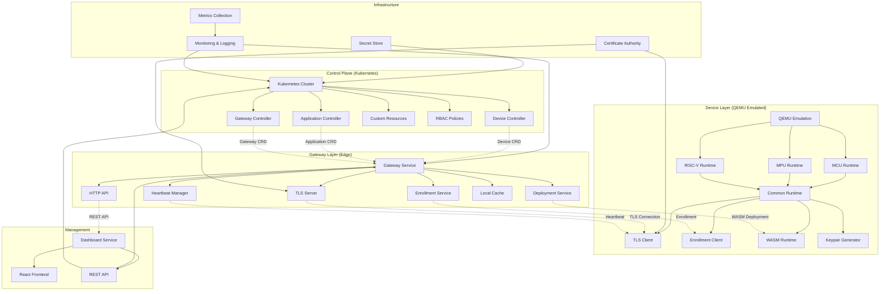
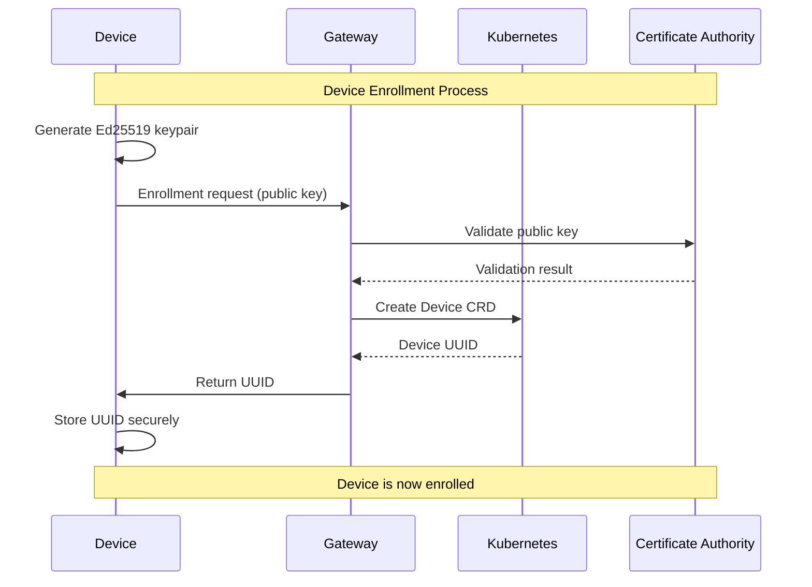
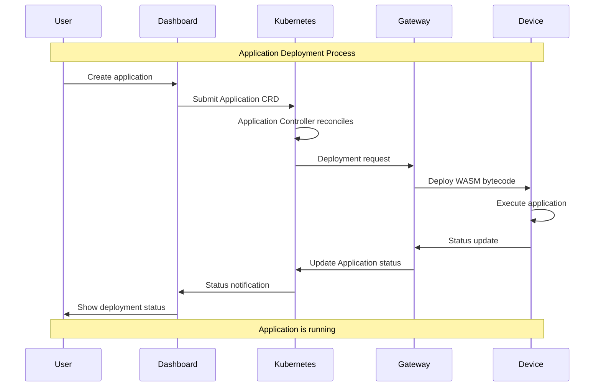
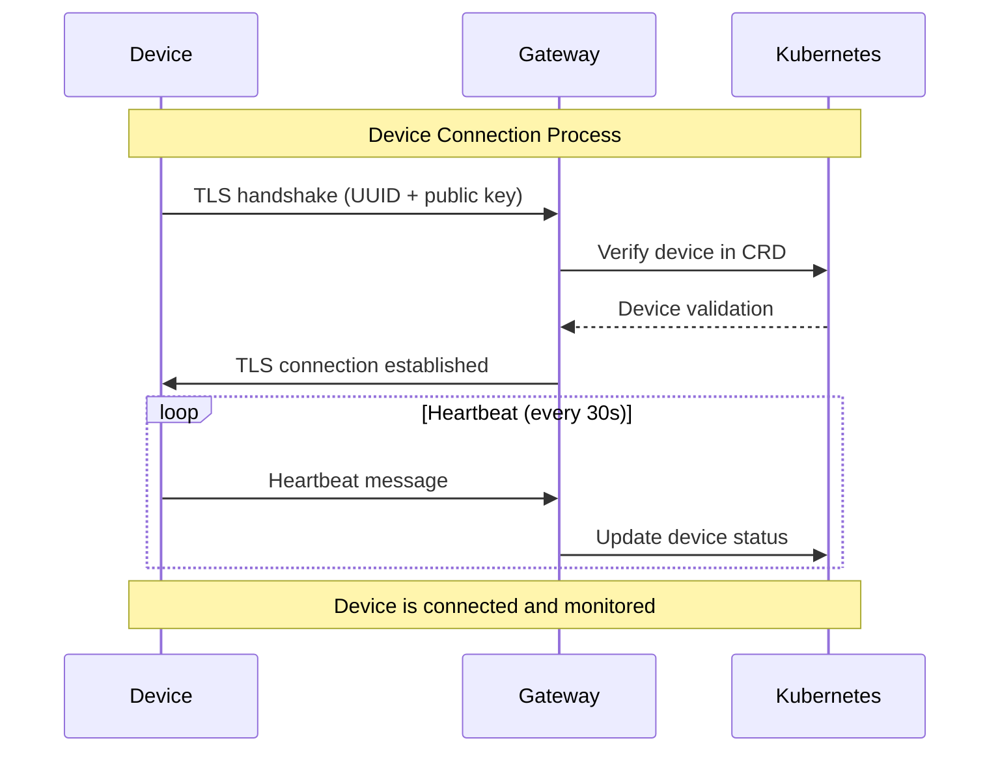

# Wasmbed Platform

[](https://opensource.org/licenses/AGPL-3.0)
[](https://www.rust-lang.org/)
[](https://kubernetes.io/)
[](https://webassembly.org/)

**A complete WebAssembly-based edge computing platform for IoT devices with Kubernetes orchestration, TLS security, and real-time monitoring.**

## 🚀 Overview

Wasmbed Platform is a production-ready edge computing solution that enables secure deployment and management of WebAssembly applications on IoT devices. The platform provides:

- **Secure Device Enrollment**: TLS-based authentication with Ed25519 keypairs
- **Kubernetes Orchestration**: Full CRD-based management with controllers
- **Real-time Monitoring**: Comprehensive metrics, logging, and health monitoring
- **Edge Gateway**: High-performance gateway for device communication
- **Modern Dashboard**: React-based web interface for platform management
- **QEMU Integration**: Device emulation for development and testing

## Architecture

The platform follows a 3-layer architecture:


```mermaid
graph TB
    subgraph "Control Plane (Kubernetes)"
        CP[Kubernetes Cluster]
        DC[Device Controller]
        AC[Application Controller]
        GC[Gateway Controller]
        CRD[Custom Resources]
        RBAC[RBAC Policies]
        
        CP --> DC
        CP --> AC
        CP --> GC
        CP --> CRD
        CP --> RBAC
    end
    
    subgraph "Gateway Layer (Edge)"
        GW[Gateway Service]
        TLS[TLS Server]
        HTTP[HTTP API]
        ENR[Enrollment Service]
        DEP[Deployment Service]
        HB[Heartbeat Manager]
        CACHE[Local Cache]
        
        GW --> TLS
        GW --> HTTP
        GW --> ENR
        GW --> DEP
        GW --> HB
        GW --> CACHE
    end
    
    subgraph "Device Layer (QEMU Emulated)"
        QEMU[QEMU Emulation]
        MCU[MCU Runtime]
        MPU[MPU Runtime]
        RISC[RISC-V Runtime]
        RT[Common Runtime]
        TLS_C[TLS Client]
        ENR_C[Enrollment Client]
        WASM[WASM Runtime]
        KP[Keypair Generator]
        
        QEMU --> MCU
        QEMU --> MPU
        QEMU --> RISC
        MCU --> RT
        MPU --> RT
        RISC --> RT
        RT --> TLS_C
        RT --> ENR_C
        RT --> WASM
        RT --> KP
    end
    
    subgraph "Infrastructure"
        CA[Certificate Authority]
        SS[Secret Store]
        MON[Monitoring & Logging]
        METRICS[Metrics Collection]
        
        CA --> TLS
        CA --> TLS_C
        SS --> CP
        MON --> GW
        MON --> CP
        METRICS --> MON
    end
    
    subgraph "Management"
        DASH[Dashboard Service]
        REACT[React Frontend]
        API[REST API]
        
        DASH --> REACT
        DASH --> API
        API --> GW
        API --> CP
    end
    
    %% Connections
    DC -.->|Device CRD| GW
    AC -.->|Application CRD| GW
    GC -.->|Gateway CRD| GW
    TLS -.->|TLS Connection| TLS_C
    HTTP -.->|REST API| DASH
    ENR -.->|Enrollment| ENR_C
    DEP -.->|WASM Deployment| WASM
    HB -.->|Heartbeat| TLS_C
```

## 🔧 Key Features

### 🔐 **Security First**
- **TLS 1.3**: End-to-end encryption for all communications
- **Ed25519 Cryptography**: Modern elliptic curve digital signatures
- **Certificate Management**: Automated CA and certificate lifecycle
- **RBAC**: Role-based access control for Kubernetes resources

### ⚡ **High Performance**
- **WebAssembly Runtime**: Fast, secure, and portable application execution
- **Edge Gateway**: Low-latency communication with devices
- **QEMU Integration**: Hardware-accelerated device emulation
- **Optimized Controllers**: Efficient Kubernetes resource management

### 📊 **Comprehensive Monitoring**
- **Real-time Metrics**: System performance and health indicators
- **Structured Logging**: Centralized log aggregation and analysis
- **Health Checks**: Automated service health monitoring
- **Alerting**: Proactive issue detection and notification

### 🎛️ **Modern Management**
- **React Dashboard**: Intuitive web-based management interface
- **REST APIs**: Programmatic access to all platform features
- **Kubernetes Native**: Full integration with Kubernetes ecosystem
- **CLI Tools**: Command-line utilities for automation

## 🚀 Quick Start

### Prerequisites

- **Rust 1.70+**: For building platform components
- **Node.js 16+**: For React dashboard development
- **Docker**: For containerization and QEMU integration
- **k3d**: Lightweight Kubernetes for local development
- **kubectl**: Kubernetes command-line tool

### Installation

1. **Clone the repository**:
```bash
git clone https://github.com/wasmbed/wasmbed-platform.git
cd wasmbed-platform
```

2. **Install dependencies**:
```bash
# Install Rust (if not already installed)
curl --proto '=https' --tlsv1.2 -sSf https://sh.rustup.rs | sh

# Install Node.js dependencies
cd dashboard-react && npm install && cd ..

# Install k3d
curl -s https://raw.githubusercontent.com/k3d-io/k3d/main/install.sh | bash
```

3. **Build the platform**:
```bash
./scripts/build.sh
```

4. **Deploy the platform**:
```bash
./scripts/deploy.sh
```

5. **Access the dashboard**:
```bash
# Open your browser to:
http://localhost:30470
```

## 🎛️ Management Scripts

The platform includes a comprehensive suite of management scripts accessible via the `wasmbed` command:

### **Main Console**
```bash
wasmbed                    # Interactive management console
wasmbed help              # Show all available commands
```

### **Core Operations**
```bash
wasmbed clean             # Clean up all resources
wasmbed build             # Build all components
wasmbed deploy            # Deploy the complete platform
wasmbed stop              # Stop all services
wasmbed status            # Check system status
```

### **Resource Management**
```bash
wasmbed devices           # Device management operations
wasmbed applications      # Application management operations
wasmbed monitor           # Monitoring and observability
wasmbed logs              # View system logs
wasmbed certs             # Certificate management
```

### **Development Tools**
```bash
wasmbed test              # Run end-to-end tests
wasmbed dev               # Start development environment
wasmbed shell             # Access platform shell
```

## 📊 Service Endpoints

| Service | Port | Protocol | Description |
|---------|------|----------|-------------|
| **Dashboard** | 30470 | HTTP | React web interface |
| **Gateway HTTP** | 30451 | HTTP | REST API for management |
| **Gateway TLS** | 30450 | TLS | Secure device communication |
| **Infrastructure** | 30460 | HTTP | CA, monitoring, logging |
| **Kubernetes API** | 6443 | HTTPS | k3d cluster API |

## 🔄 Workflows

### **Device Enrollment Workflow**


```mermaid
sequenceDiagram
    participant D as Device
    participant G as Gateway
    participant K as Kubernetes
    participant CA as Certificate Authority
    
    Note over D,CA: Device Enrollment Process
    
    D->>D: Generate Ed25519 keypair
    D->>G: Enrollment request (public key)
    G->>CA: Validate public key
    CA-->>G: Validation result
    G->>K: Create Device CRD
    K-->>G: Device UUID
    G->>D: Return UUID
    D->>D: Store UUID securely
    
    Note over D,CA: Device is now enrolled
```

### **Application Deployment Workflow**


```mermaid
sequenceDiagram
    participant U as User
    participant D as Dashboard
    participant K as Kubernetes
    participant G as Gateway
    participant DEV as Device
    
    Note over U,DEV: Application Deployment Process
    
    U->>D: Create application
    D->>K: Submit Application CRD
    K->>K: Application Controller reconciles
    K->>G: Deployment request
    G->>DEV: Deploy WASM bytecode
    DEV->>DEV: Execute application
    DEV->>G: Status update
    G->>K: Update Application status
    K->>D: Status notification
    D->>U: Show deployment status
    
    Note over U,DEV: Application is running
```

### **Device Connection Workflow**


```mermaid
sequenceDiagram
    participant D as Device
    participant G as Gateway
    participant K as Kubernetes
    
    Note over D,K: Device Connection Process
    
    D->>G: TLS handshake (UUID + public key)
    G->>K: Verify device in CRD
    K-->>G: Device validation
    G->>D: TLS connection established
    
    loop Heartbeat (every 30s)
        D->>G: Heartbeat message
        G->>K: Update device status
    end
    
    Note over D,K: Device is connected and monitored
```

## 🏛️ Architecture Components

### **Control Plane (Kubernetes)**
The Kubernetes-based control plane provides orchestration and management capabilities:

- **Device Controller**: Manages device lifecycle, enrollment, and status
- **Application Controller**: Handles WASM application deployment and updates
- **Gateway Controller**: Manages gateway instances and load balancing
- **Custom Resources**: Device, Application, and Gateway CRDs
- **RBAC**: Secure access control for all operations

### **Gateway Layer (Edge)**
High-performance edge gateways provide device connectivity and management:

- **TLS Server**: Secure communication endpoint for devices
- **HTTP API**: RESTful interface for management operations
- **Enrollment Service**: Device registration and authentication
- **Deployment Service**: WASM application distribution
- **Heartbeat Manager**: Device health monitoring
- **Local Cache**: Performance optimization and offline capability

### **Device Layer (QEMU Emulated)**
Emulated IoT devices running WebAssembly applications:

- **QEMU Emulation**: MCU, MPU, and RISC-V device simulation
- **Common Runtime**: Unified runtime environment for all architectures
- **TLS Client**: Secure communication with gateways
- **Enrollment Client**: Device registration and key management
- **WASM Runtime**: WebAssembly application execution
- **Keypair Generator**: Cryptographic key generation and management

### **Infrastructure**
Supporting services for platform operation:

- **Certificate Authority**: TLS certificate generation and validation
- **Secret Store**: Secure storage for sensitive data
- **Monitoring & Logging**: System observability and debugging
- **Metrics Collection**: Performance and usage analytics

### **Management**
User interfaces and management tools:

- **Dashboard Service**: Web-based management interface
- **React Frontend**: Modern, responsive user interface
- **REST API**: Programmatic access to platform features
- **CLI Tools**: Command-line utilities for automation

## 🧪 Testing

### **Unit Tests**
```bash
cargo test                    # Run all Rust unit tests
cd dashboard-react && npm test # Run React component tests
```

### **Integration Tests**
```bash
./scripts/test.sh            # Run end-to-end integration tests
```

### **Manual Testing**
```bash
# Test device enrollment
wasmbed devices create test-device

# Test application deployment
wasmbed applications deploy hello-world.wasm

# Monitor system health
wasmbed monitor
```

## 📈 Monitoring & Observability

### **Metrics**
- **System Metrics**: CPU, memory, disk usage
- **Device Metrics**: Connection count, heartbeat status
- **Application Metrics**: Deployment success rate, execution time
- **Gateway Metrics**: Request latency, error rates

### **Logging**
- **Structured Logs**: JSON-formatted log entries
- **Log Levels**: DEBUG, INFO, WARN, ERROR
- **Log Aggregation**: Centralized log collection
- **Log Analysis**: Real-time log filtering and search

### **Health Checks**
- **Service Health**: Automated health monitoring
- **Device Health**: Connection and heartbeat monitoring
- **Application Health**: Runtime status and performance
- **Infrastructure Health**: CA, storage, and network status

## 🔧 Configuration

### **Environment Variables**
```bash
# Gateway Configuration
WASMBED_GATEWAY_TLS_PORT=30450
WASMBED_GATEWAY_HTTP_PORT=30451

# Infrastructure Configuration
WASMBED_INFRASTRUCTURE_PORT=30460

# Dashboard Configuration
WASMBED_DASHBOARD_PORT=30470

# Kubernetes Configuration
KUBECONFIG=~/.k3d/kubeconfig-wasmbed-test.yaml
```

### **Configuration Files**
- **`WASMBED_CONFIG.md`**: Platform-wide configuration
- **`scripts/env.sh`**: Environment setup and aliases
- **`k8s/`**: Kubernetes manifests and RBAC policies

## 🏗️ Development

### **Project Structure**
```
wasmbed-platform/
├── crates/                    # Rust components
│   ├── wasmbed-types/        # Shared type definitions
│   ├── wasmbed-k8s-resource/ # Kubernetes CRDs
│   ├── wasmbed-protocol/     # Communication protocols
│   ├── wasmbed-gateway/      # Edge gateway service
│   ├── wasmbed-infrastructure/ # CA, monitoring, logging
│   ├── wasmbed-dashboard/    # Dashboard service
│   ├── wasmbed-device-controller/ # Device management
│   ├── wasmbed-application-controller/ # Application management
│   ├── wasmbed-gateway-controller/ # Gateway management
│   ├── wasmbed-device-runtime/ # Device runtime (no_std)
│   ├── wasmbed-wasm-runtime/ # WebAssembly runtime
│   └── wasmbed-qemu-manager/ # QEMU device management
├── dashboard-react/          # React web interface
├── k8s/                      # Kubernetes manifests
├── scripts/                  # Management scripts
├── docs/                     # Documentation
└── examples/                 # Example applications
```

### **Building Components**
```bash
# Build specific component
cargo build -p wasmbed-gateway

# Build with optimizations
cargo build --release

# Build for specific target
cargo build --target thumbv7em-none-eabihf
```

### **Adding New Features**
1. **Create feature branch**: `git checkout -b feature/new-feature`
2. **Implement changes**: Follow Rust and React best practices
3. **Add tests**: Unit and integration tests
4. **Update documentation**: README, API docs, examples
5. **Submit PR**: Include description and test results

## 📚 API Documentation

### **Gateway REST API**

#### **Device Management**
```http
GET    /api/v1/devices              # List all devices
POST   /api/v1/devices              # Create new device
GET    /api/v1/devices/{id}         # Get device details
PUT    /api/v1/devices/{id}         # Update device
DELETE /api/v1/devices/{id}         # Delete device
```

#### **Application Management**
```http
GET    /api/v1/applications         # List all applications
POST   /api/v1/applications         # Deploy application
GET    /api/v1/applications/{id}    # Get application details
PUT    /api/v1/applications/{id}    # Update application
DELETE /api/v1/applications/{id}    # Remove application
```

#### **Gateway Management**
```http
GET    /api/v1/gateways             # List all gateways
POST   /api/v1/gateways             # Create gateway
GET    /api/v1/gateways/{id}        # Get gateway details
PUT    /api/v1/gateways/{id}        # Update gateway
DELETE /api/v1/gateways/{id}        # Delete gateway
```

#### **Monitoring**
```http
GET    /api/v1/metrics              # Get system metrics
GET    /api/v1/logs                 # Get system logs
GET    /api/v1/health               # Health check
GET    /api/v1/status               # System status
```

## 🔒 Security

### **Cryptographic Security**
- **Ed25519**: Modern elliptic curve digital signatures
- **TLS 1.3**: Latest TLS protocol for secure communication
- **Certificate Pinning**: Prevents man-in-the-middle attacks
- **Key Rotation**: Automated key lifecycle management

### **Network Security**
- **Firewall Rules**: Restricted network access
- **VPN Support**: Secure remote access
- **Rate Limiting**: Protection against DoS attacks
- **Input Validation**: Comprehensive input sanitization

### **Access Control**
- **RBAC**: Role-based access control
- **JWT Tokens**: Secure authentication
- **API Keys**: Programmatic access control
- **Audit Logging**: Complete access audit trail

## 🚀 Deployment

### **Production Deployment**

#### **Kubernetes Cluster**
```bash
# Deploy to production Kubernetes
kubectl apply -f k8s/crds/
kubectl apply -f k8s/rbac/
kubectl apply -f k8s/deployments/
```

#### **Docker Compose**
```bash
# Deploy with Docker Compose
docker-compose -f docker-compose.prod.yml up -d
```

#### **Helm Charts**
```bash
# Deploy with Helm
helm install wasmbed ./helm/wasmbed-platform
```

### **Scaling**
- **Horizontal Scaling**: Add more gateway instances
- **Vertical Scaling**: Increase resource limits
- **Load Balancing**: Distribute device connections
- **Auto-scaling**: Kubernetes HPA integration

## 📊 Performance

### **Benchmarks**
- **Device Enrollment**: < 100ms per device
- **Application Deployment**: < 500ms per application
- **Heartbeat Latency**: < 10ms average
- **Gateway Throughput**: 10,000+ concurrent connections

### **Resource Usage**
- **Memory**: ~50MB per gateway instance
- **CPU**: ~5% per 1000 devices
- **Storage**: ~100MB for platform components
- **Network**: ~1KB/s per device (heartbeat)

## 🤝 Contributing

We welcome contributions! Please see our [Contributing Guide](CONTRIBUTING.md) for details.

### **Development Setup**
1. Fork the repository
2. Create a feature branch
3. Make your changes
4. Add tests
5. Submit a pull request

### **Code Style**
- **Rust**: Follow `rustfmt` and `clippy` guidelines
- **React**: Follow ESLint and Prettier configuration
- **Documentation**: Update README and API docs
- **Tests**: Maintain >90% test coverage

## 📄 License

This project is licensed under the AGPL-3.0 License - see the [LICENSE](LICENSE) file for details.

## 🙏 Acknowledgments

- **WebAssembly Community**: For the amazing WASM technology
- **Kubernetes Community**: For the powerful orchestration platform
- **Rust Community**: For the safe and fast systems programming language
- **React Community**: For the modern web development framework

## 📞 Support

- **Documentation**: [docs.wasmbed.io](https://docs.wasmbed.io)
- **Issues**: [GitHub Issues](https://github.com/wasmbed/wasmbed-platform/issues)
- **Discussions**: [GitHub Discussions](https://github.com/wasmbed/wasmbed-platform/discussions)
- **Email**: support@wasmbed.io

## 🗺️ Roadmap

### **v1.1.0** (Q2 2024)
- [ ] Multi-cluster support
- [ ] Advanced monitoring dashboards
- [ ] Plugin system for custom protocols
- [ ] WebAssembly component model support

### **v1.2.0** (Q3 2024)
- [ ] Edge AI/ML integration
- [ ] Advanced security features
- [ ] Performance optimizations
- [ ] Mobile device support

### **v2.0.0** (Q4 2024)
- [ ] Cloud-native deployment
- [ ] Advanced analytics
- [ ] Enterprise features
- [ ] Global edge network

---

**Built with ❤️ by the Wasmbed Team**
