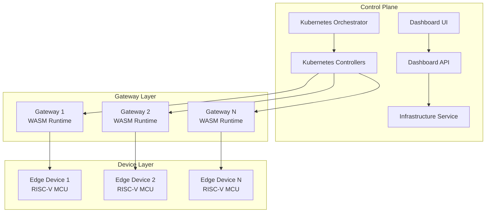
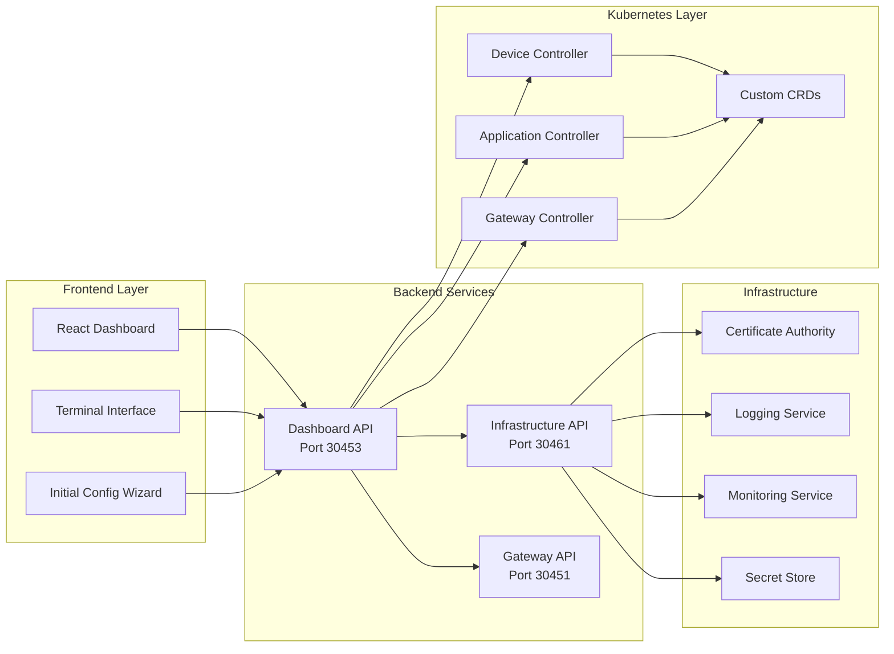
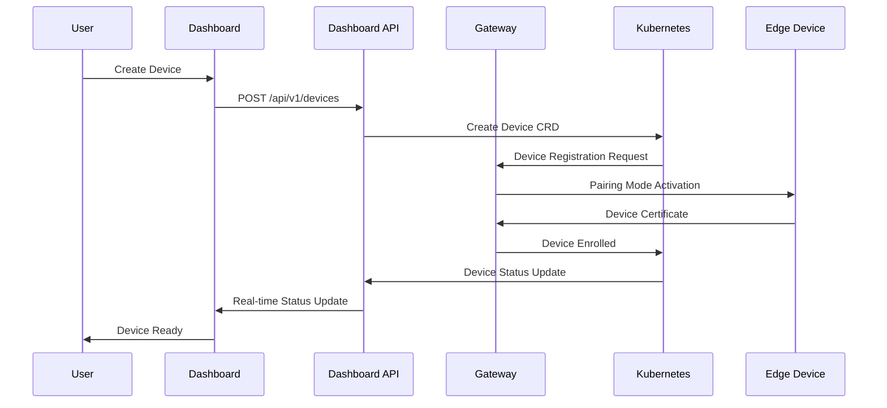
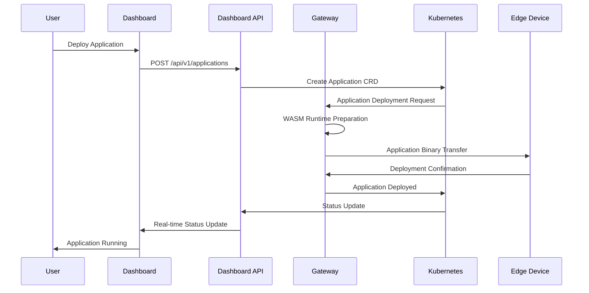
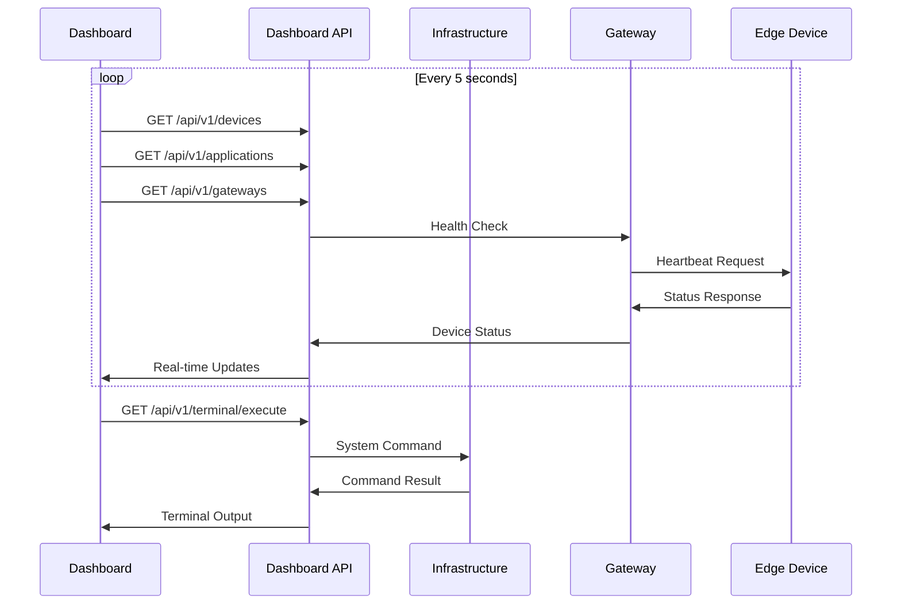
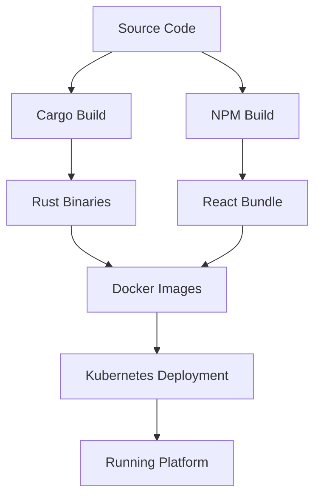
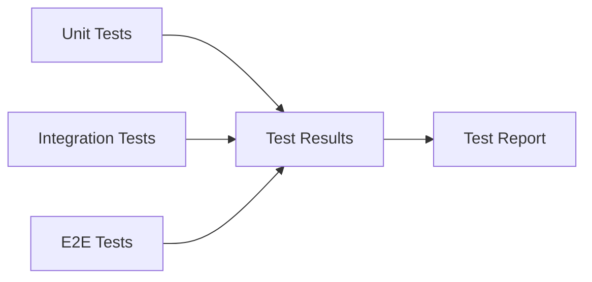
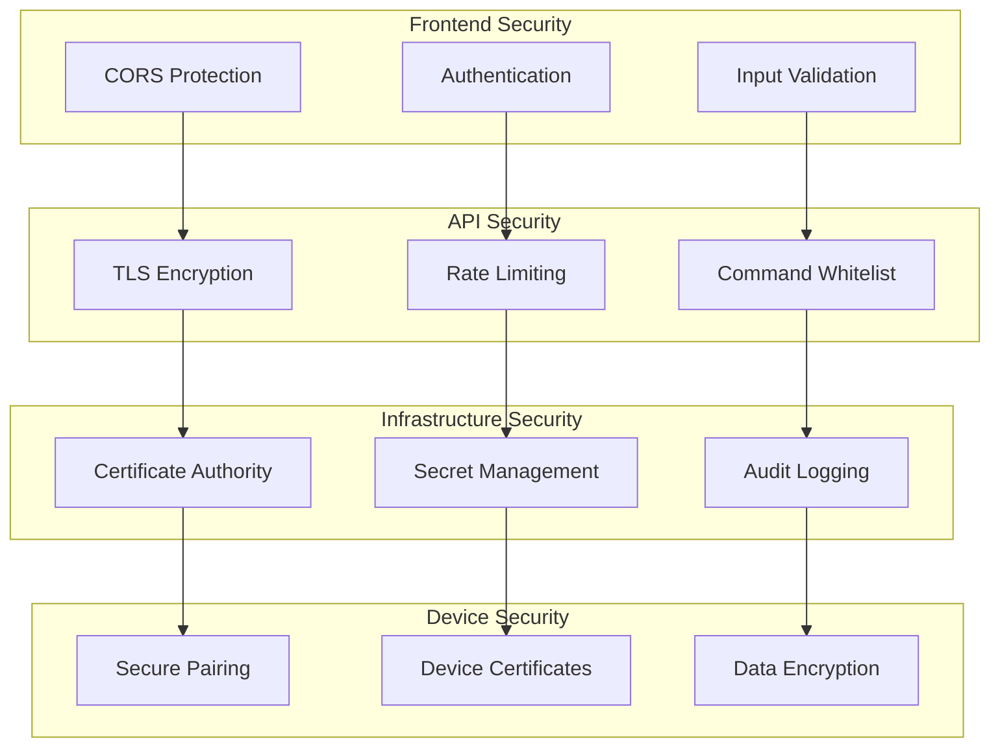
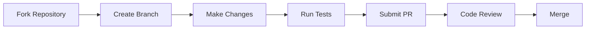
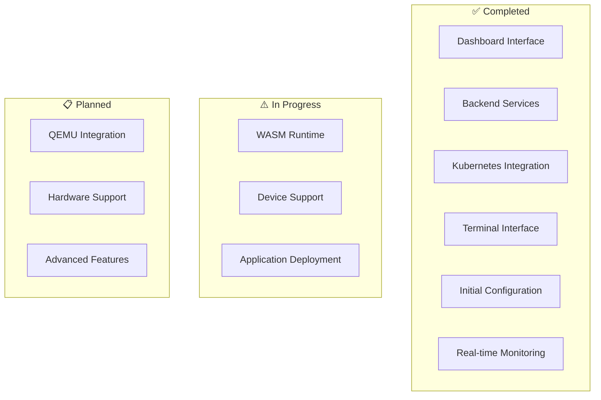

# Wasmbed Platform

A comprehensive Kubernetes-native middleware platform for deploying WebAssembly applications to edge devices with real-time monitoring, secure management, and complete lifecycle orchestration.

## 🚀 Quick Start

```bash
# Clone and deploy
git clone <repository-url>
cd retrospect
./scripts/wasmbed.sh deploy

# Access dashboard
open http://localhost:30470
```

## ✨ Key Features

- **Kubernetes-native**: Deploy WASM applications through standard Kubernetes manifests
- **Edge-optimized**: Designed for resource-constrained edge devices (RISC-V MCUs)
- **Real-time Dashboard**: Web-based management interface with live monitoring
- **Secure Terminal**: Command execution with predefined whitelisted commands
- **Device Management**: Complete device lifecycle management and monitoring
- **Application Deployment**: WASM application orchestration and runtime management
- **Infrastructure Services**: Certificate management, logging, and monitoring
- **Initial Configuration**: Guided setup wizard for system deployment

## 🏗️ System Architecture

### High-Level Architecture


```mermaid
graph TB
    subgraph "Control Plane"
        K8S[Kubernetes Orchestrator]
        DASH[Dashboard UI]
        API[Dashboard API]
        INFRA[Infrastructure Service]
        CTRL[Kubernetes Controllers]
    end
    
    subgraph "Gateway Layer"
        GW1[Gateway 1<br/>WASM Runtime]
        GW2[Gateway 2<br/>WASM Runtime]
        GW3[Gateway N<br/>WASM Runtime]
    end
    
    subgraph "Device Layer"
        DEV1[Edge Device 1<br/>RISC-V MCU]
        DEV2[Edge Device 2<br/>RISC-V MCU]
        DEV3[Edge Device N<br/>RISC-V MCU]
    end
    
    K8S --> CTRL
    DASH --> API
    API --> INFRA
    CTRL --> GW1
    CTRL --> GW2
    CTRL --> GW3
    GW1 --> DEV1
    GW2 --> DEV2
    GW3 --> DEV3
```

### Detailed Component Architecture


```mermaid
graph LR
    subgraph "Frontend Layer"
        REACT[React Dashboard]
        TERM[Terminal Interface]
        CONFIG[Initial Config Wizard]
    end
    
    subgraph "Backend Services"
        DASH_API[Dashboard API<br/>Port 30453]
        INFRA_API[Infrastructure API<br/>Port 30461]
        GW_API[Gateway API<br/>Port 30451]
    end
    
    subgraph "Kubernetes Layer"
        DEV_CTRL[Device Controller]
        APP_CTRL[Application Controller]
        GW_CTRL[Gateway Controller]
        CRDS[Custom CRDs]
    end
    
    subgraph "Infrastructure"
        CA[Certificate Authority]
        LOGS[Logging Service]
        METRICS[Monitoring Service]
        SECRETS[Secret Store]
    end
    
    REACT --> DASH_API
    TERM --> DASH_API
    CONFIG --> DASH_API
    DASH_API --> INFRA_API
    DASH_API --> GW_API
    DASH_API --> DEV_CTRL
    DASH_API --> APP_CTRL
    DASH_API --> GW_CTRL
    DEV_CTRL --> CRDS
    APP_CTRL --> CRDS
    GW_CTRL --> CRDS
    INFRA_API --> CA
    INFRA_API --> LOGS
    INFRA_API --> METRICS
    INFRA_API --> SECRETS
```

## 🔄 System Workflows

### Device Enrollment Workflow


```mermaid
sequenceDiagram
    participant U as User
    participant D as Dashboard
    participant API as Dashboard API
    participant GW as Gateway
    participant K8S as Kubernetes
    participant DEV as Edge Device
    
    U->>D: Create Device
    D->>API: POST /api/v1/devices
    API->>K8S: Create Device CRD
    K8S->>GW: Device Registration Request
    GW->>DEV: Pairing Mode Activation
    DEV->>GW: Device Certificate
    GW->>K8S: Device Enrolled
    K8S->>API: Device Status Update
    API->>D: Real-time Status Update
    D->>U: Device Ready
```

### Application Deployment Workflow


```mermaid
sequenceDiagram
    participant U as User
    participant D as Dashboard
    participant API as Dashboard API
    participant GW as Gateway
    participant K8S as Kubernetes
    participant DEV as Edge Device
    
    U->>D: Deploy Application
    D->>API: POST /api/v1/applications
    API->>K8S: Create Application CRD
    K8S->>GW: Application Deployment Request
    GW->>GW: WASM Runtime Preparation
    GW->>DEV: Application Binary Transfer
    DEV->>GW: Deployment Confirmation
    GW->>K8S: Application Deployed
    K8S->>API: Status Update
    API->>D: Real-time Status Update
    D->>U: Application Running
```

### System Monitoring Workflow


```mermaid
sequenceDiagram
    participant D as Dashboard
    participant API as Dashboard API
    participant INFRA as Infrastructure
    participant GW as Gateway
    participant DEV as Edge Device
    
    loop Every 5 seconds
        D->>API: GET /api/v1/devices
        D->>API: GET /api/v1/applications
        D->>API: GET /api/v1/gateways
        API->>GW: Health Check
        GW->>DEV: Heartbeat Request
        DEV->>GW: Status Response
        GW->>API: Device Status
        API->>D: Real-time Updates
    end
    
    D->>API: GET /api/v1/terminal/execute
    API->>INFRA: System Command
    INFRA->>API: Command Result
    API->>D: Terminal Output
```

## 🌐 Service Endpoints

| Service | Endpoint | Port | Description |
|---------|----------|------|-------------|
| **Dashboard UI** | http://localhost:30470 | 30470 | React-based web interface |
| **Dashboard API** | http://localhost:30453 | 30453 | Backend API for dashboard |
| **Infrastructure API** | http://localhost:30461 | 30461 | Infrastructure services |
| **Gateway API** | http://localhost:30451 | 30451 | Gateway management |

## 🛠️ Management Scripts

```bash
# Main management script
./scripts/wasmbed.sh deploy    # Deploy complete platform
./scripts/wasmbed.sh status    # Check system status
./scripts/wasmbed.sh stop      # Stop all services
./scripts/wasmbed.sh clean     # Clean up resources
./scripts/wasmbed.sh build     # Build all components
./scripts/wasmbed.sh test      # Run comprehensive tests
./scripts/wasmbed.sh restart   # Restart all services
./scripts/wasmbed.sh logs      # View system logs
./scripts/wasmbed.sh monitor   # Real-time monitoring
```

## 🔧 Development

### Prerequisites
- **Rust**: 1.70+ (for backend services)
- **Kubernetes**: 1.25+ (for orchestration)
- **Node.js**: 18+ (for React dashboard)
- **k3d**: Latest (for local Kubernetes cluster)
- **Docker**: Latest (for containerization)

### Build Process


```mermaid
graph TD
    A[Source Code] --> B[Cargo Build]
    B --> C[Rust Binaries]
    A --> D[NPM Build]
    D --> E[React Bundle]
    C --> F[Docker Images]
    E --> F
    F --> G[Kubernetes Deployment]
    G --> H[Running Platform]
```

### Build Commands
```bash
# Build all components
./scripts/wasmbed.sh build

# Build specific component
cargo build --package wasmbed-dashboard
cargo build --package wasmbed-gateway
cargo build --package wasmbed-infrastructure

# Build React dashboard
cd dashboard-react && npm run build
```

### Testing Framework


```mermaid
graph LR
    A[Unit Tests] --> D[Test Results]
    B[Integration Tests] --> D
    C[E2E Tests] --> D
    D --> E[Test Report]
```

### Run Tests
```bash
# Run all tests
./scripts/wasmbed.sh test

# Run specific test suites
cargo test --package wasmbed-dashboard
cargo test --package wasmbed-gateway
cargo test --package wasmbed-infrastructure

# Run React tests
cd dashboard-react && npm test
```

## 📊 System Monitoring

### Real-time Metrics


```mermaid
graph TB
    subgraph "System Metrics"
        CPU[CPU Usage]
        MEM[Memory Usage]
        NET[Network I/O]
        DISK[Disk I/O]
    end
    
    subgraph "Application Metrics"
        APP_COUNT[Application Count]
        APP_STATUS[Application Status]
        APP_PERF[Application Performance]
    end
    
    subgraph "Device Metrics"
        DEV_COUNT[Device Count]
        DEV_STATUS[Device Status]
        DEV_HEALTH[Device Health]
    end
    
    subgraph "Gateway Metrics"
        GW_COUNT[Gateway Count]
        GW_STATUS[Gateway Status]
        GW_CONN[Gateway Connections]
    end
    
    CPU --> DASHBOARD[Dashboard]
    MEM --> DASHBOARD
    NET --> DASHBOARD
    DISK --> DASHBOARD
    APP_COUNT --> DASHBOARD
    APP_STATUS --> DASHBOARD
    APP_PERF --> DASHBOARD
    DEV_COUNT --> DASHBOARD
    DEV_STATUS --> DASHBOARD
    DEV_HEALTH --> DASHBOARD
    GW_COUNT --> DASHBOARD
    GW_STATUS --> DASHBOARD
    GW_CONN --> DASHBOARD
```

## 🔐 Security Architecture

### Security Layers


```mermaid
graph TB
    subgraph "Frontend Security"
        CORS[CORS Protection]
        AUTH[Authentication]
        VALID[Input Validation]
    end
    
    subgraph "API Security"
        TLS[TLS Encryption]
        RATE[Rate Limiting]
        WHITELIST[Command Whitelist]
    end
    
    subgraph "Infrastructure Security"
        CA[Certificate Authority]
        SECRETS[Secret Management]
        AUDIT[Audit Logging]
    end
    
    subgraph "Device Security"
        PAIRING[Secure Pairing]
        CERT[Device Certificates]
        ENCRYPT[Data Encryption]
    end
    
    CORS --> TLS
    AUTH --> RATE
    VALID --> WHITELIST
    TLS --> CA
    RATE --> SECRETS
    WHITELIST --> AUDIT
    CA --> PAIRING
    SECRETS --> CERT
    AUDIT --> ENCRYPT
```

## 📚 Documentation

- **[Complete Documentation](docs/README.md)** - Comprehensive system documentation
- **[API Reference](docs/api/)** - Complete API documentation
- **[Architecture Guide](docs/architecture/)** - Detailed architecture documentation
- **[Deployment Guide](docs/deployment/)** - Step-by-step deployment guide
- **[Configuration Management](docs/CONFIGURATION_MANAGEMENT.md)** - Configuration system
- **[MCU Architecture Support](docs/MCU_ARCHITECTURE_SUPPORT.md)** - Device architecture details

## 🤝 Contributing

### Development Workflow


```mermaid
graph LR
    A[Fork Repository] --> B[Create Branch]
    B --> C[Make Changes]
    C --> D[Run Tests]
    D --> E[Submit PR]
    E --> F[Code Review]
    F --> G[Merge]
```

### Contribution Guidelines
1. Fork the repository
2. Create a feature branch: `git checkout -b feature/amazing-feature`
3. Make your changes
4. Run tests: `./scripts/wasmbed.sh test`
5. Commit changes: `git commit -m 'Add amazing feature'`
6. Push to branch: `git push origin feature/amazing-feature`
7. Submit a pull request

### Code Style
- **Rust**: Follow standard Rust formatting with `cargo fmt`
- **JavaScript**: Use ESLint and Prettier for consistent formatting
- **Documentation**: Update relevant documentation for all changes
- **Tests**: Write comprehensive tests for new features

## 📄 License

This project is licensed under the **AGPL-3.0 License** - see the [LICENSE](LICENSE) file for details.

## 📈 Status

**Current Version**: 0.1.0  
**Last Updated**: 2025  
**Compatibility**: Rust 1.70+, Kubernetes 1.25+, Node.js 18+

### Implementation Status


```mermaid
graph TB
    subgraph "✅ Completed"
        DASH[Dashboard Interface]
        API[Backend Services]
        K8S[Kubernetes Integration]
        TERM[Terminal Interface]
        CONFIG[Initial Configuration]
        MONITOR[Real-time Monitoring]
    end
    
    subgraph "⚠️ In Progress"
        WASM[WASM Runtime]
        DEVICE[Device Support]
        DEPLOY[Application Deployment]
    end
    
    subgraph "📋 Planned"
        QEMU[QEMU Integration]
        HARDWARE[Hardware Support]
        ADVANCED[Advanced Features]
    end
```

**Core Platform**: ✅ **COMPLETE**
- Dashboard with real-time data integration
- All backend microservices functional
- Kubernetes CRDs and controllers working
- Secure terminal with command whitelist
- Complete REST API implementation
- Initial configuration wizard
- Real-time monitoring and logging

**Next Development Phase**:
1. Implement real WASM runtime for edge devices
2. Add QEMU integration for device emulation
3. Implement real hardware device support
4. Add advanced application deployment mechanisms
5. Enhance security and monitoring capabilities

## ⚠️ Current Implementation Status & Limitations

### Mock/Non-Implemented Components

The following components are currently using mock data or are not fully implemented:

#### 🚫 Mock Data Areas
- **Device Status**: Device connectivity and health status are simulated
- **Application Metrics**: Performance metrics and runtime statistics are placeholder data
- **Gateway Health**: Gateway status and connection metrics are mock values
- **System Metrics**: CPU, memory, and network usage are simulated
- **Log Data**: Log entries are generated programmatically, not from real system logs

#### 🔧 Partially Implemented
- **WASM Runtime**: No actual WebAssembly execution engine is implemented
- **Device Communication**: Device-to-gateway communication is simulated
- **Application Deployment**: WASM binary deployment to devices is not functional
- **Real-time Monitoring**: Metrics collection is simulated, not from actual system resources
- **Certificate Management**: Certificate generation and validation is placeholder
- **Secret Store**: Secret management is in-memory, not persistent

#### 📋 Not Implemented
- **Hardware Device Support**: No actual RISC-V MCU integration
- **QEMU Integration**: Device emulation is not implemented
- **Real WASM Execution**: No WebAssembly runtime for edge devices
- **Persistent Storage**: All data is in-memory and lost on restart
- **Network Topology**: Network visualization shows mock connections
- **Terminal Commands**: Limited to predefined whitelisted commands
- **Application Lifecycle**: No actual application start/stop/restart functionality

#### ✅ Fully Implemented
- **Dashboard Interface**: Complete React-based UI with real API integration
- **Backend APIs**: All REST endpoints are functional and return real data
- **Kubernetes Integration**: CRDs and controllers create actual K8s resources
- **Database Operations**: All CRUD operations work with Kubernetes API
- **Authentication**: Basic authentication and CORS protection
- **Configuration Management**: Complete configuration system
- **Deployment Scripts**: Automated deployment and management scripts

### Development Notes

**Current State**: The platform provides a complete management interface and API layer, but the actual device communication and WASM execution layers are not implemented. This makes it suitable for:

- **Development and Testing**: Complete UI/UX development and API testing
- **Architecture Validation**: Testing the overall system architecture
- **Integration Testing**: Validating Kubernetes integration and controller behavior
- **Demo and Presentation**: Showcasing the platform capabilities

**Production Readiness**: The platform is **NOT** production-ready for actual device management until the mock components are replaced with real implementations.

### Migration Path to Production

1. **Phase 1**: Replace mock device communication with real hardware interfaces
2. **Phase 2**: Implement actual WASM runtime and execution engine
3. **Phase 3**: Add persistent storage and real metrics collection
4. **Phase 4**: Implement real certificate management and security
5. **Phase 5**: Add QEMU integration for device emulation and testing