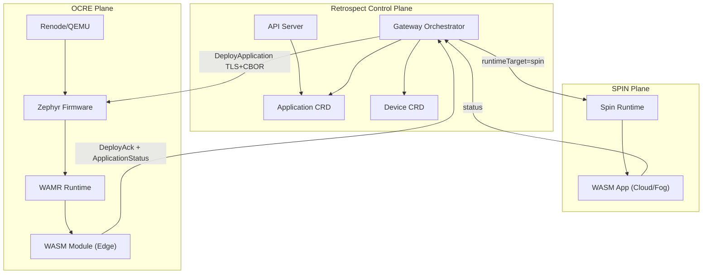
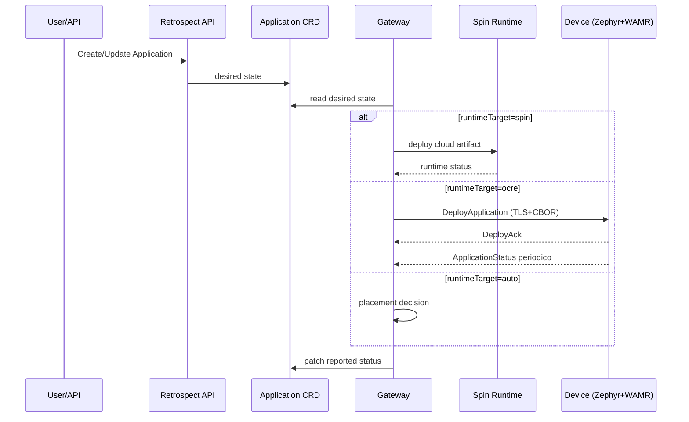

# RETROSPECT - SPIN + OCRE Integration Plan (Focused)

## Obiettivo

Integrare in Retrospect due runtime WASM diversi sotto un unico control-plane:

- `SPIN` per esecuzione cloud/fog;
- `OCRE/WAMR` per esecuzione edge su Zephyr;
- stato Kubernetes coerente con l'esecuzione reale.

La novelty e: **single control-plane, dual runtime-plane**.

---

## 1) Cosa e gia stato fatto (e verificato)

## 1.1 Nel ramo Retrospect (thesis-ciliberto)

Blocchi gia implementati:

- TLS firmware-gateway stabilizzato (handshake ed enrollment funzionanti).
- Protocollo CBOR robusto con gestione frame completi (no perdita su `recv` parziale).
- Deploy WASM lato device con esecuzione reale (`run`) dopo load/instantiate WAMR.
- `DeployAck` e `ApplicationStatus` periodico dal firmware al gateway.
- Aggiornamento `Device CRD`/`Application CRD` con stato reported.
- Struttura Renode orientata a gestione multi-device.

## 1.2 Nel repo MasterThesis (riuso utile)

Repository: [antoniodev0/MasterThesis](https://github.com/antoniodev0/MasterThesis.git)

Contributi utili gia pronti:

- pipeline SPIN/Kubernetes con `SpinApp` e artifact OCI;
- modulo edge Rust/WASI con socket custom (`sock_open`, `sock_connect`, `sock_send`, `sock_recv`);
- integrazione Zephyr + WAMR (bootstrap, load, execute);
- script `.wasm -> header C` (`prepare_for_ocre.sh`);
- documentazione/diagrammi edge-to-cloud.

Questi elementi riducono il rischio dell'integrazione in Retrospect.

---

## 2) Perche integrare SPIN e OCRE

Se i due runtime restano separati:

- doppio piano di controllo;
- stato frammentato;
- deploy non uniforme;
- test e KPI non confrontabili.

Con integrazione:

1. unico modello CRD per intent e stato;
2. deploy coerente su target eterogenei;
3. osservabilita unica (cloud + edge);
4. base scientifica forte per tesi/publication.

---

## 3) Architettura target (essenziale)

---

## 4) Flusso operativo unificato

---

## 5) Cosa implementare adesso (solo priorita alte)

## P1 - Modello unificato

- estendere `Application CRD` con:
  - `runtimeTarget: spin | ocre | auto`
  - `artifact.spinImage`
  - `artifact.edgeWasm`
  - `placementPolicy`
- normalizzare `Application.status` (phase, runtimeStatus, deviceStatuses, lastError).

## P2 - Gateway Runtime Adapter Layer

- introdurre due adapter:
  - `SpinRuntimeAdapter`
  - `OcreRuntimeAdapter`
- interfaccia comune:
  - `deploy`
  - `stop`
  - `query_status`
- orchestrazione centralizzata nel gateway.

## P3 - Status fidelity (punto critico)

- garantire che `Running` in CRD significhi esecuzione reale;
- mantenere heartbeat/status periodico affidabile;
- patch idempotente lato gateway.

## P4 - Pipeline artifact duale

- build cloud (OCI/Spin);
- build edge (WASI/WAMR compatibile);
- mapping unico "logical app -> runtime artifacts".

---

## 6) Verifica tecnica minima (accettazione)

Il lavoro e accettato quando:

1. un'app viene deployata da stesso control-plane su `spin` e `ocre`;
2. device edge esegue realmente il modulo e invia status periodico;
3. `Application CRD` resta coerente col runtime reale;
4. caso failure (disconnect/reconnect) non produce stato falso;
5. test con piu device emulati resta stabile.

KPI minimi da tracciare:

- deploy success rate;
- ack-to-running latency;
- status mismatch rate;
- heartbeat loss rate;
- recovery convergence.

---

## 7) Nota operativa

Il materiale `MasterThesis` va trattato come **baseline tecnica riusabile**, non come deliverable finale di Retrospect.  
La parte nuova da dimostrare e l'orchestrazione unificata con stato coerente cross-runtime.

