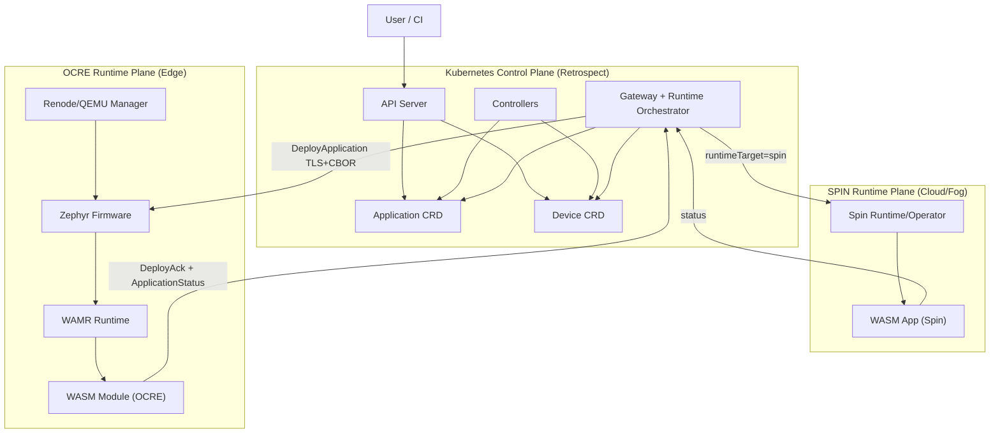
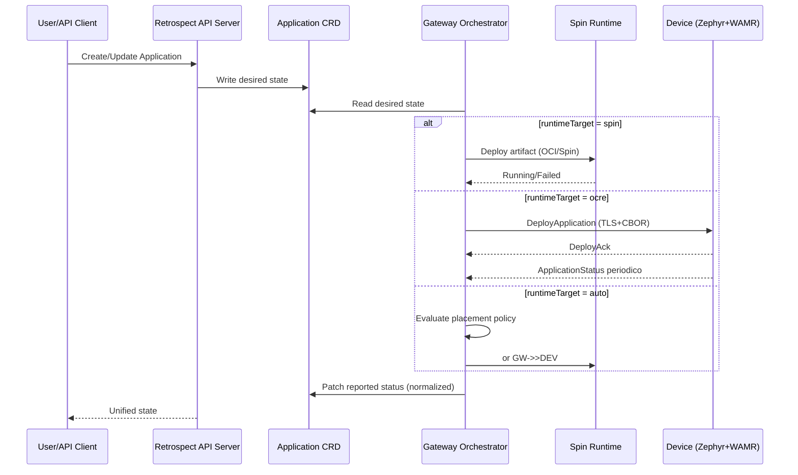
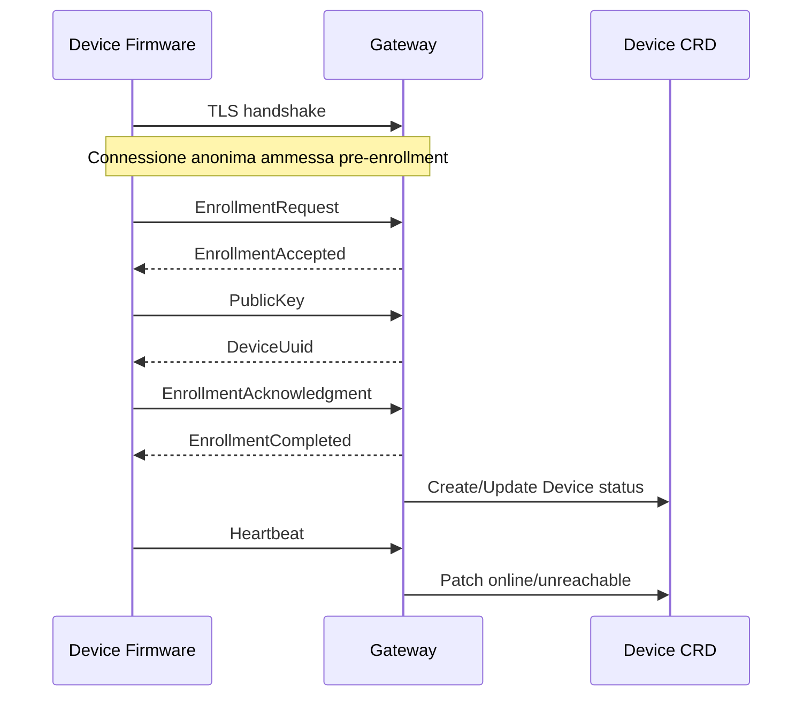

# RETROSPECT - Piano Dettagliato Integrazione SPIN + OCRE

## 1) Scopo del documento

Questo documento descrive in dettaglio:

1. cosa e gia stato realizzato nel progetto Retrospect;
2. perche integrare SPIN e OCRE e strategico;
3. cosa vogliamo realizzare in modo tecnico e verificabile;
4. come validare la novelty con criteri oggettivi.

L'obiettivo e una piattaforma unica in cui lo stesso control-plane Kubernetes (Retrospect) orchestra in modo coerente:

- workload WASM cloud/fog su runtime SPIN;
- workload WASM edge su runtime OCRE/WAMR (Zephyr);
- stato end-to-end allineato tra runtime reale e CRD Kubernetes.

---

## 2) Executive summary

La base tecnologica e gia concreta:

- lato edge sono stati consolidati TLS, enrollment CBOR, deploy, ack e status;
- lato cloud e disponibile la pipeline WASM orientata a SPIN/Kubernetes;
- lato control-plane esistono gia API, Gateway e CRD per sincronizzare desired/reported state.

Quindi la novelty non parte da zero: consiste nell'unificazione rigorosa di due runtime diversi sotto lo stesso orchestratore.

---

## 3) Stato dell'arte gia realizzato

## 3.1 Sicurezza e onboarding device

- handshake TLS firmware-gateway portato in stato funzionante;
- fix memoria/cipher suite per contesto embedded;
- supporto connessioni anonime pre-enrollment;
- sequenza completa: EnrollmentRequest -> PublicKey -> DeviceUuid -> EnrollmentCompleted.

## 3.2 Protocollo e affidabilita trasporto

- framing robusto (header + payload) con gestione ricezioni parziali;
- loop di ricezione/poll/timeout per evitare perdita messaggi di deploy;
- heartbeat periodico con aggiornamento stato device in Kubernetes.

## 3.3 Lifecycle WASM edge (OCRE/WAMR)

- ricezione modulo WASM via TLS/CBOR;
- load + instantiate in WAMR;
- chiamata entry-point effettiva (`run`);
- emissione `DeployAck` e `ApplicationStatus` periodico.

## 3.4 Coerenza stato su Kubernetes

- update di `Device CRD` e `Application CRD` con stato reported;
- mappatura eventi runtime -> stati operativi (Running/Unreachable/Failed);
- aggiornamento heartbeat continuo.

## 3.5 Emulazione e gestione device

- scenario single-device consolidato;
- evoluzione verso gestione N macchine emulata da manager centralizzato.

---

## 4) Perche integrare SPIN e OCRE in Retrospect

## 4.1 Problema reale da risolvere

Senza integrazione, cloud runtime ed edge runtime restano silos separati:

1. doppio piano di controllo;
2. stato operativo frammentato;
3. deployment duplicato e non uniforme;
4. difficile confronto sperimentale.

## 4.2 Perche SPIN

SPIN e ideale per il piano cloud/fog perche offre:

- packaging standard OCI;
- integrazione nativa con orchestrazione Kubernetes;
- lifecycle cloud-oriented semplice da automatizzare.

## 4.3 Perche OCRE

OCRE (con WAMR/Zephyr) e ideale lato edge perche offre:

- execution WASM su dispositivi constrained;
- integrazione stretta con firmware e RTOS;
- controllo preciso di rete, memoria e sicurezza locale.

## 4.4 Perche integrarli insieme

Integrarli consente di ottenere:

1. continuita cloud-fog-edge con una sola semantica di orchestrazione;
2. placement intelligente (`spin`, `ocre`, `auto`);
3. stato unificato e verificabile in Kubernetes;
4. novelty forte per tesi/pubblicazione: **single control-plane, dual runtime-plane**.

---

## 5) Visione target e novelty

## 5.1 Problema scientifico/ingegneristico

Come orchestrare workload WebAssembly su runtime eterogenei mantenendo:

- un solo piano di controllo;
- deploy uniforme;
- osservabilita affidabile;
- coerenza tra desired state e runtime reale.

## 5.2 Novelty proposta

### Single control-plane, dual runtime-plane for WebAssembly continuum

Retrospect deve essere capace di:

1. ricevere un intent unico di deploy (CRD);
2. selezionare il target runtime (`spin`, `ocre`, `auto`);
3. eseguire il deploy con adapter runtime-specifici;
4. normalizzare lo stato in un modello CRD unificato.

---

## 6) Architettura integrata

## 6.1 Diagramma architetturale

## 6.2 Diagramma flusso deploy unificato

## 6.3 Diagramma flusso enrollment e trust bootstrap

---

## 7) Modello dati unificato (CRD)

## 7.1 Campi proposti in `Application.spec`

- `runtimeTarget`: `spin | ocre | auto`
- `artifact.spinImage`: riferimento OCI per target spin
- `artifact.edgeWasm`: bytes o reference per target ocre
- `placementPolicy`:
  - `latencySensitive`
  - `resourceProfile`
  - `fallbackMode`

## 7.2 Campi proposti in `Application.status`

- `phase` globale (Pending/Deploying/Running/Degraded/Failed)
- `runtimeStatus.spin`
- `runtimeStatus.ocre`
- `deviceStatuses`
- `cloudStatuses`
- `lastHeartbeat`
- `lastError`
- `lastTransitionTime`

---

## 8) Piano implementativo dettagliato

## 8.1 Workstream A - Model & API

### Obiettivo

Evolvere CRD/API mantenendo compatibilita.

### Attivita

1. estendere schema CRD;
2. introdurre defaulting/validation;
3. aggiornare DTO gateway/controller;
4. test compatibilita backward.

### Done criteria

- CRD applicabile in cluster pulito;
- oggetti legacy ancora validi;
- test serializzazione superati.

## 8.2 Workstream B - Runtime Adapter Layer (Gateway)

### Obiettivo

Separare logica runtime-specifica dalla logica di orchestrazione.

### Attivita

1. definire interfaccia comune:
   - `deploy()`
   - `stop()`
   - `query_status()`
   - `collect_metrics()`
2. implementare `SpinRuntimeAdapter`;
3. implementare `OcreRuntimeAdapter`;
4. introdurre orchestratore di selezione runtime;
5. normalizzare error taxonomy.

### Done criteria

- deploy funzionante su target `spin` e `ocre`;
- stato CRD coerente e uniforme.

## 8.3 Workstream C - Artifact pipeline duale

### Obiettivo

Generare artifact coerenti da una singola applicazione logica.

### Attivita

1. naming/versioning unificato;
2. pipeline build SPIN (OCI);
3. pipeline build OCRE (WASI/WAMR compatibile);
4. manifest "logical app -> physical artifacts";
5. publishing automation.

### Done criteria

- artifact validi per entrambi i runtime;
- deploy ripetibile senza passaggi manuali impliciti.

## 8.4 Workstream D - Observability e status fidelity

### Obiettivo

Garantire che Kubernetes rifletta il runtime reale.

### Attivita

1. telemetria minima standard (`app_started`, `app_running`, `app_failed`, `heartbeat`);
2. correlazione deploy-id/app-id/device-id;
3. patch CRD idempotente;
4. endpoint/dashboard di verifica.

### Done criteria

- mismatch runtime-vs-CRD minimizzato;
- assenza di falsi "Running".

## 8.5 Workstream E - Multi-device e resilienza

### Obiettivo

Passare da demo single-device a scenario robusto.

### Attivita

1. test con N device emulati;
2. backpressure gateway;
3. retry e timeout policy;
4. reconnect e recovery stateful.

### Done criteria

- stabilita sotto carico;
- assenza perdita silenziosa di deploy/status.

---

## 9) Validazione sperimentale

## 9.1 Domande sperimentali

1. Il control-plane unico governa correttamente runtime eterogenei?
2. Lo stato CRD resta coerente con lo stato runtime reale?
3. Il placement policy-aware migliora comportamento operativo?

## 9.2 Esperimenti minimi

### E1 - Functional parity

- stessa applicazione logica su SPIN e OCRE;
- risultato funzionale equivalente.

### E2 - Status fidelity

- confronto runtime observed vs CRD reported;
- misura mismatch rate.

### E3 - Failure & recovery

- disconnessione device, restart gateway, timeout rete;
- misura convergenza stato.

### E4 - Multi-device

- aumento progressivo device emulati;
- misura throughput deploy/status.

## 9.3 KPI

- deployment success rate;
- deploy latency;
- ack-to-running latency;
- status mismatch rate;
- heartbeat loss rate;
- recovery convergence;
- CPU/RAM gateway sotto carico.

---

## 10) Rischi e mitigazioni

## 10.1 Rischi tecnici

1. divergenza semantica SPIN/OCRE  
   Mitigazione: adapter layer + contract test comuni.
2. incoerenza stato runtime/CRD  
   Mitigazione: eventi idempotenti + reconciliation loop.
3. overhead gateway sotto carico  
   Mitigazione: backpressure, batching, profiling.
4. dipendenza da fork firmware  
   Mitigazione: piano di reintegro su baseline standard.

## 10.2 Rischi progettuali

1. scope creep  
   Mitigazione: MVP rigoroso e priorita chiare.
2. debito documentale  
   Mitigazione: documentazione aggiornata per workstream.

---

## 11) Priorita implementative (senza tempistiche)

### P1 - Fondazioni architetturali

- CRD esteso;
- adapter layer operativo;
- primo deploy dual target.

### P2 - Coerenza operativa

- status unificato;
- osservabilita minima;
- verifica fidelity.

### P3 - Robustezza e scalabilita

- failure handling;
- multi-device;
- hardening e tuning.

---

## 12) Deliverable finali attesi

1. CRD/API estesi e documentati;
2. gateway con Runtime Adapter Layer SPIN + OCRE;
3. pipeline artifact duale ripetibile;
4. test e2e nominali e degradati;
5. stato osservabile coerente;
6. report sperimentale con KPI.

---

## 13) Definition of done

Il prototipo si considera completo quando:

1. deploy `runtimeTarget=spin` e `runtimeTarget=ocre` funzionano dal medesimo control-plane;
2. il runtime edge esegue realmente il modulo e riporta stato periodico;
3. lo stato Kubernetes riflette il runtime reale con mismatch trascurabile;
4. test multi-device e failure-recovery superati;
5. setup e risultati sono riproducibili e documentati.

---

## 14) Valore immediatamente capitalizzabile

Gia oggi sono riusabili:

- fix TLS/enrollment e framing robusto;
- deploy path con ack e status firmware;
- base cloud SPIN in ambiente Kubernetes;
- documentazione tecnica consolidata.

Questo conferma che la parte piu rischiosa e stata gia affrontata: il passo successivo e l'unificazione architetturale con validazione sperimentale rigorosa.

