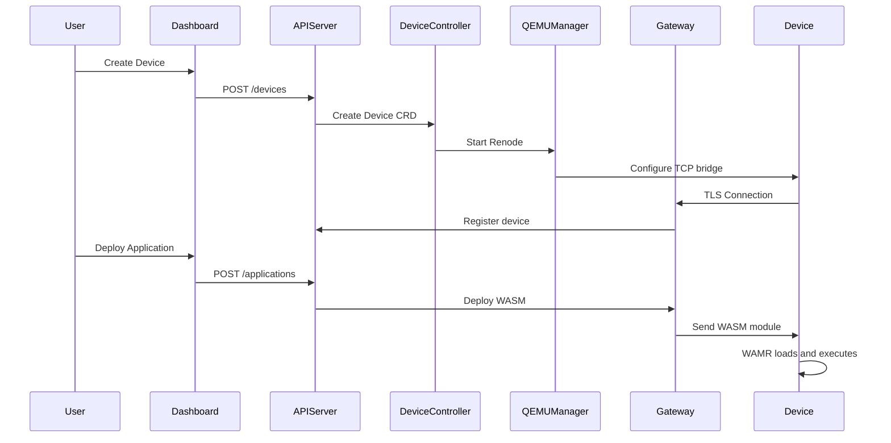
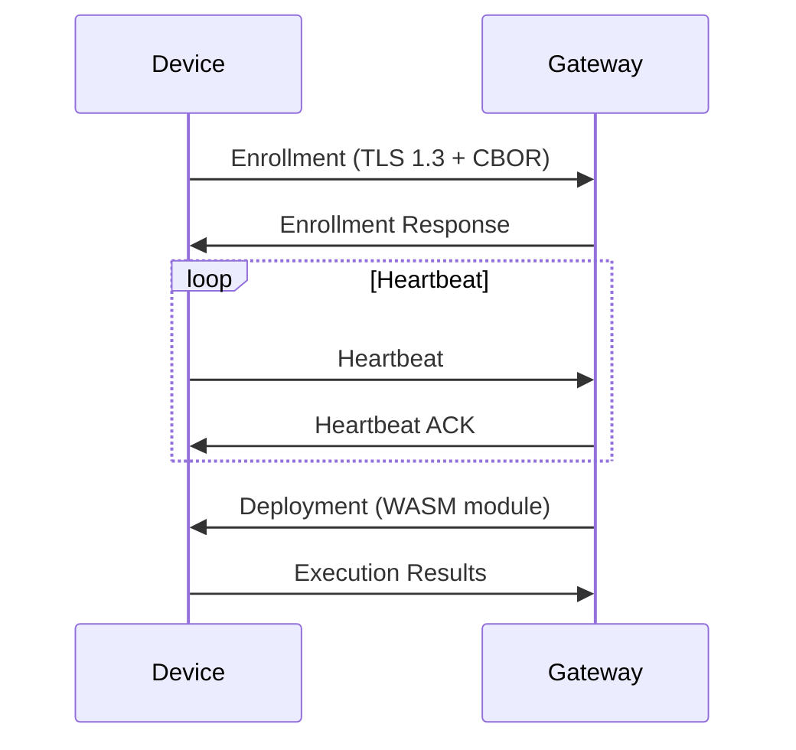
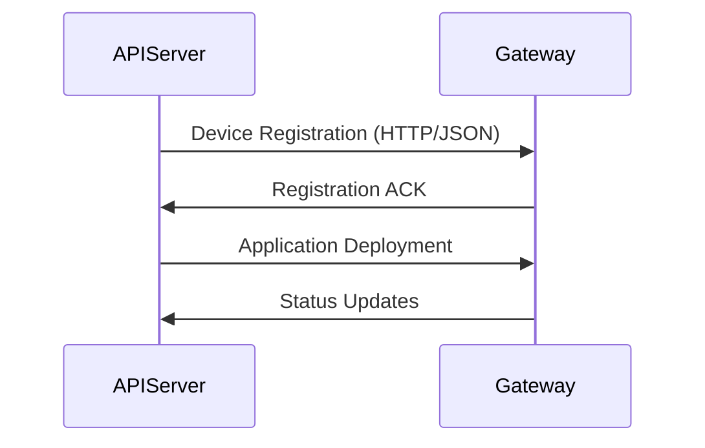

# Wasmbed Architecture

## System Overview

Wasmbed is a distributed platform that enables deployment and execution of WebAssembly applications on embedded devices emulated via Renode.

## Main Components

### 1. API Server (`wasmbed-api-server`)

**Responsibilities:**
- Exposes REST API for device/application management
- Kubernetes controllers for CRDs
- Coordination between components

**Interfaces:**
- REST API (port 8080)
- Kubernetes API (CRDs)
- Communication with Gateway

**Location:**
- Source: `crates/wasmbed-api-server/`
- Deployment: Kubernetes Pod in `wasmbed` namespace
- Service: Exposes port 8080

### 2. Gateway (`wasmbed-gateway`)

**Responsibilities:**
- TLS server for devices
- Device-to-gateway connection management
- WASM module deployment
- Heartbeat monitoring

**Protocol:**
- TLS 1.3 with client authentication
- CBOR serialization
- Message-based communication

**Location:**
- Source: `crates/wasmbed-gateway/`
- Deployment: Kubernetes Pod in `wasmbed` namespace
- Service: Exposes TLS port (default 40029) and HTTP port (8080)

### 3. Renode Manager (`wasmbed-qemu-manager`)

**Responsibilities:**
- Renode instance management
- Start/stop emulated devices
- TCP bridge configuration
- Firmware loading

**Integration:**
- Docker for Renode containerization
- TCP bridge for tunneling
- Renode scripts (.resc)

**Location:**
- Source: `crates/wasmbed-qemu-manager/`
- Runtime: Executes as part of API Server process

### 4. TCP Bridge (`wasmbed-tcp-bridge`)

**Responsibilities:**
- TCP tunneling between device and gateway
- Multiple connection management
- TLS data forwarding

**Location:**
- Source: `crates/wasmbed-tcp-bridge/`
- Runtime: Separate process or sidecar container

### 5. Zephyr Firmware (`zephyr-app`)

**Stack:**
- Zephyr RTOS (v4.3.0)
- Network stack (TCP/TLS)
- WAMR runtime (v2.4.3)
- Wasmbed protocol handler

**Functionality:**
- Network initialization
- TLS connection to gateway
- WASM module execution
- Wasmbed protocol management

**Location:**
- Source: `zephyr-app/`
- Build output: `zephyr-workspace/build/<board>/zephyr/zephyr.elf`
- Runtime: Loaded into Renode emulation

## Deployment Flow

## Communication

### Device ↔ Gateway

**Protocol:**
- **Transport**: TLS 1.3
- **Format**: CBOR
- **Messages**: Enrollment, Heartbeat, Deployment, Execution results

### API Server ↔ Gateway

**Protocol:**
- **Transport**: HTTP/gRPC
- **Format**: JSON/Protobuf
- **Operations**: Device registration, Application deployment, Status updates

## Storage

### Kubernetes Resources

- **Device CRD**: Device state
- **Application CRD**: Application configuration
- **Gateway CRD**: Gateway configuration

### Local Cache

- Gateway maintains local cache for performance
- Periodic synchronization with API Server

## Security

### TLS

- Client certificates for device authentication
- Server certificates for gateway
- CA chain for validation

### Authorization

- Public key authentication
- Device enrollment with pairing
- Gateway authorization

## Scalability

### Gateway

- Multiple gateway instances supported
- Load balancing via Kubernetes Service
- Configurable HPA (Horizontal Pod Autoscaler)

### Devices

- Each gateway manages multiple connections
- TCP bridge for isolation
- Configurable resource limits

## Monitoring

### Metrics

- Device status
- Application execution
- Network connectivity
- Resource usage

### Logging

- Structured logging (tracing)
- Configurable log levels
- Centralized logging via Kubernetes
