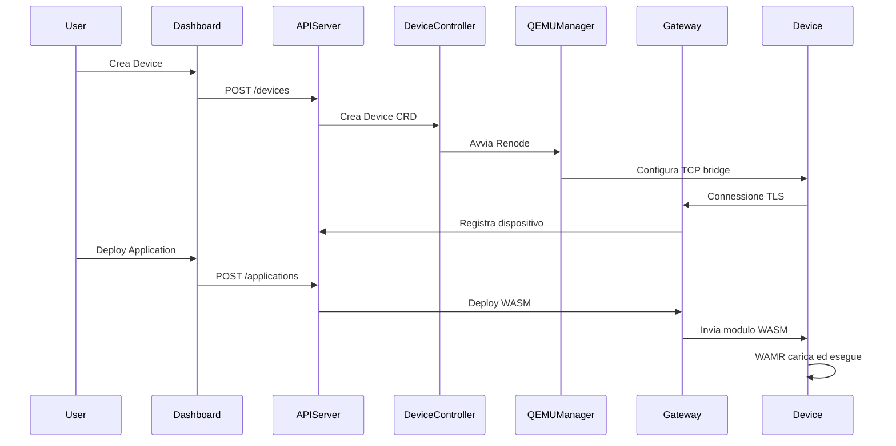
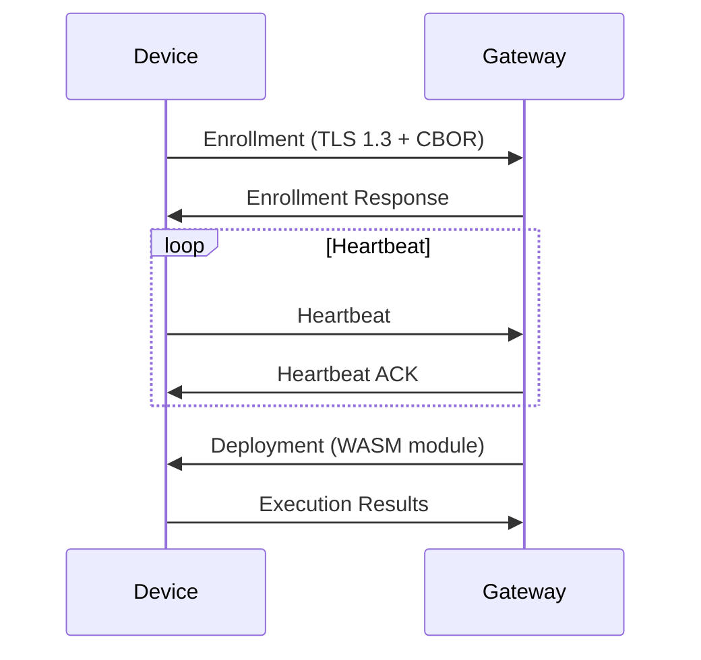
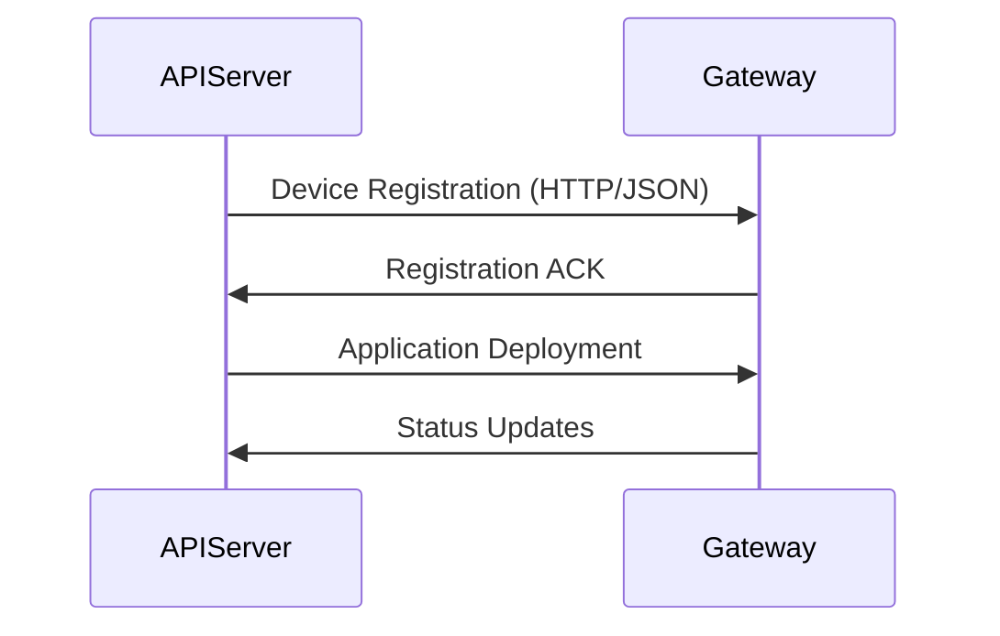

# Architettura Wasmbed

## Panoramica Sistema

Wasmbed è una piattaforma distribuita che permette il deployment e l'esecuzione di applicazioni WebAssembly su dispositivi embedded emulati tramite Renode.

## Componenti Principali

### 1. API Server (`wasmbed-api-server`)

**Responsabilità:**
- Esposizione REST API per gestione dispositivi/applicazioni
- Kubernetes controllers per CRDs
- Coordinamento tra componenti

**Interfacce:**
- REST API (porta 8080)
- Kubernetes API (CRDs)
- Comunicazione con Gateway

### 2. Gateway (`wasmbed-gateway`)

**Responsabilità:**
- Server TLS per dispositivi
- Gestione connessioni device-to-gateway
- Deployment moduli WASM
- Heartbeat monitoring

**Protocollo:**
- TLS 1.3 con autenticazione client
- CBOR serialization
- Message-based communication

### 3. QEMU Manager (`wasmbed-qemu-manager`)

**Responsabilità:**
- Gestione istanze Renode
- Avvio/stop dispositivi emulati
- Configurazione TCP bridge
- Caricamento firmware

**Integrazione:**
- Docker per containerizzazione Renode
- TCP bridge per tunneling
- Script Renode (.resc)

### 4. TCP Bridge (`wasmbed-tcp-bridge`)

**Responsabilità:**
- Tunneling TCP tra dispositivo e gateway
- Gestione connessioni multiple
- Forwarding dati TLS

### 5. Firmware Zephyr (`zephyr-app`)

**Stack:**
- Zephyr RTOS (v4.3.0)
- Network stack (TCP/TLS)
- WAMR runtime (v2.4.3)
- Wasmbed protocol handler

**Funzionalità:**
- Inizializzazione networking
- Connessione TLS al gateway
- Esecuzione moduli WASM
- Gestione protocollo Wasmbed

## Flusso di Deployment

## Comunicazione

### Device ↔ Gateway

**Protocollo:**
- **Transport**: TLS 1.3
- **Format**: CBOR
- **Messages**: Enrollment, Heartbeat, Deployment, Execution results

### API Server ↔ Gateway

**Protocollo:**
- **Transport**: HTTP/gRPC
- **Format**: JSON/Protobuf
- **Operations**: Device registration, Application deployment, Status updates

## Storage

### Kubernetes Resources

- **Device CRD**: Stato dispositivi
- **Application CRD**: Configurazione applicazioni
- **Gateway CRD**: Configurazione gateway

### Local Cache

- Gateway mantiene cache locale per performance
- Sincronizzazione periodica con API Server

## Sicurezza

### TLS

- Certificati client per autenticazione dispositivi
- Certificati server per gateway
- CA chain per validazione

### Autorizzazione

- Public key authentication
- Device enrollment con pairing
- Gateway authorization

## Scalabilità

### Gateway

- Multiple istanze gateway supportate
- Load balancing via Kubernetes Service
- HPA (Horizontal Pod Autoscaler) configurabile

### Dispositivi

- Ogni gateway gestisce multiple connessioni
- TCP bridge per isolamento
- Resource limits configurabili

## Monitoring

### Metrics

- Device status
- Application execution
- Network connectivity
- Resource usage

### Logging

- Structured logging (tracing)
- Log levels configurabili
- Centralized logging via Kubernetes
