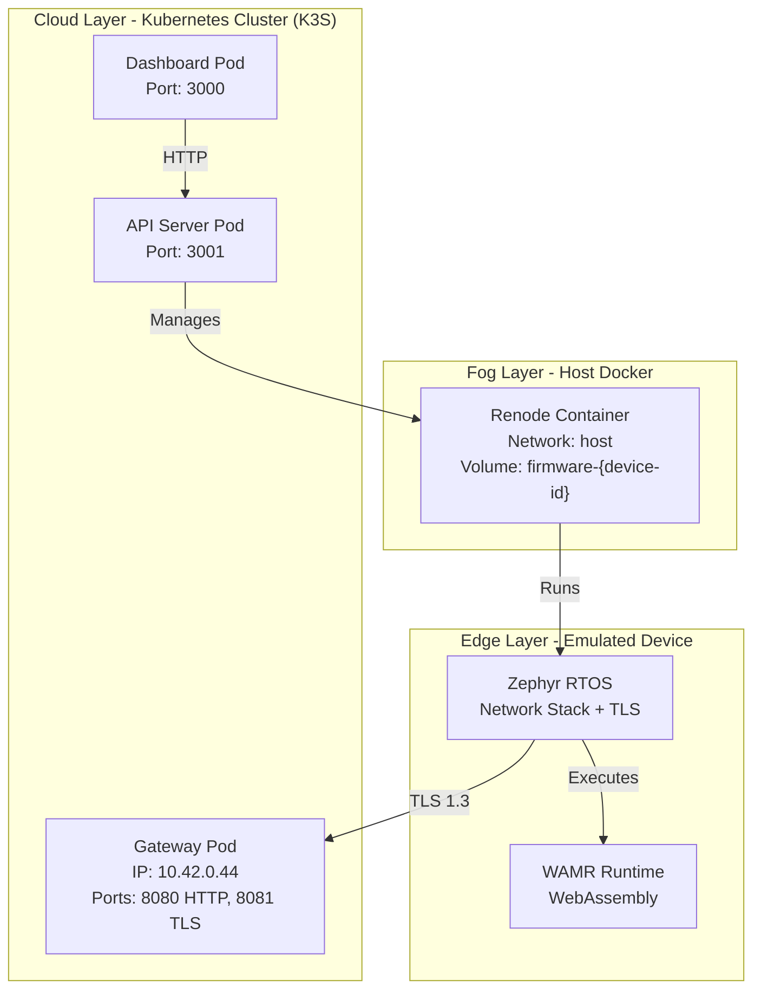

# RETROSPECT Wasmbed Architecture

## Overview

RETROSPECT Wasmbed is a distributed system for managing WebAssembly applications on embedded devices across the Cloud-Fog-Edge computing continuum. The system uses Kubernetes for orchestration, Renode for hardware emulation, and Zephyr RTOS for device firmware.

## System Components

### 1. Control Plane (Kubernetes)

#### Gateway
- **Location**: Kubernetes Pod (wasmbed namespace)
- **IP**: Dynamic (e.g., 10.42.0.12)
- **Ports**:
  - 8080: HTTP API
  - 8081: TLS (secure device connections)
- **Responsibilities**:
  - Device enrollment and authentication
  - TLS certificate management
  - Message routing between devices and applications
  - WebAssembly module deployment

#### API Server
- **Location**: Kubernetes Pod (wasmbed namespace)
- **Port**: 3001
- **Responsibilities**:
  - RESTful API for device/application management
  - Kubernetes CRD management (Device, Application, Gateway)
  - Renode container orchestration
  - Firmware deployment

#### Dashboard
- **Location**: Kubernetes Pod (wasmbed namespace)
- **Port**: 3000 (exposed via port-forward)
- **Responsibilities**:
  - Web UI for system monitoring
  - Network topology visualization
  - Device status and logs
  - Application deployment interface

#### Infrastructure Service
- **Location**: Kubernetes Pod (wasmbed namespace)
- **Port**: 30460
- **Responsibilities**:
  - Certificate Authority (CA)
  - Secret storage
  - System monitoring

### 2. Device Emulation (Host Docker)

#### Renode Containers
- **Location**: Host Docker (one container per device)
- **Network**: `--net=host` (shares host network)
- **Volumes**: Device-specific firmware volumes
- **Responsibilities**:
  - Hardware emulation (CPU, memory, peripherals)
  - Loads and executes Zephyr firmware
  - Provides UART analyzer for logs

#### Zephyr RTOS Firmware
- **Location**: Runs inside Renode container
- **Boards Supported**:
  - **nRF52840 DK** (Official Zephyr board) - Recommended
  - **STM32F4 Discovery** (Official Zephyr board)
  - Arduino Nano 33 BLE (Legacy)
- **Components**:
  - Network stack (TCP/IP, TLS)
  - WAMR (WebAssembly Micro Runtime)
  - Wasmbed protocol handler
- **Responsibilities**:
  - Reads gateway endpoint from memory (0x20001000)
  - Establishes TLS connection to gateway
  - Executes WebAssembly modules
  - Sends telemetry and receives commands

## Network Architecture



## TLS Connection Flow

1. **Device Startup**:
   - Renode container starts with firmware volume
   - Renode writes gateway endpoint to memory (0x20001000)
   - Format: `"10.42.0.12:8081"` (15 bytes)

2. **Zephyr Initialization**:
   - Zephyr boots and initializes network stack
   - Reads gateway endpoint from memory address 0x20001000
   - Parses host IP and port

3. **TLS Connection**:
   - Zephyr calls `network_connect_tls(host, port)`
   - Creates TCP socket with TLS options
   - Performs TLS handshake with gateway
   - Connection is persistent until device stops

4. **Communication**:
   - Device sends enrollment request
   - Gateway authenticates using public key
   - Device receives WebAssembly modules
   - WAMR executes modules
   - Device sends telemetry data

## Gateway Endpoint Resolution

### Problem Solved
Previously, devices used a TCP bridge at `127.0.0.1:40029`. Now they connect directly to the gateway pod IP.

### Resolution Process

1. **API Server** (in Pod):
   ```rust
   // When starting device emulation
   let gateway_endpoint = if is_local_address(endpoint) {
       // Resolve to actual gateway pod IP
       kubectl get pods -n wasmbed -l app=wasmbed-gateway \
           -o jsonpath='{.items[0].status.podIP}'
       // Returns: "10.42.0.12"
   }
   let tls_port = 8081; // Gateway TLS port
   let full_endpoint = format!("{}:{}", gateway_endpoint, tls_port);
   ```

2. **Renode Script Generation**:
   ```bash
   # Write endpoint to memory (called before Zephyr starts)
   sysbus WriteDoubleWord 0x20001000 0x0000000f  # Length: 15
   sysbus WriteDoubleWord 0x20001004 0x342e3031  # "10.4"
   sysbus WriteDoubleWord 0x20001008 0x2e302e32  # "2.0."
   sysbus WriteDoubleWord 0x2000100c 0x383a3231  # "12:8"
   sysbus WriteDoubleWord 0x20001010 0x00313830  # "081"
   ```

3. **Zephyr Reading**:
   ```c
   #define GATEWAY_ENDPOINT_ADDR 0x20001000
   
   uint32_t *length_ptr = (uint32_t *)GATEWAY_ENDPOINT_ADDR;
   uint32_t length = *length_ptr; // 15
   
   char *endpoint_ptr = (char *)(GATEWAY_ENDPOINT_ADDR + 4);
   memcpy(gateway_endpoint, endpoint_ptr, length);
   gateway_endpoint[length] = '\0';
   // Result: "10.42.0.12:8081"
   ```

### Persistence
- The endpoint is resolved once at device creation
- Stored in device CRD status
- Reused on subsequent Renode restarts
- No more `127.0.0.1` fallback

## Supported MCU Types

See [MCU_SUPPORT.md](MCU_SUPPORT.md) for complete list of supported MCU types.

### Ethernet-Enabled Boards (Recommended)

1. **STM32F746G Discovery** (`Stm32F746gDisco`) - **Default**
   - CPU: ARM Cortex-M7 @ 216 MHz
   - RAM: 320 KB
   - Flash: 1 MB
   - Network: Ethernet 10/100 Mbps
   - Renode platform: `stm32f7_discovery-bb.repl`

2. **FRDM-K64F** (`FrdmK64f`)
   - CPU: ARM Cortex-M4 @ 120 MHz
   - RAM: 256 KB
   - Flash: 1 MB
   - Network: Ethernet 10/100 Mbps
   - Renode platform: `frdm_k64f.repl`

### WiFi-Enabled Boards

3. **ESP32 DevKitC** (`Esp32DevkitC`)
   - CPU: Xtensa LX6 @ 240 MHz
   - RAM: 520 KB
   - Flash: 4 MB
   - Network: WiFi 802.11 b/g/n
   - Renode platform: `esp32.repl`

### Other Supported Boards

- **nRF52840 DK** (`Nrf52840DK`) - BLE only
- **STM32F4 Discovery** (`Stm32F4Disco`) - No network
- **Arduino Nano 33 BLE** (`RenodeArduinoNano33Ble`) - Legacy
- **MPS2-AN385** (`Mps2An385`) - Legacy
- And more (see [MCU_SUPPORT.md](MCU_SUPPORT.md))

## Data Flow

### Device Enrollment

```
1. Device boots → Zephyr reads endpoint from memory
2. Zephyr → TLS connect → Gateway:8081
3. Gateway ← Enrollment request (with public key)
4. Gateway → Verify public key
5. Gateway → Store device in Kubernetes CRD
6. Gateway → Respond with enrollment confirmation
```

### Application Deployment

```
1. User → Dashboard → Upload WASM module
2. Dashboard → API Server → Create Application CRD
3. Gateway watches CRD → Detects new application
4. Gateway → Device (via TLS): Deploy application
5. Device → WAMR → Load and execute WASM
6. Device → Gateway: Send execution results
```

## Security

### TLS Configuration
- **Gateway**: Generates self-signed certificate
- **Devices**: Skip certificate verification (development mode)
- **Production**: Use proper CA and certificate validation

### Authentication
- Devices authenticated by Ed25519 public keys
- Keys stored in Kubernetes CRD
- Gateway validates signatures on messages

## Storage

### Kubernetes CRDs
- **Device**: Device metadata, status, public key
- **Application**: WASM module metadata, binary
- **Gateway**: Gateway configuration, endpoints

### Docker Volumes
- **Firmware volumes**: One per device (e.g., `firmware-nrf52840-device`)
- Contains: `zephyr.elf` (firmware binary)
- Mounted read-only in Renode container

### File System (API Server Pod)
- `/tmp/`: Renode scripts, debug logs
- `/app/zephyr-workspace/`: Firmware binaries
- `/app/qemu_devices.json`: In-memory device cache

## Deployment

### Prerequisites
- K3S cluster running (or compatible Kubernetes 1.24+)
- Docker daemon accessible
- Zephyr firmware compiled for target boards (optional for basic deployment)

### Components Startup Order
1. Infrastructure service (CA, secrets)
2. Gateway
3. API Server
4. Dashboard
5. Device CRDs creation
6. Renode containers (on-demand)

### Port Forwarding
- Dashboard: `kubectl port-forward -n wasmbed svc/wasmbed-dashboard 3000:3000`
- API Server: `kubectl port-forward -n wasmbed svc/wasmbed-api-server 3001:3001`
- Gateway HTTP: `kubectl port-forward -n wasmbed svc/wasmbed-gateway 8080:8080`
- Gateway TLS: `kubectl port-forward -n wasmbed svc/wasmbed-gateway 8081:8081`

## Monitoring

### Dashboard Views
- **Network Topology**: Visual graph of devices and gateways
- **Device Status**: Real-time status of all devices
- **System Health**: Infrastructure component health
- **Logs**: Aggregated logs from all components

### Health Endpoints
- Gateway: `http://gateway:8080/health`
- API Server: `http://api-server:3001/health`
- Infrastructure: `http://infrastructure:30460/api/v1/infrastructure/health`

## Troubleshooting

### Device Not Connecting
1. Check gateway pod IP: `kubectl get pods -n wasmbed -l app=wasmbed-gateway -o wide`
2. Verify endpoint in memory: Check API server logs for "Writing gateway endpoint"
3. Test TLS port: `curl -k https://10.42.0.12:8081/health`

### Renode Container Exits Immediately
1. Check firmware volume: `docker run --rm -v firmware-DEVICE:/firmware alpine ls -la /firmware`
2. Verify firmware path in API server logs
3. Check Renode script: `kubectl exec -n wasmbed API_POD -- cat /tmp/renode_prewrite_DEVICE.resc`

### Dashboard Shows "UNKNOWN" Status
1. Check API endpoints in NetworkTopology.js
2. Verify infrastructure service is running
3. Check browser console for errors

## Deployment Locations

### Cloud Layer
- **API Server**: Kubernetes Pod - Centralized control plane
- **Gateway**: Kubernetes Pod - Centralized security and certificate management
- **Dashboard**: Kubernetes Pod - Centralized access, no local installation
- **Controllers**: Kubernetes Pods - Kubernetes-native lifecycle management

### Fog Layer
- **Renode Containers**: Host Docker - Close to edge, efficient resource usage, isolated per device
- **Renode Manager**: Inside API Server Pod - Direct Docker API access

### Edge Layer
- **Zephyr RTOS**: Inside Renode - Represents actual embedded device behavior
- **WAMR Runtime**: Inside Zephyr - Executes applications in constrained environment
- **WASM Applications**: Loaded into WAMR - Actual edge computing workload

## Future Improvements

1. **Certificate Management**: Implement proper CA with certificate rotation
2. **Device Persistence**: Store device state in persistent volumes
3. **Scalability**: Support multiple gateway instances with load balancing
4. **Real Hardware Support**: Complete integration guide for physical devices (see [REAL_DEVICE_INTEGRATION.md](REAL_DEVICE_INTEGRATION.md))
5. **Performance Optimization**: Optimize Renode startup time and API response times
6. **Monitoring**: Enhanced metrics collection and distributed tracing
