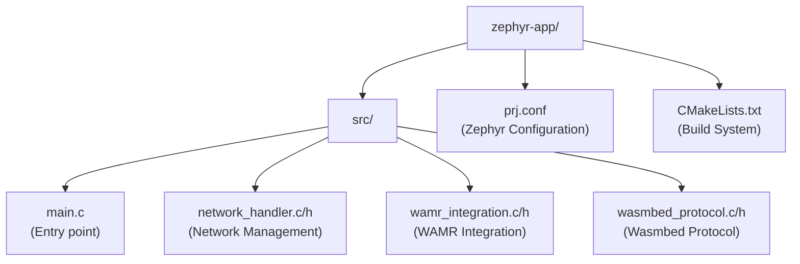

# Zephyr RTOS Firmware Documentation

## Overview

The RETROSPECT Wasmbed firmware is based on Zephyr RTOS and integrates:
- Network stack for TCP/TLS communication
- WAMR runtime for WebAssembly execution
- Wasmbed protocol for gateway communication

## Struttura Codice



## Componenti

### main.c

Application entry point. Responsible for:
- Network stack initialization
- WAMR runtime initialization
- Wasmbed protocol initialization
- Main event loop

### network_handler.c

Zephyr network stack management:

**Main Functions:**
- `network_init()`: Initializes network stack and DHCP
- `network_connect_tls()`: TLS connection to gateway
- `network_send()`: Send data
- `network_receive()`: Receive data
- `network_process()`: Process network events

**Features:**
- Automatic retry for network interface
- Graceful handling of network absence
- TLS support with SNI
- Zephyr Socket API (not POSIX)

### wamr_integration.c

WAMR runtime integration:

**Main Functions:**
- `wamr_init()`: Initializes WAMR runtime
- `wamr_load_module()`: Loads WASM module
- `wamr_instantiate()`: Creates module instance
- `wamr_call_function()`: Executes WASM function
- `wamr_process()`: Runtime processing
- `wamr_cleanup()`: Resource cleanup

**Configuration:**
- Static heap buffer: 64KB
- Stack size: 64KB per instance
- Multi-module support

### wasmbed_protocol.c

Wasmbed communication protocol:

**Main Functions:**
- `wasmbed_protocol_init()`: Initializes protocol
- `wasmbed_protocol_handle_message()`: Handles incoming messages
- `wasmbed_protocol_send_message()`: Sends messages

**Features:**
- Gateway endpoint reading from memory (0x20001000)
- Endpoint parsing (host:port)
- Automatic TLS connection
- CBOR message handling

## Configuration

### prj.conf

Zephyr configuration based on working `dhcpv4_client` sample:

**Network:**
- `CONFIG_NETWORKING=y`
- `CONFIG_NET_IPV4=y`
- `CONFIG_NET_TCP=y`
- `CONFIG_NET_SOCKETS=y`
- `CONFIG_NET_DHCPV4=y`

**TLS:**
- `CONFIG_MBEDTLS=y`
- `CONFIG_MBEDTLS_BUILTIN=y`
- `CONFIG_NET_SOCKETS_SOCKOPT_TLS=y`

**Logging:**
- `CONFIG_LOG=y`
- `CONFIG_NET_LOG=y`
- `CONFIG_SERIAL=y`
- `CONFIG_UART_INTERRUPT_DRIVEN=y`

**Memory:**
- `CONFIG_HEAP_MEM_POOL_SIZE=8192`

**Notes:**
- `CONFIG_POSIX_API=n` (uses Zephyr socket API)
- MPU enabled (works with dhcpv4_client base)

## Compilation

### Prerequisites

- Zephyr SDK 0.16.5+ installed
- Zephyr workspace configured
- WAMR cloned in `../wamr`
- Python 3.8+ with dependencies (west, pykwalify, pyelftools)

### Build Process

#### For STM32F746G Discovery (Recommended - Ethernet)

```bash
cd zephyr-workspace
source ../.venv/bin/activate
west build -b stm32f746g_disco ../zephyr-app --pristine --build-dir build/stm32f746g_disco
```

Output: `build/stm32f746g_disco/zephyr/zephyr.elf`

#### For FRDM-K64F (Ethernet)

```bash
cd zephyr-workspace
source ../.venv/bin/activate
west build -b frdm_k64f ../zephyr-app --pristine --build-dir build/frdm_k64f
```

Output: `build/frdm_k64f/zephyr/zephyr.elf`

#### For nRF52840 DK

```bash
cd zephyr-workspace
source ../.venv/bin/activate
west build -b nrf52840dk/nrf52840 ../zephyr-app --pristine --build-dir build/nrf52840dk_nrf52840
```

Output: `build/nrf52840dk_nrf52840/zephyr/zephyr.elf`

### Build Output

- `build/<board>/zephyr/zephyr.elf`: Firmware ELF file
- `build/<board>/zephyr/zephyr.bin`: Binary file (for flashing)
- `build/<board>/zephyr/zephyr.hex`: Intel HEX file (for flashing)
- Typical size: ~290KB FLASH, ~121KB RAM (varies by board)

## Supported Platforms

See [MCU_SUPPORT.md](MCU_SUPPORT.md) for complete list of supported MCU types.

### Ethernet-Enabled Boards (Recommended)

1. **STM32F746G Discovery** (`stm32f746g_disco`)
   - Renode platform: `stm32f7_discovery-bb`
   - Network: Ethernet 10/100 Mbps
   - UART: `usart1`

2. **FRDM-K64F** (`frdm_k64f`)
   - Renode platform: `frdm_k64f`
   - Network: Ethernet 10/100 Mbps
   - UART: `uart0`

### WiFi-Enabled Boards

3. **ESP32 DevKitC** (`esp32_devkitc_wroom`)
   - Renode platform: `esp32`
   - Network: WiFi 802.11 b/g/n
   - UART: `uart0`

### Other Supported Boards

- **nRF52840 DK**: BLE only, no Ethernet/WiFi
- **STM32F4 Discovery**: No network support
- **Arduino Nano 33 BLE**: Legacy support


## Execution in Renode

### Renode Scripts

Renode scripts are automatically generated by the API Server. Example structure:

```renode
mach add "device-id"
include @platforms/boards/stm32f7_discovery-bb.repl
showAnalyzer sysbus.usart1

# Ethernet configuration (for Ethernet-enabled boards)
emulation CreateSwitch "ethernet_switch"
emulation CreateTap "tap0" "ethernet_tap"
sysbus.ethernet MAC "00:11:22:33:44:55"
connector Connect sysbus.ethernet ethernet_switch
connector Connect host.ethernet_tap ethernet_switch
host.ethernet_tap Start

# Load firmware
sysbus LoadELF "/firmware/zephyr.elf"

# Set machine
mach set "device-id"

# Start execution
start
```

### UART Output

The firmware emits logs on UART:
- Boot message
- Network initialization
- DHCP IP assignment (for Ethernet boards)
- WAMR initialization
- Protocol initialization
- Gateway connection status
- Application ready

## Debugging

### Log Levels

Configurable in `prj.conf`:
- `CONFIG_LOG_LEVEL_DBG`: Debug messages
- `CONFIG_LOG_LEVEL_INF`: Info messages
- `CONFIG_LOG_LEVEL_WRN`: Warning messages
- `CONFIG_LOG_LEVEL_ERR`: Error messages

### UART Output

Monitor UART in Renode to see:
- Initialization status
- Network errors
- WAMR errors
- Protocol messages
- Gateway connection status

### Common Issues

**Network interface not available:**
- Normal for nRF52840 (no Ethernet)
- Firmware continues without network
- Use Ethernet-enabled boards for network testing

**WAMR heap error:**
- Verify heap buffer size
- Check available memory
- Reduce WASM module size

**TLS connection failed:**
- Verify gateway endpoint in memory (0x20001000)
- Check TLS certificates
- Verify gateway pod is accessible
- Check network connectivity

**Firmware crashes on startup:**
- Verify correct Renode platform is used
- Check firmware is compiled for correct board
- Verify UART configuration matches platform

## Integrazione WAMR

### Initialization

```c
RuntimeInitArgs init_args;
init_args.mem_alloc_type = Alloc_With_Pool;
init_args.mem_alloc_option.pool.heap_buf = wamr_heap_buffer;
init_args.mem_alloc_option.pool.heap_size = WAMR_HEAP_SIZE;
wasm_runtime_full_init(&init_args);
```

### Module Loading

```c
wasm_module_t module = wasm_runtime_load(wasm_bytes, wasm_size, error_buf, sizeof(error_buf));
```

### Execution

```c
wasm_runtime_call_wasm(exec_env, function, argc, argv);
```

## Wasmbed Protocol

### Gateway Endpoint Memory

Gateway endpoint is written to memory at `0x20001000`:
- Bytes 0-3: Length (uint32_t, little-endian)
- Bytes 4+: Endpoint string ("host:port", null-terminated)

Example: `"10.42.0.44:8081"` (15 bytes)
- Length: `0x0F` (15)
- String: `"10.42.0.44:8081"`

### Message Format

- **Transport**: TLS 1.3
- **Serialization**: CBOR (Compact Binary Object Representation)
- **Message Types**: ClientMessage / ServerMessage
- **Authentication**: Ed25519 public key signatures

### Message Flow

1. Device connects to gateway via TLS
2. Device sends enrollment request with public key
3. Gateway authenticates and registers device
4. Gateway sends WASM deployment messages
5. Device loads and executes WASM via WAMR
6. Device sends execution results/status to gateway

## Additional Resources

- [Zephyr RTOS Documentation](https://docs.zephyrproject.org/)
- [WAMR Documentation](https://github.com/bytecodealliance/wasm-micro-runtime)
- [TLS Connection Guide](TLS_CONNECTION.md)
- [MCU Support](MCU_SUPPORT.md)
- [Real Device Integration](REAL_DEVICE_INTEGRATION.md)
