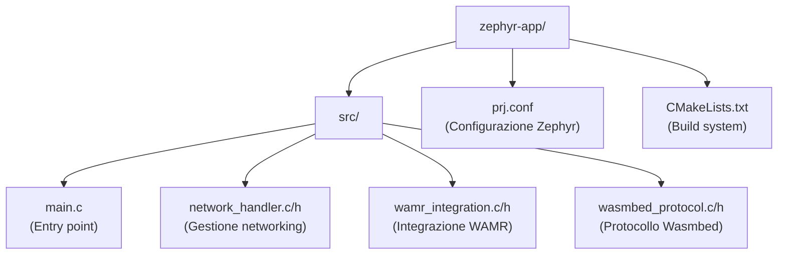

# Firmware Zephyr - Documentazione

## Panoramica

Il firmware Wasmbed è basato su Zephyr RTOS e integra:
- Network stack per comunicazione TCP/TLS
- WAMR runtime per esecuzione WebAssembly
- Protocollo Wasmbed per comunicazione con gateway

## Struttura Codice



## Componenti

### main.c

Entry point dell'applicazione. Responsabile di:
- Inizializzazione network stack
- Inizializzazione WAMR runtime
- Inizializzazione protocollo Wasmbed
- Main loop per gestione eventi

### network_handler.c

Gestione stack di rete Zephyr:

**Funzioni principali:**
- `network_init()`: Inizializza network stack e DHCP
- `network_connect_tls()`: Connessione TLS al gateway
- `network_send()`: Invio dati
- `network_receive()`: Ricezione dati
- `network_process()`: Processamento eventi network

**Caratteristiche:**
- Retry automatico per interfaccia network
- Gestione graceful dell'assenza di network
- Supporto TLS con SNI
- Socket API Zephyr (non POSIX)

### wamr_integration.c

Integrazione WAMR runtime:

**Funzioni principali:**
- `wamr_init()`: Inizializza runtime WAMR
- `wamr_load_module()`: Carica modulo WASM
- `wamr_instantiate()`: Crea istanza modulo
- `wamr_call_function()`: Esegue funzione WASM
- `wamr_process()`: Processamento runtime
- `wamr_cleanup()`: Cleanup risorse

**Configurazione:**
- Heap buffer statico: 64KB
- Stack size: 64KB per istanza
- Multi-module support

### wasmbed_protocol.c

Protocollo di comunicazione Wasmbed:

**Funzioni principali:**
- `wasmbed_protocol_init()`: Inizializza protocollo
- `wasmbed_protocol_handle_message()`: Gestisce messaggi in arrivo
- `wasmbed_protocol_send_message()`: Invia messaggi

**Caratteristiche:**
- Lettura endpoint gateway da memoria (0x20001000)
- Parsing endpoint (host:port)
- Connessione TLS automatica
- Gestione messaggi CBOR

## Configurazione

### prj.conf

Configurazione Zephyr basata su `dhcpv4_client` sample funzionante:

**Network:**
- `CONFIG_NETWORKING=y`
- `CONFIG_NET_IPV4=y`
- `CONFIG_NET_TCP=y`
- `CONFIG_NET_SOCKETS=y`
- `CONFIG_NET_DHCPV4=y`

**TLS:**
- `CONFIG_MBEDTLS=y`
- `CONFIG_NET_SOCKETS_SOCKOPT_TLS=y`

**Logging:**
- `CONFIG_LOG=y`
- `CONFIG_NET_LOG=y`

**Memory:**
- `CONFIG_HEAP_MEM_POOL_SIZE=8192`

**Note:**
- `CONFIG_POSIX_API=n` (usa socket API Zephyr)
- MPU abilitato (funziona con dhcpv4_client base)

## Compilazione

### Prerequisiti

- Zephyr SDK installato
- Zephyr workspace configurato
- WAMR clonato in `../wamr`

### Build

```bash
cd zephyr-workspace
source ../.env.zephyr
export ZEPHYR_BASE="$PWD/zephyr"
west build -b nrf52840dk/nrf52840 ../zephyr-app
```

### Output

- `build/nrf52840dk/nrf52840/zephyr/zephyr.elf`: Firmware ELF
- Dimensione tipica: ~290KB FLASH, ~121KB RAM

## Piattaforme Supportate

### Arduino Nano 33 BLE (nRF52840)

- **Renode platform**: `arduino_nano_33_ble`
- **MCU**: nRF52840 (ARM Cortex-M4)
- **Network**: Nessuna interfaccia Ethernet fisica (normale)

### STM32F4 Discovery

- **Renode platform**: `stm32f4_discovery`
- **MCU**: STM32F407 (ARM Cortex-M4)


## Esecuzione in Renode

### Script Renode

Script di esempio in `renode-scripts/`:
- `arduino_nano_ble.resc`
- `nrf52840_dk.resc`
- `stm32f4_discovery.resc`

### Comandi Base

```renode
mach add "device"
include @platforms/boards/arduino_nano_33_ble.repl
showAnalyzer sysbus.uart0
sysbus LoadELF "/firmware/zephyr.elf"
mach set "device"
start
```

### Output UART

Il firmware emette log su UART0:
- Boot message
- Network initialization
- WAMR initialization
- Protocol initialization
- Application ready

## Debugging

### Log Levels

Configurabili in `prj.conf`:
- `CONFIG_LOG_LEVEL_DBG`
- `CONFIG_LOG_LEVEL_INF`
- `CONFIG_LOG_LEVEL_WRN`
- `CONFIG_LOG_LEVEL_ERR`

### UART Output

Monitor UART in Renode per vedere:
- Stato inizializzazione
- Errori network
- Errori WAMR
- Messaggi protocollo

### Common Issues

**Network interface non disponibile:**
- Normale su nRF52840 (nessuna Ethernet)
- Firmware continua senza network

**WAMR heap error:**
- Verificare dimensione heap buffer
- Controllare memoria disponibile

**TLS connection failed:**
- Verificare endpoint gateway
- Controllare certificati
- Verificare TCP bridge attivo

## Integrazione WAMR

### Initialization

```c
RuntimeInitArgs init_args;
init_args.mem_alloc_type = Alloc_With_Pool;
init_args.mem_alloc_option.pool.heap_buf = wamr_heap_buffer;
init_args.mem_alloc_option.pool.heap_size = WAMR_HEAP_SIZE;
wasm_runtime_full_init(&init_args);
```

### Module Loading

```c
wasm_module_t module = wasm_runtime_load(wasm_bytes, wasm_size, error_buf, sizeof(error_buf));
```

### Execution

```c
wasm_runtime_call_wasm(exec_env, function, argc, argv);
```

## Protocollo Wasmbed

### Endpoint Memory

Gateway endpoint scritto in memoria a `0x20001000`:
- Bytes 0-3: Length (uint32_t)
- Bytes 4+: Endpoint string ("host:port")

### Message Format

- **Transport**: TLS
- **Serialization**: CBOR
- **Types**: ClientMessage / ServerMessage

### Message Flow

1. Device si connette al gateway via TLS
2. Gateway invia messaggi deployment
3. Device carica ed esegue WASM
4. Device invia risultati/status
