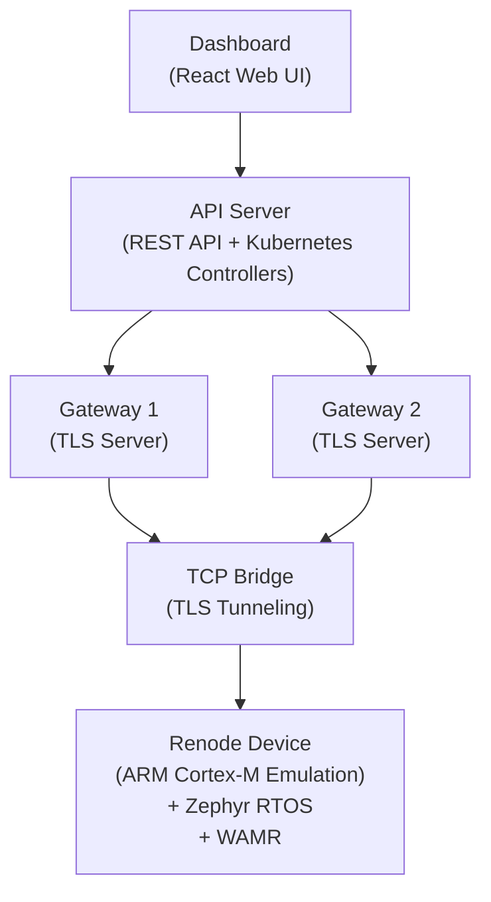
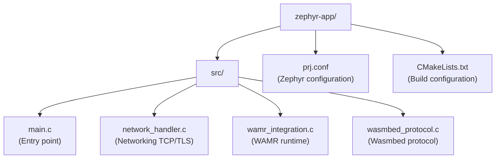

# Wasmbed Platform - Documentation

Kubernetes-native platform for deploying and managing WebAssembly applications on embedded devices using Renode emulation.

## Table of Contents

- [Overview](#overview)
- [Architecture](#architecture)
- [Components](#components)
- [Setup and Deployment](#setup-and-deployment)
- [Firmware](#firmware)
- [Development](#development)
- [Sequence Diagrams](#sequence-diagrams)

## Overview

Wasmbed is a complete platform for deploying and managing WebAssembly applications on ARM Cortex-M embedded devices. The platform uses:

- **Renode**: Hardware emulation for embedded devices
- **Zephyr RTOS**: Real-time operating system for firmware
- **WAMR**: WebAssembly runtime for executing WASM modules
- **Kubernetes**: Orchestration and lifecycle management
- **TLS/CBOR**: Secure communication between devices and gateway

## Architecture

### High-Level Architecture



### Communication Flow

1. **Dashboard** → API Server: Device and application management
2. **API Server** → Gateway: Configuration and deployment
3. **Gateway** → Device (via TCP Bridge): TLS/CBOR communication
4. **Device**: WASM execution via WAMR

## Components

### Component Overview

The Wasmbed platform consists of several components, each with specific responsibilities and deployment locations:

#### 1. API Server (`wasmbed-api-server`)

**What it is:**
A REST API server and Kubernetes controller orchestrator that manages the entire Wasmbed platform lifecycle.

**What it does:**
- Exposes REST API endpoints for device, application, and gateway management
- Integrates with Kubernetes API to manage Custom Resource Definitions (CRDs)
- Coordinates between gateway, device controllers, and infrastructure components
- Provides WebSocket endpoints for real-time monitoring
- Manages device emulation via Renode integration
- Handles application compilation from Rust source code to WebAssembly

**Where it resides:**
- **Architecture location**: **Cloud** (Kubernetes cluster)
- **Source code**: `crates/wasmbed-api-server/`
- **Main entry point**: `crates/wasmbed-api-server/src/main.rs`
- **Deployment**: Kubernetes Deployment in `k8s/deployments/api-server-deployment.yaml`
- **Service**: Kubernetes Service exposing port 8080
- **Container**: Built from `Dockerfile.api-server`
- **Runtime**: Runs as a Kubernetes Pod in the `wasmbed` namespace

**Key Features:**
- REST API on port 8080 (configurable via `WASMBED_API_SERVER_PORT`)
- WebSocket support for real-time updates
- Integration with `wasmbed-qemu-manager` for Renode device management
- Kubernetes client for CRD operations
- Template engine for dashboard rendering

#### 2. Gateway (`wasmbed-gateway`)

**What it is:**
A TLS server that acts as the secure communication endpoint for embedded devices, handling device enrollment, heartbeat monitoring, and WASM module deployment.

**What it does:**
- Accepts TLS 1.3 connections from embedded devices with mutual authentication
- Handles device enrollment and registration
- Manages device heartbeat monitoring (30-second intervals)
- Deploys WASM modules to connected devices
- Maintains local cache for performance optimization
- Provides HTTP API for internal communication with API Server
- Validates device certificates and manages authorization

**Where it resides:**
- **Architecture location**: **Cloud** (Kubernetes cluster)
- **Source code**: `crates/wasmbed-gateway/`
- **Main entry point**: `crates/wasmbed-gateway/src/main.rs`
- **Modules**: 
  - `enrollment.rs`: Device enrollment logic
  - `heartbeat.rs`: Heartbeat monitoring
  - `deployment.rs`: WASM module deployment
  - `tls_server.rs`: TLS server implementation
  - `http_api.rs`: HTTP API for internal communication
  - `local_cache.rs`: Local caching using Sled database
- **Deployment**: Kubernetes Deployment in `k8s/deployments/wasmbed-deployments.yaml`
- **Service**: Kubernetes Service exposing TLS port (default 40029) and HTTP port (8080)
- **Container**: Built from `Dockerfile.gateway`
- **Runtime**: Runs as a Kubernetes Pod in the `wasmbed` namespace

**Key Features:**
- TLS 1.3 server with client certificate authentication
- CBOR message serialization
- Device capability validation
- WASM module validation and deployment
- Local cache using Sled embedded database
- Kubernetes integration for device status updates

#### 3. QEMU Manager (`wasmbed-qemu-manager`)

**What it is:**
A component that manages Renode emulation instances for embedded devices (previously named QEMU Manager, now uses Renode).

**What it does:**
- Starts and stops Renode emulation containers
- Configures TCP bridge connections between emulated devices and gateway
- Loads Zephyr firmware ELF files into Renode
- Generates Renode scripts (.resc) for device configuration
- Manages device lifecycle (start, stop, restart)
- Handles Docker container operations for Renode instances

**Where it resides:**
- **Architecture location**: **Cloud** (Kubernetes cluster, executes within API Server)
- **Source code**: `crates/wasmbed-qemu-manager/`
- **Main entry point**: `crates/wasmbed-qemu-manager/src/lib.rs` (library, used by API Server)
- **Integration**: Called by `wasmbed-api-server` for device management
- **Runtime**: Executes as part of API Server process, managing Docker containers

**Key Features:**
- Docker integration for Renode containerization
- TCP bridge configuration for network tunneling
- Support for multiple MCU types (nRF52840, STM32F4, etc.)
- Renode script generation
- Firmware loading and device initialization

#### 4. TCP Bridge (`wasmbed-tcp-bridge`)

**What it is:**
A TCP tunneling component that bridges network connections between emulated devices running in Renode and the gateway service.

**What it does:**
- Creates TCP tunnels between Renode device network interfaces and gateway
- Forwards TLS traffic end-to-end between device and gateway
- Manages multiple concurrent connections
- Handles connection lifecycle (establish, maintain, teardown)

**Where it resides:**
- **Architecture location**: **Cloud** (Kubernetes cluster, runs as separate process or sidecar)
- **Source code**: `crates/wasmbed-tcp-bridge/`
- **Main entry point**: `crates/wasmbed-tcp-bridge/src/main.rs`
- **Integration**: Used by `wasmbed-qemu-manager` to establish network connections
- **Runtime**: Runs as a separate process or sidecar container, managed by QEMU Manager

**Key Features:**
- TCP port forwarding
- Connection multiplexing
- TLS passthrough (does not terminate TLS, only tunnels)
- Automatic reconnection on failure

#### 5. Device Controller (`wasmbed-device-controller`)

**What it is:**
A Kubernetes controller that watches Device CRD resources and reconciles device state.

**What it does:**
- Watches for Device CRD creation, updates, and deletions
- Triggers Renode device startup when Device is created
- Updates Device status based on device connectivity
- Manages device lifecycle in coordination with QEMU Manager
- Handles device state transitions (Pending → Connected → Disconnected)

**Where it resides:**
- **Architecture location**: **Cloud** (Kubernetes cluster)
- **Source code**: `crates/wasmbed-device-controller/`
- **Main entry point**: `crates/wasmbed-device-controller/src/main.rs`
- **Deployment**: Kubernetes Deployment in `k8s/deployments/wasmbed-deployments.yaml`
- **RBAC**: Permissions defined in `k8s/rbac/device-controller-rbac.yaml`
- **Container**: Built from `Dockerfile.device-controller`
- **Runtime**: Runs as a Kubernetes Pod in the `wasmbed` namespace

**Key Features:**
- Kubernetes controller pattern implementation
- CRD watch and reconciliation
- Integration with API Server for device management
- Status update propagation

#### 6. Application Controller (`wasmbed-application-controller`)

**What it is:**
A Kubernetes controller that watches Application CRD resources and manages application deployment to devices.

**What it does:**
- Watches for Application CRD creation and updates
- Coordinates application deployment to target devices
- Validates WASM module format and compatibility
- Updates Application status based on deployment progress
- Manages application lifecycle (Pending → Deployed → Running)

**Where it resides:**
- **Architecture location**: **Cloud** (Kubernetes cluster)
- **Source code**: `crates/wasmbed-application-controller/`
- **Main entry point**: `crates/wasmbed-application-controller/src/main.rs`
- **Deployment**: Kubernetes Deployment in `k8s/deployments/wasmbed-deployments.yaml`
- **RBAC**: Permissions defined in `k8s/rbac/application-controller-rbac.yaml`
- **Container**: Built from `Dockerfile.application-controller`
- **Runtime**: Runs as a Kubernetes Pod in the `wasmbed` namespace

**Key Features:**
- Application deployment orchestration
- WASM module validation
- Target device selection and validation
- Deployment status tracking

#### 7. Gateway Controller (`wasmbed-gateway-controller`)

**What it is:**
A Kubernetes controller that watches Gateway CRD resources and manages gateway instances.

**What it does:**
- Watches for Gateway CRD creation and updates
- Manages gateway instance lifecycle
- Coordinates gateway scaling and configuration
- Updates Gateway status based on gateway health

**Where it resides:**
- **Architecture location**: **Cloud** (Kubernetes cluster)
- **Source code**: `crates/wasmbed-gateway-controller/`
- **Main entry point**: `crates/wasmbed-gateway-controller/src/main.rs`
- **Deployment**: Kubernetes Deployment in `k8s/deployments/wasmbed-deployments.yaml`
- **RBAC**: Permissions defined in `k8s/rbac/gateway-controller-rbac.yaml`
- **Container**: Built from `Dockerfile.gateway-controller`
- **Runtime**: Runs as a Kubernetes Pod in the `wasmbed` namespace

#### 8. Dashboard (`dashboard-react`)

**What it is:**
A React-based web application that provides a user interface for managing devices, applications, and monitoring the Wasmbed platform.

**What it does:**
- Provides web UI for device management (create, view, delete devices)
- Enables application creation and deployment
- Displays real-time monitoring and status information
- Shows device health, application execution status, and metrics
- Allows Rust source code compilation to WebAssembly
- Provides WebSocket-based real-time updates

**Where it resides:**
- **Architecture location**: **Cloud** (Kubernetes cluster)
- **Source code**: `dashboard-react/`
- **Entry point**: `dashboard-react/src/App.js` or `dashboard-react/src/index.js`
- **Build output**: `dashboard-react/build/` (static files)
- **Deployment**: Kubernetes Deployment in `k8s/deployments/dashboard-deployment.yaml`
- **Service**: Kubernetes Service exposing port 3000
- **Container**: Built from `Dockerfile.dashboard`
- **Runtime**: Runs as a Kubernetes Pod in the `wasmbed` namespace, serves static files via HTTP server

**Key Features:**
- React-based single-page application
- REST API integration with API Server
- WebSocket support for real-time updates
- Device and application management UI
- Monitoring dashboards

#### 9. Firmware (`zephyr-app`)

**What it is:**
The embedded firmware that runs on emulated devices, based on Zephyr RTOS with WAMR integration.

**What it does:**
- Initializes Zephyr network stack (TCP/TLS support)
- Establishes TLS connection to gateway
- Handles device enrollment with gateway
- Sends periodic heartbeat messages
- Receives and loads WASM modules from gateway
- Executes WASM modules using WAMR runtime
- Sends execution results and status updates back to gateway

**Where it resides:**
- **Architecture location**: **End Device** (emulated in Renode, runs on ARM Cortex-M4 or other supported MCU)
- **Source code**: `zephyr-app/`
- **Main entry point**: `zephyr-app/src/main.c`
- **Components**:
  - `zephyr-app/src/network_handler.c/h`: Network stack management
  - `zephyr-app/src/wamr_integration.c/h`: WAMR runtime integration
  - `zephyr-app/src/wasmbed_protocol.c/h`: Wasmbed protocol handler
- **Configuration**: `zephyr-app/prj.conf` (Zephyr build configuration)
- **Build system**: `zephyr-app/CMakeLists.txt`
- **Build output**: `zephyr-workspace/build/<board>/zephyr/zephyr.elf`
- **Runtime**: Loaded into Renode emulation, runs on ARM Cortex-M4 (or other supported MCU)

**Key Features:**
- Zephyr RTOS v4.3.0
- Network stack with DHCP support
- TLS 1.3 client with certificate authentication
- WAMR runtime v2.4.3 for WASM execution
- CBOR message parsing and generation
- Memory-constrained execution environment

### Supporting Libraries and Utilities

#### Protocol Library (`wasmbed-protocol`)

**What it is:**
A library defining the CBOR-based communication protocol between devices and gateway.

**Where it resides:**
- **Architecture location**: **Cloud** (used by Gateway) and **End Device** (used by firmware)
- **Source code**: `crates/wasmbed-protocol/`
- **Usage**: Used by both `wasmbed-gateway` (Cloud) and firmware (End Device)

#### Types Library (`wasmbed-types`)

**What it is:**
Shared type definitions used across Wasmbed components.

**Where it resides:**
- **Architecture location**: **Cloud** (used by all cloud components)
- **Source code**: `crates/wasmbed-types/`

#### Kubernetes Resource Library (`wasmbed-k8s-resource`)

**What it is:**
Library defining Kubernetes Custom Resource Definitions (Device, Application, Gateway).

**Where it resides:**
- **Architecture location**: **Cloud** (used by all Kubernetes components)
- **Source code**: `crates/wasmbed-k8s-resource/`
- **CRD definitions**: `k8s/crds/`

#### Certificate Management (`wasmbed-cert`)

**What it is:**
Library for TLS certificate management and validation.

**Where it resides:**
- **Architecture location**: **Cloud** (used by Gateway and API Server)
- **Source code**: `crates/wasmbed-cert/`
- **Certificates**: `certs/` directory

#### Configuration (`wasmbed-config`)

**What it is:**
Configuration management library.

**Where it resides:**
- **Architecture location**: **Cloud** (used by all cloud components)
- **Source code**: `crates/wasmbed-config/`
- **Config file**: `config/wasmbed-config.yaml`

### Infrastructure Components

#### Renode Sidecar (`wasmbed-renode-sidecar`)

**What it is:**
A sidecar container that runs alongside Renode to provide additional functionality.

**Where it resides:**
- **Source code**: `crates/wasmbed-renode-sidecar/`

#### Infrastructure Manager (`wasmbed-infrastructure`)

**What it is:**
Component for managing infrastructure resources.

**Where it resides:**
- **Source code**: `crates/wasmbed-infrastructure/`

## Setup and Deployment

### Prerequisites

- Kubernetes cluster
- Docker
- Rust toolchain
- Zephyr SDK (for firmware compilation)

### Quick Start

```bash
# 1. Setup environment
./scripts/setup-zephyr-workspace.sh

# 2. Build components
./scripts/02-build-components.sh

# 3. Deploy infrastructure
./scripts/03-deploy-infrastructure.sh

# 4. Verify status
./scripts/04-check-system-status.sh
```

### Configuration

The main configuration file is `config/wasmbed-config.yaml`.

### Kubernetes Deployment

Kubernetes manifests are located in `k8s/`:

- `k8s/crds/`: Custom Resource Definitions
- `k8s/deployments/`: Component deployments
- `k8s/rbac/`: Permissions and authorizations
- `k8s/namespace.yaml`: Wasmbed namespace

## Firmware

### Structure



### Compilation

```bash
cd zephyr-workspace
source ../.env.zephyr
west build -b nrf52840dk/nrf52840 ../zephyr-app
```

### Firmware Components

1. **Network Handler**: Zephyr network stack management
   - Interface initialization
   - TCP/TLS connection
   - Send/Receive data

2. **WAMR Integration**: WebAssembly runtime
   - Runtime initialization
   - WASM module loading
   - WASM function execution

3. **Wasmbed Protocol**: Communication protocol handler
   - Gateway endpoint reading
   - CBOR message handling
   - WASM deployment

### Supported Platforms

- **Arduino Nano 33 BLE** (nRF52840)
- **STM32F4 Discovery**
- **Arduino Uno R4**

All platforms use Renode for emulation.

## Development

### Repository Structure

```mermaid
graph TD
    Root["retrospect/"]
    Crates["crates/<br/>(Rust Components)"]
    ZephyrApp["zephyr-app/<br/>(Zephyr Firmware)"]
    ZephyrWS["zephyr-workspace/<br/>(Zephyr Workspace)"]
    ZephyrSDK["zephyr-sdk-0.16.5/<br/>(Zephyr SDK)"]
    WAMR["wamr/<br/>(WAMR runtime submodule)"]
    K8s["k8s/<br/>(Kubernetes Manifests)"]
    Scripts["scripts/<br/>(Utility Scripts)"]
    RenodeScripts["renode-scripts/<br/>(Renode Scripts .resc)"]
    Config["config/<br/>(Configuration Files)"]
    Certs["certs/<br/>(TLS Certificates)"]
    Dashboard["dashboard-react/<br/>(React Dashboard)"]
    Doc["doc/<br/>(Documentation)"]
    Dockerfiles["Dockerfile.*<br/>(Component Dockerfiles)"]
    QemuDevices["qemu_devices.json<br/>(Device State)"]
    
    Root --> Crates
    Root --> ZephyrApp
    Root --> ZephyrWS
    Root --> ZephyrSDK
    Root --> WAMR
    Root --> K8s
    Root --> Scripts
    Root --> RenodeScripts
    Root --> Config
    Root --> Certs
    Root --> Dashboard
    Root --> Doc
    Root --> Dockerfiles
    Root --> QemuDevices
```



**Main directories:**
- `crates/`: Rust components of the system
- `zephyr-app/`: Zephyr RTOS firmware with WAMR
- `zephyr-workspace/`: Zephyr workspace (cloned from repository)
- `zephyr-sdk-0.16.5/`: Zephyr SDK for firmware compilation
- `wamr/`: WAMR runtime (Git submodule)
- `k8s/`: Kubernetes manifests (CRDs, deployments, RBAC)
- `scripts/`: Utility scripts for setup, build, deploy
- `renode-scripts/`: Renode scripts (.resc) for device emulation
- `config/`: Configuration files (wasmbed-config.yaml)
- `certs/`: TLS certificates (CA, server, client)
- `dashboard-react/`: React web dashboard
- `doc/`: System documentation

**Root files:**
- `qemu_devices.json`: Emulated device state (runtime-generated)
- `Dockerfile.*`: Dockerfiles for component container builds
- `Cargo.toml`, `Cargo.lock`: Rust workspace

**Generated directories (not in repository):**
- `target/`: Rust build artifacts (generated by `cargo build`)
- `.venv/`: Python virtualenv (generated by setup script)
- `logs/`: Temporary logs (generated at runtime)

### Build

```bash
# Build Rust components
cargo build --release

# Build firmware
./scripts/build-zephyr-app.sh
```

### Testing

```bash
# Test complete workflow
./scripts/09-test-workflows.sh

# Test dashboard
./scripts/10-test-dashboard.sh

# Test Renode
./scripts/11-test-renode-dashboard.sh
```

### Useful Scripts

- `06-master-control.sh`: Main control (deploy/stop/status)
- `quick-setup.sh`: Quick complete setup
- `build-zephyr-app.sh`: Firmware compilation
- `test-firmware-complete.sh`: Complete firmware test

## Communication

### Protocol

The communication protocol uses:
- **Transport**: TLS 1.3
- **Serialization**: CBOR
- **Messages**: ClientMessage / ServerMessage

### Endpoints

- **Gateway TLS**: Configurable port (default 40029)
- **API Server**: Port 8080
- **Dashboard**: Port 3000

## Troubleshooting

### Firmware doesn't start in Renode

1. Verify firmware is compiled correctly
2. Check UART logs in Renode
3. Verify Renode script configuration

### Gateway doesn't connect

1. Verify TLS certificates
2. Check endpoint configuration
3. Verify TCP bridge is active

### WASM doesn't execute

1. Verify WAMR is initialized
2. Check WASM module format
3. Verify firmware logs

## Sequence Diagrams

For a detailed description of communication flows and interactions between components, see [SEQUENCE_DIAGRAMS.md](./SEQUENCE_DIAGRAMS.md).

The document contains sequence diagrams in Mermaid format for:
- Device Enrollment (complete workflow, simplified, initialization, heartbeat)
- Application Deployment (complete workflow, simplified, compilation, execution)
- Error Handling (error handling for enrollment, connection, deployment, runtime)

## License

AGPL-3.0
