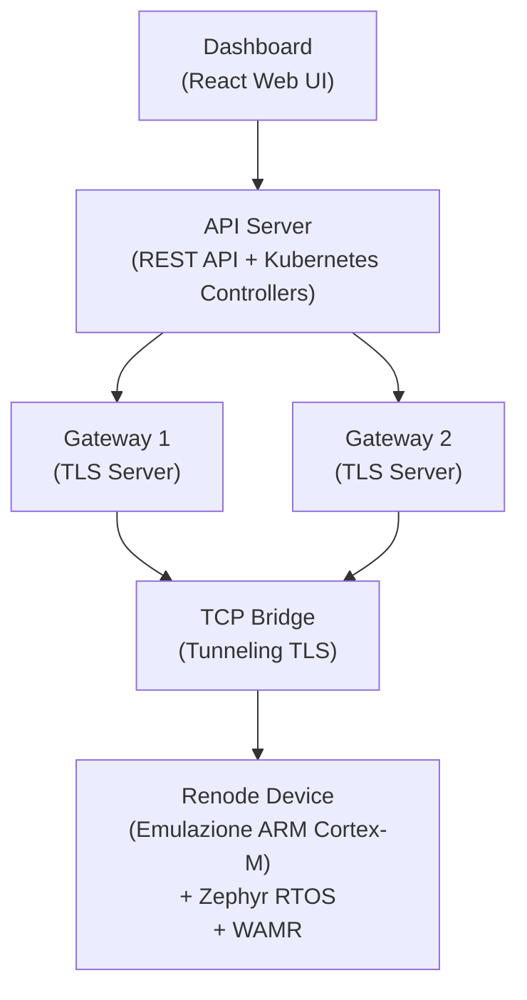
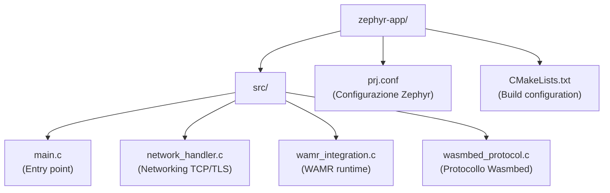

# Wasmbed Platform - Documentazione

Piattaforma Kubernetes-native per il deployment di applicazioni WebAssembly su dispositivi embedded con emulazione Renode.

## Indice

- [Panoramica](#panoramica)
- [Architettura](#architettura)
- [Componenti](#componenti)
- [Setup e Deployment](#setup-e-deployment)
- [Firmware](#firmware)
- [Sviluppo](#sviluppo)

## Panoramica

Wasmbed è una piattaforma completa per il deployment e la gestione di applicazioni WebAssembly su dispositivi embedded ARM Cortex-M. La piattaforma utilizza:

- **Renode**: Emulazione hardware per dispositivi embedded
- **Zephyr RTOS**: Sistema operativo real-time per il firmware
- **WAMR**: Runtime WebAssembly per l'esecuzione di moduli WASM
- **Kubernetes**: Orchestrazione e gestione del ciclo di vita
- **TLS/CBOR**: Comunicazione sicura tra dispositivi e gateway

## Architettura



### Flusso di Comunicazione

1. **Dashboard** → API Server: Gestione dispositivi e applicazioni
2. **API Server** → Gateway: Configurazione e deployment
3. **Gateway** → Dispositivo (via TCP Bridge): Comunicazione TLS/CBOR
4. **Dispositivo**: Esecuzione WASM tramite WAMR

## Componenti

### Backend (Rust)

#### Core Components

- **`wasmbed-api-server`**: Server REST API e Kubernetes controllers
  - Gestione dispositivi (Device CRD)
  - Gestione applicazioni (Application CRD)
  - Gestione gateway (Gateway CRD)
  - Monitoring e status

- **`wasmbed-gateway`**: Gateway TLS per comunicazione con dispositivi
  - Server TLS con autenticazione client
  - Gestione heartbeat
  - Deployment WASM
  - Comunicazione CBOR

- **`wasmbed-qemu-manager`**: Gestione emulazione Renode
  - Avvio/stop dispositivi Renode
  - Configurazione TCP bridge
  - Gestione firmware Zephyr

- **`wasmbed-tcp-bridge`**: Bridge TCP per tunneling TLS
  - Connessione tra dispositivo emulato e gateway
  - Tunneling TLS end-to-end

#### Kubernetes Controllers

- **`wasmbed-device-controller`**: Controller per Device CRD
- **`wasmbed-application-controller`**: Controller per Application CRD
- **`wasmbed-gateway-controller`**: Controller per Gateway CRD

#### Utilities

- **`wasmbed-protocol`**: Protocollo CBOR per comunicazione
- **`wasmbed-types`**: Tipi condivisi
- **`wasmbed-config`**: Gestione configurazione
- **`wasmbed-cert`**: Gestione certificati TLS
- **`wasmbed-wasm-runtime`**: Runtime WASM per testing

### Frontend

- **`dashboard-react`**: Dashboard web React
  - Gestione dispositivi
  - Deployment applicazioni
  - Monitoring real-time

### Firmware

- **`zephyr-app`**: Applicazione Zephyr RTOS
  - Network stack (TCP/TLS)
  - Integrazione WAMR
  - Protocollo Wasmbed
  - Esecuzione moduli WASM

## Setup e Deployment

### Prerequisiti

- Kubernetes cluster
- Docker
- Rust toolchain
- Zephyr SDK (per compilazione firmware)

### Quick Start

```bash
# 1. Setup ambiente
./scripts/setup-zephyr-workspace.sh

# 2. Build componenti
./scripts/02-build-components.sh

# 3. Deploy infrastruttura
./scripts/03-deploy-infrastructure.sh

# 4. Verifica stato
./scripts/04-check-system-status.sh
```

### Configurazione

Il file di configurazione principale è `config/wasmbed-config.yaml`.

### Deployment Kubernetes

I manifest Kubernetes si trovano in `k8s/`:

- `k8s/crds/`: Custom Resource Definitions
- `k8s/deployments/`: Deployment dei componenti
- `k8s/rbac/`: Permessi e autorizzazioni
- `k8s/namespace.yaml`: Namespace Wasmbed

## Firmware

### Struttura



### Compilazione

```bash
cd zephyr-workspace
source ../.env.zephyr
west build -b nrf52840dk/nrf52840 ../zephyr-app
```

### Componenti Firmware

1. **Network Handler**: Gestione stack di rete Zephyr
   - Inizializzazione interfaccia
   - Connessione TCP/TLS
   - Send/Receive dati

2. **WAMR Integration**: Runtime WebAssembly
   - Inizializzazione runtime
   - Caricamento moduli WASM
   - Esecuzione funzioni WASM

3. **Wasmbed Protocol**: Protocollo di comunicazione
   - Lettura endpoint gateway
   - Gestione messaggi CBOR
   - Deployment WASM

### Piattaforme Supportate

- **Arduino Nano 33 BLE** (nRF52840)
- **STM32F4 Discovery**
- **Arduino Uno R4**

Tutte le piattaforme utilizzano Renode per l'emulazione.

## Sviluppo

### Struttura Repository

```mermaid
graph TD
    Root["retrospect/"]
    Crates["crates/<br/>(Componenti Rust)"]
    ZephyrApp["zephyr-app/<br/>(Firmware Zephyr)"]
    ZephyrWS["zephyr-workspace/<br/>(Workspace Zephyr)"]
    ZephyrSDK["zephyr-sdk-0.16.5/<br/>(Zephyr SDK)"]
    WAMR["wamr/<br/>(WAMR runtime submodule)"]
    K8s["k8s/<br/>(Manifest Kubernetes)"]
    Scripts["scripts/<br/>(Script di utilità)"]
    RenodeScripts["renode-scripts/<br/>(Script Renode .resc)"]
    Config["config/<br/>(File di configurazione)"]
    Certs["certs/<br/>(Certificati TLS)"]
    Dashboard["dashboard-react/<br/>(Dashboard React)"]
    Doc["doc/<br/>(Documentazione)"]
    Dockerfiles["Dockerfile.*<br/>(Dockerfiles componenti)"]
    QemuDevices["qemu_devices.json<br/>(Stato dispositivi)"]
    
    Root --> Crates
    Root --> ZephyrApp
    Root --> ZephyrWS
    Root --> ZephyrSDK
    Root --> WAMR
    Root --> K8s
    Root --> Scripts
    Root --> RenodeScripts
    Root --> Config
    Root --> Certs
    Root --> Dashboard
    Root --> Doc
    Root --> Dockerfiles
    Root --> QemuDevices
```



**Cartelle principali:**
- `crates/`: Componenti Rust del sistema
- `zephyr-app/`: Firmware Zephyr RTOS con WAMR
- `zephyr-workspace/`: Workspace Zephyr (clonato da repository)
- `zephyr-sdk-0.16.5/`: Zephyr SDK per compilazione firmware
- `wamr/`: WAMR runtime (submodule Git)
- `k8s/`: Manifest Kubernetes (CRDs, deployments, RBAC)
- `scripts/`: Script di utilità per setup, build, deploy
- `renode-scripts/`: Script Renode (.resc) per emulazione dispositivi
- `config/`: File di configurazione (wasmbed-config.yaml)
- `certs/`: Certificati TLS (CA, server, client)
- `dashboard-react/`: Dashboard web React
- `doc/`: Documentazione del sistema

**File nella root:**
- `qemu_devices.json`: Stato dispositivi emulati (generato runtime)
- `Dockerfile.*`: Dockerfiles per build container dei componenti
- `Cargo.toml`, `Cargo.lock`: Workspace Rust

**Cartelle generate (non in repository):**
- `target/`: Build artifacts Rust (generata da `cargo build`)
- `.venv/`: Virtualenv Python (generata da setup script)
- `logs/`: Log temporanei (generata runtime)

### Build

```bash
# Build Rust components
cargo build --release

# Build firmware
./scripts/build-zephyr-app.sh
```

### Testing

```bash
# Test completo workflow
./scripts/09-test-workflows.sh

# Test dashboard
./scripts/10-test-dashboard.sh

# Test Renode
./scripts/11-test-renode-dashboard.sh
```

### Script Utili

- `06-master-control.sh`: Controllo principale (deploy/stop/status)
- `quick-setup.sh`: Setup rapido completo
- `build-zephyr-app.sh`: Compilazione firmware
- `test-firmware-complete.sh`: Test firmware completo

## Comunicazione

### Protocollo

Il protocollo di comunicazione utilizza:
- **Transport**: TLS 1.3
- **Serialization**: CBOR
- **Messages**: ClientMessage / ServerMessage

### Endpoint

- **Gateway TLS**: Porta configurabile (default 40029)
- **API Server**: Porta 8080
- **Dashboard**: Porta 3000

## Troubleshooting

### Firmware non si avvia in Renode

1. Verificare che il firmware sia compilato correttamente
2. Controllare i log UART in Renode
3. Verificare configurazione Renode script

### Gateway non si connette

1. Verificare certificati TLS
2. Controllare configurazione endpoint
3. Verificare TCP bridge attivo

### WASM non si esegue

1. Verificare che WAMR sia inizializzato
2. Controllare formato modulo WASM
3. Verificare log firmware

## Licenza

AGPL-3.0
