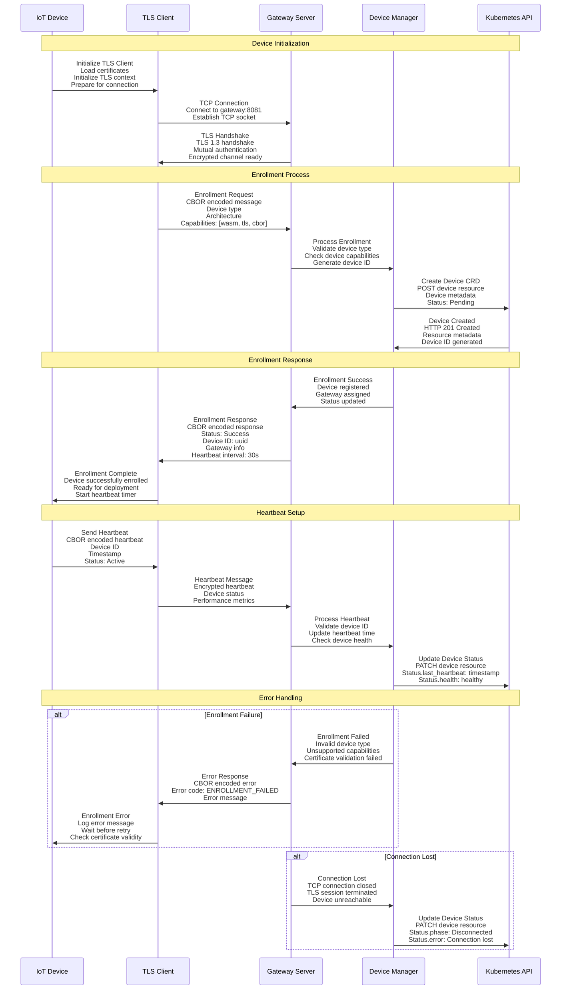
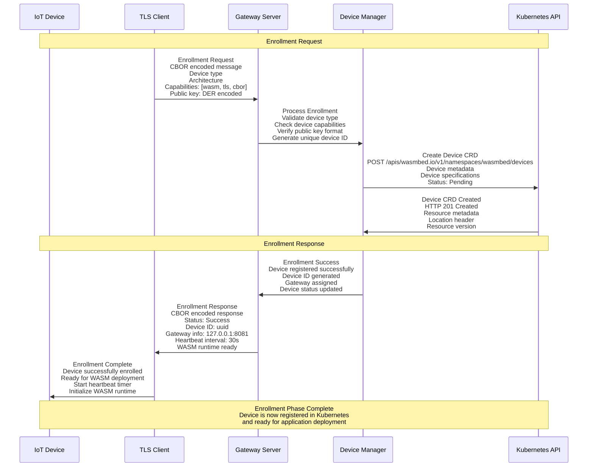
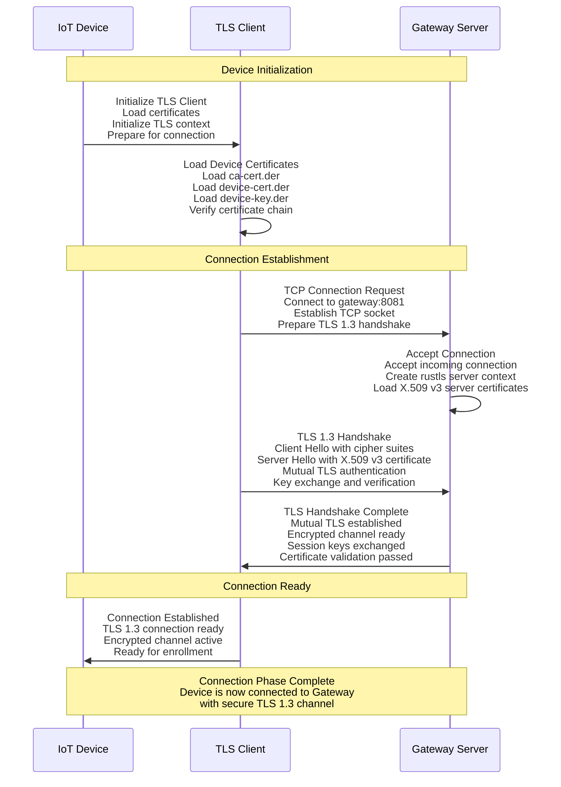
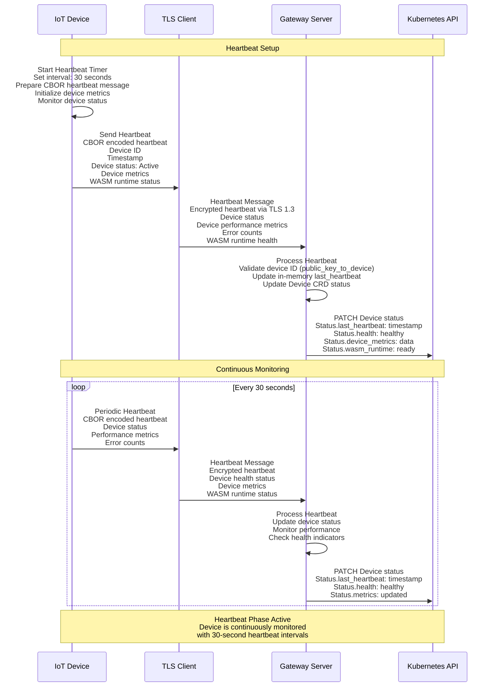
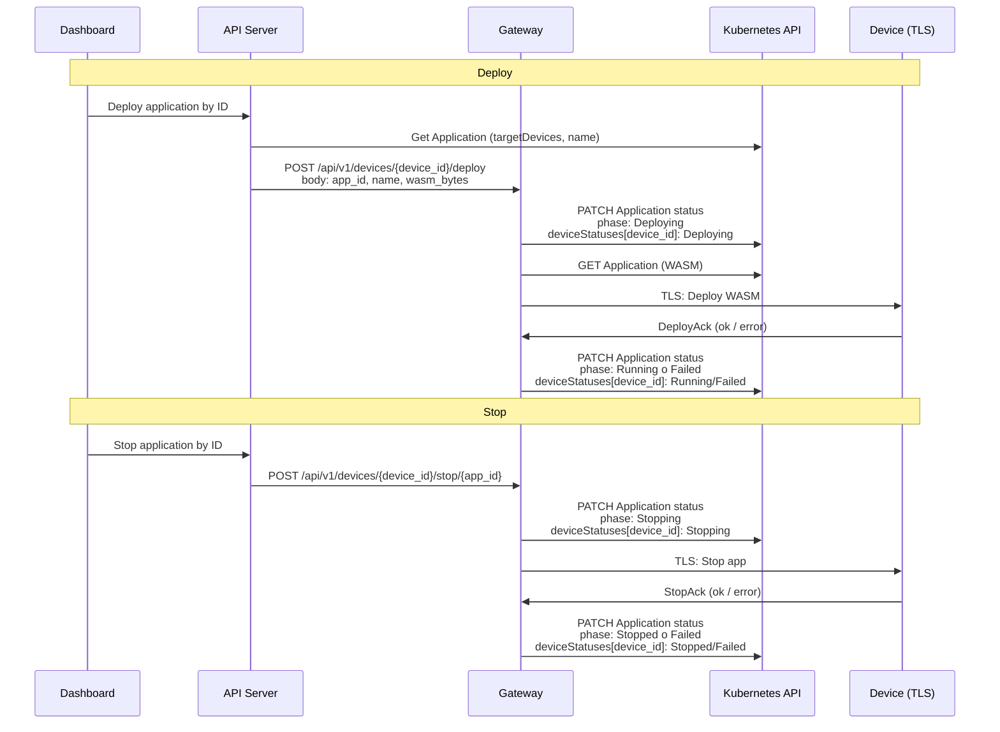
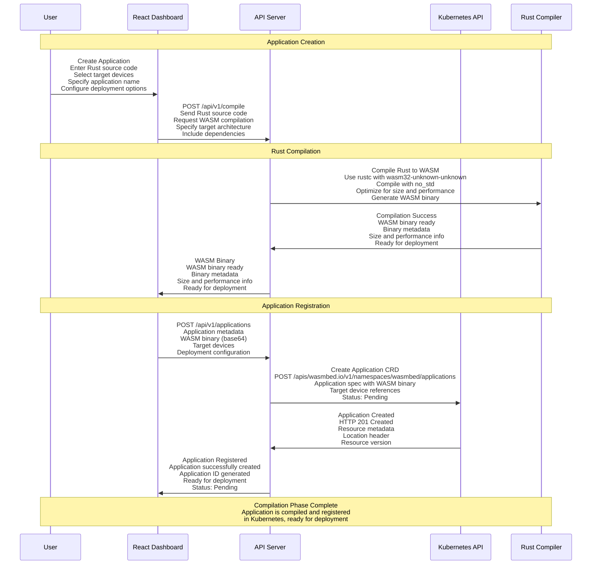
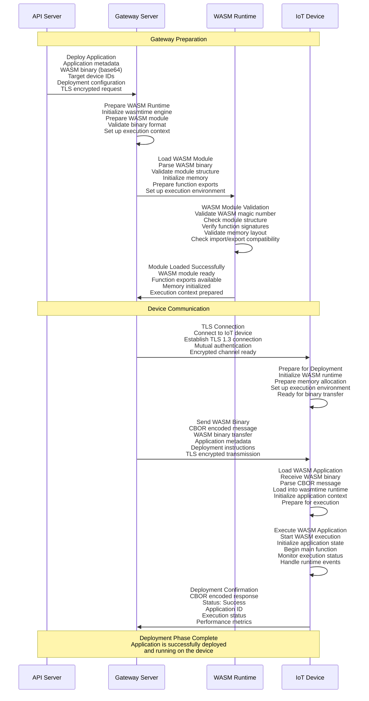
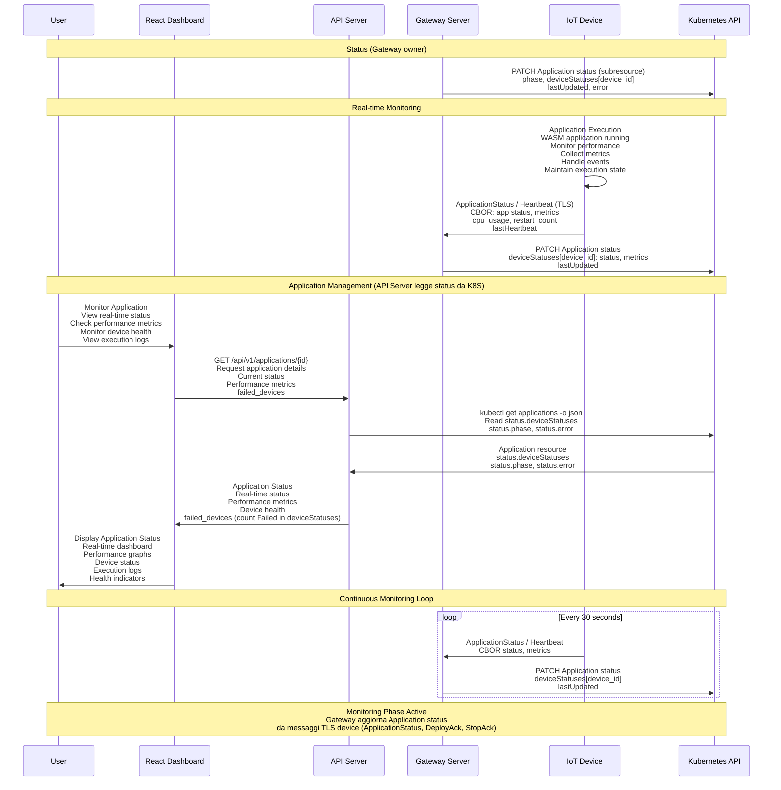
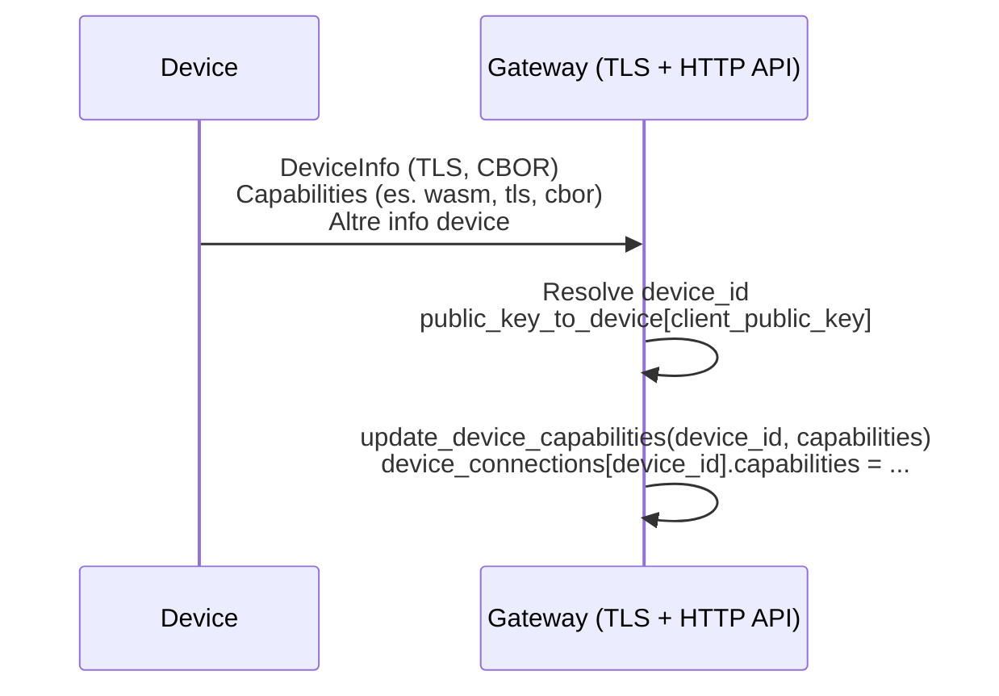
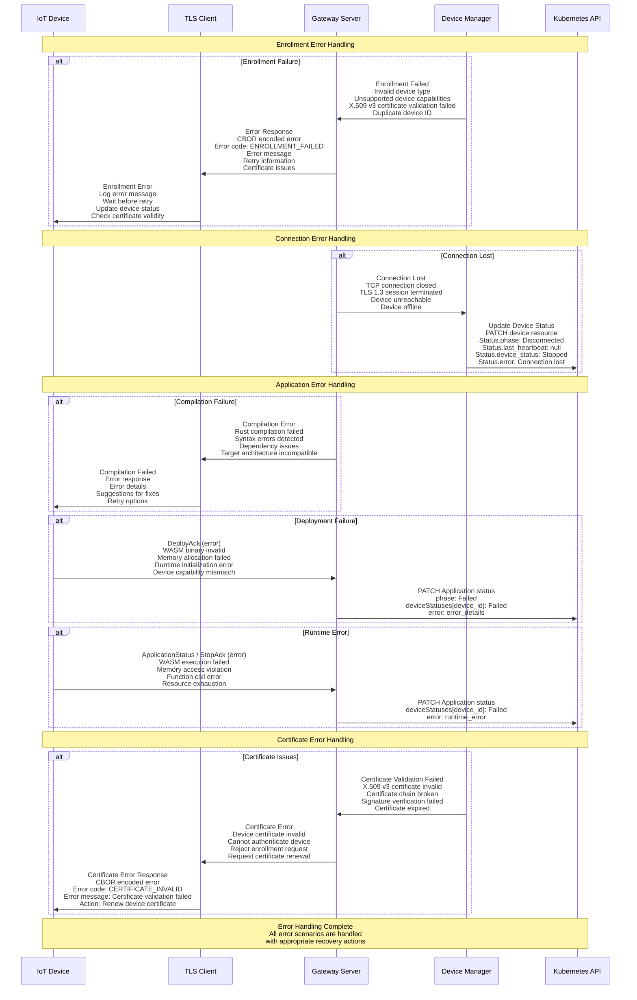

# Sequence Diagrams - Wasmbed Platform

Questo documento contiene tutti i sequence diagram che descrivono i flussi di comunicazione e le interazioni tra i componenti della piattaforma Wasmbed.

## Indice

1. [Device Enrollment](#device-enrollment)
   - [Workflow Completo](#device-enrollment-completo)
   - [Workflow Semplificato](#device-enrollment-semplificato)
   - [Processo di Enrollment](#processo-di-enrollment)
   - [Inizializzazione e Connessione](#inizializzazione-e-connessione)
   - [Heartbeat e Monitoring](#heartbeat-e-monitoring)
2. [Application Deployment](#application-deployment)
   - [Workflow Completo](#application-deployment-completo)
   - [Workflow Semplificato](#application-deployment-semplificato)
   - [Deploy e Stop (API Server → Gateway)](#deploy-e-stop-api-server--gateway)
   - [Compilazione e Creazione](#compilazione-e-creazione)
   - [Esecuzione su Device](#esecuzione-su-device)
   - [Monitoring e Management](#monitoring-e-management)
3. [DeviceInfo e capabilities](#deviceinfo-e-capabilities)
4. [Error Handling](#error-handling)

---

## Device Enrollment

### Device Enrollment Completo


```mermaid
sequenceDiagram
    participant MCU as IoT Device
    participant TLS_CLIENT as TLS Client
    participant GATEWAY as Gateway Server
    participant DEVICE_MGR as Device Manager
    participant CERT_MGR as Certificate Manager
    participant K8S_API as Kubernetes API
    participant CONTROLLER as Device Controller
    participant ETCD as etcd

    Note over MCU,ETCD: Initialization Phase

    MCU->>MCU: Initialize Device<br/>Start device<br/>Load device firmware<br/>Initialize device hardware
    MCU->>TLS_CLIENT: Create TLS Client<br/>Install rustls crypto provider<br/>Load device certificates (DER format)<br/>Initialize TLS context with X.509 v3
    TLS_CLIENT->>TLS_CLIENT: Load Device Certificates<br/>Load ca-cert.der<br/>Load device-cert.der<br/>Load device-key.der<br/>Verify certificate chain

    Note over MCU,ETCD: Connection Establishment

    TLS_CLIENT->>GATEWAY: TCP Connection Request<br/>Connect to gateway:8081<br/>Establish TCP socket<br/>Prepare TLS 1.3 handshake
    GATEWAY->>GATEWAY: Accept Connection<br/>Accept incoming connection<br/>Create rustls server context<br/>Load X.509 v3 server certificates
    TLS_CLIENT->>GATEWAY: TLS 1.3 Handshake<br/>Client Hello with cipher suites<br/>Server Hello with X.509 v3 certificate<br/>Mutual TLS authentication<br/>Key exchange and verification
    GATEWAY->>TLS_CLIENT: TLS Handshake Complete<br/>Mutual TLS established<br/>Encrypted channel ready<br/>Session keys exchanged<br/>Certificate validation passed

    Note over MCU,ETCD: Enrollment Request

    TLS_CLIENT->>GATEWAY: Enrollment Request<br/>CBOR encoded message<br/>Device type<br/>Architecture<br/>Capabilities: ["wasm", "tls", "cbor"]<br/>Public key: DER encoded
    GATEWAY->>DEVICE_MGR: Process Enrollment<br/>Validate device type<br/>Check device capabilities<br/>Verify public key format<br/>Generate unique device ID
    DEVICE_MGR->>CERT_MGR: Validate Device Certificate<br/>Verify X.509 v3 device certificate<br/>Check certificate chain against CA<br/>Validate signature with rustls<br/>Check certificate expiration
    CERT_MGR->>DEVICE_MGR: Certificate Valid<br/>X.509 v3 certificate verification passed<br/>Device authenticated via mTLS<br/>Ready for Kubernetes registration
    DEVICE_MGR->>K8S_API: Create Device CRD<br/>POST /apis/wasmbed.io/v1/namespaces/wasmbed/devices<br/>Device metadata<br/>Device specifications<br/>Status: Pending
    K8S_API->>ETCD: Store Device Resource<br/>Persist device resource<br/>Generate resource version<br/>Create watch events for controllers
    ETCD->>K8S_API: Device Created<br/>Resource stored successfully<br/>Version: 1<br/>UID generated<br/>Namespace: wasmbed
    K8S_API->>DEVICE_MGR: Device CRD Created<br/>HTTP 201 Created<br/>Resource metadata<br/>Location header<br/>Resource version

    Note over MCU,ETCD: Controller Notification

    K8S_API->>CONTROLLER: Watch Event: Device Added<br/>Event type: ADDED<br/>Object: Device resource<br/>Namespace: wasmbed<br/>Resource version<br/>Device detected
    CONTROLLER->>CONTROLLER: Reconcile Device<br/>Parse device resource<br/>Validate device spec<br/>Check device status<br/>Update device phase to Connected
    CONTROLLER->>K8S_API: Update Device Status<br/>PATCH device resource<br/>Status.phase: "Connected"<br/>Status.gateway: gateway-pod-name<br/>Status.device_status: "Running"<br/>Status.connected_since: timestamp
    K8S_API->>ETCD: Update Device Status<br/>Update resource in etcd<br/>Increment resource version<br/>Generate watch events<br/>Persist device status

    Note over MCU,ETCD: Enrollment Response

    DEVICE_MGR->>GATEWAY: Enrollment Success<br/>Device registered successfully<br/>Device ID generated<br/>Gateway assigned<br/>Device status updated
    GATEWAY->>TLS_CLIENT: Enrollment Response<br/>CBOR encoded response<br/>Status: Success<br/>Device ID: uuid<br/>Gateway info: 127.0.0.1:8081<br/>Heartbeat interval: 30s<br/>WASM runtime ready
    TLS_CLIENT->>MCU: Enrollment Complete<br/>Device successfully enrolled<br/>Ready for WASM deployment<br/>Start heartbeat timer<br/>Initialize WASM runtime

    Note over MCU,ETCD: Heartbeat Setup

    MCU->>MCU: Start Heartbeat Timer<br/>Set interval: 30 seconds<br/>Prepare CBOR heartbeat message<br/>Initialize ARM Cortex-M4 metrics<br/>Monitor Renode status
    MCU->>TLS_CLIENT: Send Heartbeat<br/>CBOR encoded heartbeat<br/>Device ID<br/>Timestamp<br/>Renode status: Active<br/>ARM Cortex-M4 metrics<br/>WASM runtime status
    TLS_CLIENT->>GATEWAY: Heartbeat Message<br/>Encrypted heartbeat via TLS 1.3<br/>Device status<br/>Renode performance metrics<br/>ARM Cortex-M4 error counts<br/>WASM runtime health
    GATEWAY->>DEVICE_MGR: Process Heartbeat<br/>Validate device ID<br/>Update last heartbeat time<br/>Check Renode device health<br/>Process ARM Cortex-M4 metrics<br/>Monitor WASM runtime
    DEVICE_MGR->>K8S_API: Update Device Heartbeat<br/>PATCH device resource<br/>Status.last_heartbeat: timestamp<br/>Status.health: "healthy"<br/>Status.renode_metrics: data<br/>Status.wasm_runtime: "ready"

    Note over MCU,ETCD: Error Handling

    alt Enrollment Failure
        DEVICE_MGR->>GATEWAY: Enrollment Failed<br/>Invalid Renode device type<br/>Unsupported ARM Cortex-M4 capabilities<br/>X.509 v3 certificate validation failed<br/>Duplicate device ID
        GATEWAY->>TLS_CLIENT: Error Response<br/>CBOR encoded error<br/>Error code: ENROLLMENT_FAILED<br/>Error message<br/>Retry information<br/>Certificate issues
        TLS_CLIENT->>MCU: Enrollment Error<br/>Log error message<br/>Wait before retry<br/>Update Renode device status<br/>Check certificate validity
    end

    alt Connection Lost
        GATEWAY->>DEVICE_MGR: Connection Lost<br/>TCP connection closed<br/>TLS 1.3 session terminated<br/>Renode device unreachable<br/>ARM Cortex-M4 offline
        DEVICE_MGR->>K8S_API: Update Device Status<br/>PATCH device resource<br/>Status.phase: "Disconnected"<br/>Status.last_heartbeat: null<br/>Status.renode_status: "Stopped"<br/>Status.error: "Connection lost"
        K8S_API->>CONTROLLER: Watch Event: Device Updated<br/>Event type: MODIFIED<br/>Object: Device resource<br/>Status change detected<br/>Renode device offline
    end

    alt Certificate Issues
        CERT_MGR->>DEVICE_MGR: Certificate Validation Failed<br/>X.509 v3 certificate invalid<br/>Certificate chain broken<br/>Signature verification failed<br/>Certificate expired
        DEVICE_MGR->>GATEWAY: Certificate Error<br/>Device certificate invalid<br/>Cannot authenticate device<br/>Reject enrollment request<br/>Request certificate renewal
        GATEWAY->>TLS_CLIENT: Certificate Error Response<br/>CBOR encoded error<br/>Error code: CERTIFICATE_INVALID<br/>Error message: Certificate validation failed<br/>Action: Renew device certificate
    end
```

### Device Enrollment Semplificato


```mermaid
sequenceDiagram
    participant MCU as IoT Device
    participant TLS_CLIENT as TLS Client
    participant GATEWAY as Gateway Server
    participant DEVICE_MGR as Device Manager
    participant K8S_API as Kubernetes API

    Note over MCU,K8S_API: Device Initialization

    MCU->>TLS_CLIENT: Initialize TLS Client<br/>Load certificates<br/>Initialize TLS context<br/>Prepare for connection
    TLS_CLIENT->>GATEWAY: TCP Connection<br/>Connect to gateway:8081<br/>Establish TCP socket
    GATEWAY->>TLS_CLIENT: TLS Handshake<br/>TLS 1.3 handshake<br/>Mutual authentication<br/>Encrypted channel ready

    Note over MCU,K8S_API: Enrollment Process

    TLS_CLIENT->>GATEWAY: Enrollment Request<br/>CBOR encoded message<br/>Device type<br/>Architecture<br/>Capabilities: [wasm, tls, cbor]
    GATEWAY->>DEVICE_MGR: Process Enrollment<br/>Validate device type<br/>Check device capabilities<br/>Generate device ID
    DEVICE_MGR->>K8S_API: Create Device CRD<br/>POST device resource<br/>Device metadata<br/>Status: Pending
    K8S_API->>DEVICE_MGR: Device Created<br/>HTTP 201 Created<br/>Resource metadata<br/>Device ID generated

    Note over MCU,K8S_API: Enrollment Response

    DEVICE_MGR->>GATEWAY: Enrollment Success<br/>Device registered<br/>Gateway assigned<br/>Status updated
    GATEWAY->>TLS_CLIENT: Enrollment Response<br/>CBOR encoded response<br/>Status: Success<br/>Device ID: uuid<br/>Gateway info<br/>Heartbeat interval: 30s
    TLS_CLIENT->>MCU: Enrollment Complete<br/>Device successfully enrolled<br/>Ready for deployment<br/>Start heartbeat timer

    Note over MCU,K8S_API: Heartbeat Setup

    MCU->>TLS_CLIENT: Send Heartbeat<br/>CBOR encoded heartbeat<br/>Device ID<br/>Timestamp<br/>Status: Active
    TLS_CLIENT->>GATEWAY: Heartbeat Message<br/>Encrypted heartbeat<br/>Device status<br/>Performance metrics
    GATEWAY->>DEVICE_MGR: Process Heartbeat<br/>Validate device ID<br/>Update heartbeat time<br/>Check device health
    DEVICE_MGR->>K8S_API: Update Device Status<br/>PATCH device resource<br/>Status.last_heartbeat: timestamp<br/>Status.health: healthy

    Note over MCU,K8S_API: Error Handling

    alt Enrollment Failure
        DEVICE_MGR->>GATEWAY: Enrollment Failed<br/>Invalid device type<br/>Unsupported capabilities<br/>Certificate validation failed
        GATEWAY->>TLS_CLIENT: Error Response<br/>CBOR encoded error<br/>Error code: ENROLLMENT_FAILED<br/>Error message
        TLS_CLIENT->>MCU: Enrollment Error<br/>Log error message<br/>Wait before retry<br/>Check certificate validity
    end

    alt Connection Lost
        GATEWAY->>DEVICE_MGR: Connection Lost<br/>TCP connection closed<br/>TLS session terminated<br/>Device unreachable
        DEVICE_MGR->>K8S_API: Update Device Status<br/>PATCH device resource<br/>Status.phase: Disconnected<br/>Status.error: Connection lost
    end
```

### Processo di Enrollment


```mermaid
sequenceDiagram
    participant MCU as IoT Device
    participant TLS_CLIENT as TLS Client
    participant GATEWAY as Gateway Server
    participant DEVICE_MGR as Device Manager
    participant K8S_API as Kubernetes API

    Note over MCU,K8S_API: Enrollment Request

    TLS_CLIENT->>GATEWAY: Enrollment Request<br/>CBOR encoded message<br/>Device type<br/>Architecture<br/>Capabilities: [wasm, tls, cbor]<br/>Public key: DER encoded
    GATEWAY->>DEVICE_MGR: Process Enrollment<br/>Validate device type<br/>Check device capabilities<br/>Verify public key format<br/>Generate unique device ID
    DEVICE_MGR->>K8S_API: Create Device CRD<br/>POST /apis/wasmbed.io/v1/namespaces/wasmbed/devices<br/>Device metadata<br/>Device specifications<br/>Status: Pending
    K8S_API->>DEVICE_MGR: Device CRD Created<br/>HTTP 201 Created<br/>Resource metadata<br/>Location header<br/>Resource version

    Note over MCU,K8S_API: Enrollment Response

    DEVICE_MGR->>GATEWAY: Enrollment Success<br/>Device registered successfully<br/>Device ID generated<br/>Gateway assigned<br/>Device status updated
    GATEWAY->>TLS_CLIENT: Enrollment Response<br/>CBOR encoded response<br/>Status: Success<br/>Device ID: uuid<br/>Gateway info: 127.0.0.1:8081<br/>Heartbeat interval: 30s<br/>WASM runtime ready
    TLS_CLIENT->>MCU: Enrollment Complete<br/>Device successfully enrolled<br/>Ready for WASM deployment<br/>Start heartbeat timer<br/>Initialize WASM runtime

    Note over MCU,K8S_API: Enrollment Phase Complete<br/>Device is now registered in Kubernetes<br/>and ready for application deployment
```

### Inizializzazione e Connessione


```mermaid
sequenceDiagram
    participant MCU as IoT Device
    participant TLS_CLIENT as TLS Client
    participant GATEWAY as Gateway Server

    Note over MCU,GATEWAY: Device Initialization

    MCU->>TLS_CLIENT: Initialize TLS Client<br/>Load certificates<br/>Initialize TLS context<br/>Prepare for connection
    TLS_CLIENT->>TLS_CLIENT: Load Device Certificates<br/>Load ca-cert.der<br/>Load device-cert.der<br/>Load device-key.der<br/>Verify certificate chain

    Note over MCU,GATEWAY: Connection Establishment

    TLS_CLIENT->>GATEWAY: TCP Connection Request<br/>Connect to gateway:8081<br/>Establish TCP socket<br/>Prepare TLS 1.3 handshake
    GATEWAY->>GATEWAY: Accept Connection<br/>Accept incoming connection<br/>Create rustls server context<br/>Load X.509 v3 server certificates
    TLS_CLIENT->>GATEWAY: TLS 1.3 Handshake<br/>Client Hello with cipher suites<br/>Server Hello with X.509 v3 certificate<br/>Mutual TLS authentication<br/>Key exchange and verification
    GATEWAY->>TLS_CLIENT: TLS Handshake Complete<br/>Mutual TLS established<br/>Encrypted channel ready<br/>Session keys exchanged<br/>Certificate validation passed

    Note over MCU,GATEWAY: Connection Ready

    TLS_CLIENT->>MCU: Connection Established<br/>TLS 1.3 connection ready<br/>Encrypted channel active<br/>Ready for enrollment

    Note over MCU,GATEWAY: Connection Phase Complete<br/>Device is now connected to Gateway<br/>with secure TLS 1.3 channel
```

### Heartbeat e Monitoring

Il Gateway riceve gli heartbeat via TLS, aggiorna lo stato in-memory (device_connections) e opzionalmente il Device CRD (PATCH status.last_heartbeat, health).


```mermaid
sequenceDiagram
    participant MCU as IoT Device
    participant TLS_CLIENT as TLS Client
    participant GATEWAY as Gateway Server
    participant K8S_API as Kubernetes API

    Note over MCU,K8S_API: Heartbeat Setup

    MCU->>MCU: Start Heartbeat Timer<br/>Set interval: 30 seconds<br/>Prepare CBOR heartbeat message<br/>Initialize device metrics<br/>Monitor device status
    MCU->>TLS_CLIENT: Send Heartbeat<br/>CBOR encoded heartbeat<br/>Device ID<br/>Timestamp<br/>Device status: Active<br/>Device metrics<br/>WASM runtime status
    TLS_CLIENT->>GATEWAY: Heartbeat Message<br/>Encrypted heartbeat via TLS 1.3<br/>Device status<br/>Device performance metrics<br/>Error counts<br/>WASM runtime health
    GATEWAY->>GATEWAY: Process Heartbeat<br/>Validate device ID (public_key_to_device)<br/>Update in-memory last_heartbeat<br/>Update Device CRD status
    GATEWAY->>K8S_API: PATCH Device status<br/>Status.last_heartbeat: timestamp<br/>Status.health: healthy<br/>Status.device_metrics: data<br/>Status.wasm_runtime: ready

    Note over MCU,K8S_API: Continuous Monitoring

    loop Every 30 seconds
        MCU->>TLS_CLIENT: Periodic Heartbeat<br/>CBOR encoded heartbeat<br/>Device status<br/>Performance metrics<br/>Error counts
        TLS_CLIENT->>GATEWAY: Heartbeat Message<br/>Encrypted heartbeat<br/>Device health status<br/>Device metrics<br/>WASM runtime status
        GATEWAY->>GATEWAY: Process Heartbeat<br/>Update device status<br/>Monitor performance<br/>Check health indicators
        GATEWAY->>K8S_API: PATCH Device status<br/>Status.last_heartbeat: timestamp<br/>Status.health: healthy<br/>Status.metrics: updated
    end

    Note over MCU,K8S_API: Heartbeat Phase Active<br/>Device is continuously monitored<br/>with 30-second heartbeat intervals
```

---

## Application Deployment

### Application Deployment Completo


```mermaid
sequenceDiagram
    participant USER as User
    participant DASHBOARD as React Dashboard
    participant API_SERVER as API Server
    participant COMPILER as Rust Compiler
    participant GATEWAY as Gateway Server
    participant DEVICE_MGR as Device Manager
    participant WASM_RT as WASM Runtime
    participant DEVICE as IoT Device
    participant K8S_API as Kubernetes API
    participant APP_CTRL as Application Controller
    participant ETCD as etcd

    Note over USER,ETCD: Application Creation Phase

    USER->>DASHBOARD: Create Application<br/>Enter Rust source code<br/>Select target devices<br/>Specify application name<br/>Configure deployment options
    DASHBOARD->>API_SERVER: POST /api/v1/compile<br/>Send Rust source code<br/>Request WASM compilation<br/>Specify target architecture<br/>Include dependencies
    API_SERVER->>COMPILER: Compile Rust to WASM<br/>Use rustc with wasm32-unknown-unknown target<br/>Compile with no_std for ARM Cortex-M4<br/>Optimize for size and performance<br/>Generate WASM binary
    COMPILER->>COMPILER: Rust Compilation Process<br/>Parse Rust source code<br/>Resolve dependencies<br/>Generate LLVM IR<br/>Compile to WebAssembly<br/>Optimize binary size
    COMPILER->>API_SERVER: WASM Binary Generated<br/>Base64 encoded WASM binary<br/>Compilation successful<br/>Binary size and metadata<br/>Target architecture: ARM Cortex-M4
    API_SERVER->>DASHBOARD: Compilation Success<br/>WASM binary ready<br/>Binary metadata<br/>Size and performance info<br/>Ready for deployment

    Note over USER,ETCD: Application Deployment Phase

    DASHBOARD->>API_SERVER: POST /api/v1/applications<br/>Application metadata<br/>WASM binary (base64)<br/>Target devices<br/>Deployment configuration
    API_SERVER->>K8S_API: Create Application CRD<br/>POST /apis/wasmbed.io/v1/namespaces/wasmbed/applications<br/>Application spec with WASM binary<br/>Target device references<br/>Status: Pending
    K8S_API->>ETCD: Store Application Resource<br/>Persist application resource<br/>Generate resource version<br/>Create watch events<br/>Store WASM binary metadata
    ETCD->>K8S_API: Application Created<br/>Resource stored successfully<br/>Version: 1<br/>UID generated<br/>Namespace: wasmbed
    K8S_API->>API_SERVER: Application CRD Created<br/>HTTP 201 Created<br/>Resource metadata<br/>Location header<br/>Resource version

    Note over USER,ETCD: Deploy via API Server → Gateway (owner of Application status)

    DASHBOARD->>API_SERVER: POST deploy by application ID<br/>Request deploy for application<br/>Target devices from spec
    API_SERVER->>K8S_API: Get Application CRD<br/>Read target devices, app name<br/>Resolve gateway endpoint per device
    K8S_API->>API_SERVER: Application resource<br/>spec.targetDevices.deviceNames<br/>metadata.name (app_id)
    loop Per target device
        API_SERVER->>GATEWAY: POST /api/v1/devices/{device_id}/deploy<br/>Body: app_id, name, wasm_bytes (optional)<br/>HTTP to Gateway
        GATEWAY->>K8S_API: PATCH Application status (subresource)<br/>phase: Deploying<br/>deviceStatuses[device_id]: Deploying<br/>lastUpdated
        GATEWAY->>K8S_API: GET Application<br/>Load WASM from spec
        K8S_API->>GATEWAY: Application (WASM binary in spec)
        GATEWAY->>DEVICE: TLS: Send WASM / Deploy<br/>CBOR message<br/>WASM binary<br/>Application metadata
        DEVICE->>DEVICE: Load and execute WASM<br/>Initialize runtime<br/>Run application
        DEVICE->>GATEWAY: DeployAck (TLS)<br/>Success or error
        GATEWAY->>K8S_API: PATCH Application status<br/>phase: Running (or Failed)<br/>deviceStatuses[device_id]: Running/Failed<br/>lastUpdated, error (if failed)
    end
    API_SERVER->>DASHBOARD: Deploy initiated<br/>initiated, errors per device

    Note over USER,ETCD: Real-time Monitoring (Gateway owner of Application status)

    DEVICE->>DEVICE: Application Execution<br/>WASM application running<br/>Monitor performance<br/>Collect metrics<br/>Handle events<br/>Maintain execution state
    DEVICE->>GATEWAY: ApplicationStatus / Heartbeat (TLS)<br/>CBOR: app status, metrics<br/>cpu_usage, restart_count<br/>lastHeartbeat
    GATEWAY->>K8S_API: PATCH Application status (subresource)<br/>deviceStatuses[device_id]: status, metrics<br/>lastUpdated<br/>phase unchanged or updated

    Note over USER,ETCD: Error Handling

    alt Compilation Failure
        COMPILER->>API_SERVER: Compilation Error<br/>Rust compilation failed<br/>Syntax errors detected<br/>Dependency issues<br/>Target architecture incompatible
        API_SERVER->>DASHBOARD: Compilation Failed<br/>Error response<br/>Error details<br/>Suggestions for fixes<br/>Retry options
    end

    alt Deployment Failure
        DEVICE->>GATEWAY: DeployAck (error)<br/>WASM invalid / memory failed<br/>Runtime init error<br/>Device capability mismatch
        GATEWAY->>K8S_API: PATCH Application status<br/>phase: Failed<br/>deviceStatuses[device_id]: Failed<br/>error: error_details
    end

    alt Runtime Error
        DEVICE->>GATEWAY: ApplicationStatus / StopAck (error)<br/>Runtime error<br/>Memory / function error<br/>Resource exhaustion
        GATEWAY->>K8S_API: PATCH Application status<br/>deviceStatuses[device_id]: Failed<br/>error: runtime_error
    end

    Note over USER,ETCD: Application Management

    USER->>DASHBOARD: Monitor Application<br/>View real-time status<br/>Check performance metrics<br/>Monitor device health<br/>View execution logs
    DASHBOARD->>API_SERVER: GET /api/v1/applications/{id}<br/>Request application details<br/>Current status<br/>Performance metrics<br/>Device information
    API_SERVER->>K8S_API: Get Application Resource<br/>GET application resource<br/>Current status<br/>Deployment information<br/>Performance data
    K8S_API->>API_SERVER: Application Resource<br/>Application details<br/>Current status<br/>Metrics data<br/>Device information
    API_SERVER->>DASHBOARD: Application Status<br/>Real-time status<br/>Performance metrics<br/>Device health<br/>Execution information
    DASHBOARD->>USER: Display Application Status<br/>Real-time dashboard<br/>Performance graphs<br/>Device status<br/>Execution logs<br/>Health indicators
```

### Application Deployment Semplificato

```mermaid
sequenceDiagram
    participant USER as User
    participant DASHBOARD as React Dashboard
    participant API_SERVER as API Server
    participant GATEWAY as Gateway Server
    participant DEVICE as IoT Device
    participant K8S_API as Kubernetes API

    Note over USER,K8S_API: Application Creation

    USER->>DASHBOARD: Create Application<br/>Enter Rust source code<br/>Select target devices<br/>Configure deployment
    DASHBOARD->>API_SERVER: POST /api/v1/compile<br/>Send Rust source code<br/>Request WASM compilation<br/>Specify target architecture
    API_SERVER->>API_SERVER: Compile Rust to WASM<br/>Use rustc with wasm32-unknown-unknown<br/>Compile with no_std<br/>Generate WASM binary
    API_SERVER->>DASHBOARD: Compilation Success<br/>WASM binary ready<br/>Binary metadata<br/>Ready for deployment

    Note over USER,K8S_API: Application Deployment

    DASHBOARD->>API_SERVER: POST /api/v1/applications<br/>Application metadata<br/>WASM binary (base64)<br/>Target devices
    API_SERVER->>K8S_API: Create Application CRD<br/>POST application resource<br/>Application spec with WASM binary<br/>Status: Pending
    K8S_API->>API_SERVER: Application Created<br/>HTTP 201 Created<br/>Resource metadata<br/>Application ID generated

    Note over USER,K8S_API: Deploy (API Server → Gateway HTTP; Gateway owner status)

    API_SERVER->>GATEWAY: POST /api/v1/devices/{id}/deploy<br/>app_id, name, wasm_bytes (optional)
    GATEWAY->>K8S_API: PATCH Application status<br/>phase: Deploying<br/>deviceStatuses[device_id]: Deploying
    GATEWAY->>K8S_API: GET Application (WASM from spec)
    GATEWAY->>DEVICE: TLS: Send WASM / Deploy<br/>CBOR message
    DEVICE->>DEVICE: Load and execute WASM
    DEVICE->>GATEWAY: DeployAck (TLS)<br/>Success or error
    GATEWAY->>K8S_API: PATCH Application status<br/>phase: Running or Failed<br/>deviceStatuses[device_id]<br/>lastUpdated, error (if failed)

    Note over USER,K8S_API: Status Updates

    GATEWAY->>K8S_API: PATCH Application status (on ApplicationStatus/DeployAck)<br/>deviceStatuses[device_id]: metrics, status<br/>lastUpdated

    Note over USER,K8S_API: Real-time Monitoring

    DEVICE->>DEVICE: Application Execution<br/>WASM application running<br/>Monitor performance<br/>Collect metrics<br/>Handle events
    DEVICE->>GATEWAY: ApplicationStatus / Heartbeat (TLS)<br/>Application status<br/>Performance metrics<br/>Error counts<br/>Resource usage
    GATEWAY->>K8S_API: PATCH Application status<br/>deviceStatuses[device_id]: metrics<br/>lastUpdated<br/>Status.health: healthy

    Note over USER,K8S_API: Application Management

    USER->>DASHBOARD: Monitor Application<br/>View real-time status<br/>Check performance metrics<br/>Monitor device health<br/>View execution logs
    DASHBOARD->>API_SERVER: GET /api/v1/applications/{id}<br/>Request application details<br/>Current status<br/>Performance metrics<br/>Device information
    API_SERVER->>K8S_API: Get Application Resource<br/>GET application resource<br/>Current status<br/>Deployment information<br/>Performance data
    K8S_API->>API_SERVER: Application Resource<br/>Application details<br/>Current status<br/>Metrics data<br/>Device information
    API_SERVER->>DASHBOARD: Application Status<br/>Real-time status<br/>Performance metrics<br/>Device health<br/>Execution information
    DASHBOARD->>USER: Display Application Status<br/>Real-time dashboard<br/>Performance graphs<br/>Device status<br/>Execution logs<br/>Health indicators

    Note over USER,K8S_API: Error Handling

    alt Compilation Failure
        API_SERVER->>DASHBOARD: Compilation Error<br/>Rust compilation failed<br/>Syntax errors detected<br/>Dependency issues
        DASHBOARD->>USER: Compilation Failed<br/>Error response<br/>Error details<br/>Suggestions for fixes
    end

    alt Deployment Failure
        DEVICE->>GATEWAY: Deployment Error<br/>WASM binary invalid<br/>Memory allocation failed<br/>Runtime initialization error
        GATEWAY->>K8S_API: Update Application Status<br/>PATCH application resource<br/>Status.phase: Failed<br/>Status.error: error_details
    end

    alt Runtime Error
        DEVICE->>GATEWAY: Runtime Error<br/>WASM execution failed<br/>Memory access violation<br/>Function call error
        GATEWAY->>K8S_API: Update Application Status<br/>PATCH application resource<br/>Status.phase: Error<br/>Status.health: unhealthy
    end
```

### Deploy e Stop (API Server → Gateway)

Flusso attuale: l'API Server invia deploy/stop al Gateway via HTTP; il Gateway è owner dello status dell'Application CRD (phase, deviceStatuses, lastUpdated, error).


```mermaid
sequenceDiagram
    participant DASHBOARD as Dashboard
    participant API_SERVER as API Server
    participant GATEWAY as Gateway
    participant K8S_API as Kubernetes API
    participant DEVICE as Device (TLS)

    Note over DASHBOARD,DEVICE: Deploy

    DASHBOARD->>API_SERVER: Deploy application by ID
    API_SERVER->>K8S_API: Get Application (targetDevices, name)
    API_SERVER->>GATEWAY: POST /api/v1/devices/{device_id}/deploy<br/>body: app_id, name, wasm_bytes
    GATEWAY->>K8S_API: PATCH Application status<br/>phase: Deploying<br/>deviceStatuses[device_id]: Deploying
    GATEWAY->>K8S_API: GET Application (WASM)
    GATEWAY->>DEVICE: TLS: Deploy WASM
    DEVICE->>GATEWAY: DeployAck (ok / error)
    GATEWAY->>K8S_API: PATCH Application status<br/>phase: Running o Failed<br/>deviceStatuses[device_id]: Running/Failed

    Note over DASHBOARD,DEVICE: Stop

    DASHBOARD->>API_SERVER: Stop application by ID
    API_SERVER->>GATEWAY: POST /api/v1/devices/{device_id}/stop/{app_id}
    GATEWAY->>K8S_API: PATCH Application status<br/>phase: Stopping<br/>deviceStatuses[device_id]: Stopping
    GATEWAY->>DEVICE: TLS: Stop app
    DEVICE->>GATEWAY: StopAck (ok / error)
    GATEWAY->>K8S_API: PATCH Application status<br/>phase: Stopped o Failed<br/>deviceStatuses[device_id]: Stopped/Failed
```

### Compilazione e Creazione


```mermaid
sequenceDiagram
    participant USER as User
    participant DASHBOARD as React Dashboard
    participant API_SERVER as API Server
    participant K8S_API as Kubernetes API
    participant COMPILER as Rust Compiler

    Note over USER,COMPILER: Application Creation

    USER->>DASHBOARD: Create Application<br/>Enter Rust source code<br/>Select target devices<br/>Specify application name<br/>Configure deployment options
    DASHBOARD->>API_SERVER: POST /api/v1/compile<br/>Send Rust source code<br/>Request WASM compilation<br/>Specify target architecture<br/>Include dependencies

    Note over USER,COMPILER: Rust Compilation

    API_SERVER->>COMPILER: Compile Rust to WASM<br/>Use rustc with wasm32-unknown-unknown<br/>Compile with no_std<br/>Optimize for size and performance<br/>Generate WASM binary
    COMPILER->>API_SERVER: Compilation Success<br/>WASM binary ready<br/>Binary metadata<br/>Size and performance info<br/>Ready for deployment
    API_SERVER->>DASHBOARD: WASM Binary<br/>WASM binary ready<br/>Binary metadata<br/>Size and performance info<br/>Ready for deployment

    Note over USER,COMPILER: Application Registration

    DASHBOARD->>API_SERVER: POST /api/v1/applications<br/>Application metadata<br/>WASM binary (base64)<br/>Target devices<br/>Deployment configuration
    API_SERVER->>K8S_API: Create Application CRD<br/>POST /apis/wasmbed.io/v1/namespaces/wasmbed/applications<br/>Application spec with WASM binary<br/>Target device references<br/>Status: Pending
    K8S_API->>API_SERVER: Application Created<br/>HTTP 201 Created<br/>Resource metadata<br/>Location header<br/>Resource version
    API_SERVER->>DASHBOARD: Application Registered<br/>Application successfully created<br/>Application ID generated<br/>Ready for deployment<br/>Status: Pending

    Note over USER,COMPILER: Compilation Phase Complete<br/>Application is compiled and registered<br/>in Kubernetes, ready for deployment
```

### Esecuzione su Device


```mermaid
sequenceDiagram
    participant API_SERVER as API Server
    participant GATEWAY as Gateway Server
    participant WASM_RT as WASM Runtime
    participant DEVICE as IoT Device

    Note over API_SERVER,DEVICE: Gateway Preparation

    API_SERVER->>GATEWAY: Deploy Application<br/>Application metadata<br/>WASM binary (base64)<br/>Target device IDs<br/>Deployment configuration<br/>TLS encrypted request
    GATEWAY->>GATEWAY: Prepare WASM Runtime<br/>Initialize wasmtime engine<br/>Prepare WASM module<br/>Validate binary format<br/>Set up execution context
    GATEWAY->>WASM_RT: Load WASM Module<br/>Parse WASM binary<br/>Validate module structure<br/>Initialize memory<br/>Prepare function exports<br/>Set up execution environment
    WASM_RT->>WASM_RT: WASM Module Validation<br/>Validate WASM magic number<br/>Check module structure<br/>Verify function signatures<br/>Validate memory layout<br/>Check import/export compatibility
    WASM_RT->>GATEWAY: Module Loaded Successfully<br/>WASM module ready<br/>Function exports available<br/>Memory initialized<br/>Execution context prepared

    Note over API_SERVER,DEVICE: Device Communication

    GATEWAY->>DEVICE: TLS Connection<br/>Connect to IoT device<br/>Establish TLS 1.3 connection<br/>Mutual authentication<br/>Encrypted channel ready
    DEVICE->>DEVICE: Prepare for Deployment<br/>Initialize WASM runtime<br/>Prepare memory allocation<br/>Set up execution environment<br/>Ready for binary transfer
    GATEWAY->>DEVICE: Send WASM Binary<br/>CBOR encoded message<br/>WASM binary transfer<br/>Application metadata<br/>Deployment instructions<br/>TLS encrypted transmission
    DEVICE->>DEVICE: Load WASM Application<br/>Receive WASM binary<br/>Parse CBOR message<br/>Load into wasmtime runtime<br/>Initialize application context<br/>Prepare for execution
    DEVICE->>DEVICE: Execute WASM Application<br/>Start WASM execution<br/>Initialize application state<br/>Begin main function<br/>Monitor execution status<br/>Handle runtime events
    DEVICE->>GATEWAY: Deployment Confirmation<br/>CBOR encoded response<br/>Status: Success<br/>Application ID<br/>Execution status<br/>Performance metrics

    Note over API_SERVER,DEVICE: Deployment Phase Complete<br/>Application is successfully deployed<br/>and running on the device
```

### Monitoring e Management

Il Gateway è owner dello status dell'Application CRD: aggiorna phase, deviceStatuses (per device), lastUpdated in risposta a ApplicationStatus, DeployAck, StopAck ricevuti via TLS dal device.


```mermaid
sequenceDiagram
    participant USER as User
    participant DASHBOARD as React Dashboard
    participant API_SERVER as API Server
    participant GATEWAY as Gateway Server
    participant DEVICE as IoT Device
    participant K8S_API as Kubernetes API

    Note over USER,K8S_API: Status (Gateway owner)

    GATEWAY->>K8S_API: PATCH Application status (subresource)<br/>phase, deviceStatuses[device_id]<br/>lastUpdated, error

    Note over USER,K8S_API: Real-time Monitoring

    DEVICE->>DEVICE: Application Execution<br/>WASM application running<br/>Monitor performance<br/>Collect metrics<br/>Handle events<br/>Maintain execution state
    DEVICE->>GATEWAY: ApplicationStatus / Heartbeat (TLS)<br/>CBOR: app status, metrics<br/>cpu_usage, restart_count<br/>lastHeartbeat
    GATEWAY->>K8S_API: PATCH Application status<br/>deviceStatuses[device_id]: status, metrics<br/>lastUpdated

    Note over USER,K8S_API: Application Management (API Server legge status da K8S)

    USER->>DASHBOARD: Monitor Application<br/>View real-time status<br/>Check performance metrics<br/>Monitor device health<br/>View execution logs
    DASHBOARD->>API_SERVER: GET /api/v1/applications/{id}<br/>Request application details<br/>Current status<br/>Performance metrics<br/>failed_devices
    API_SERVER->>K8S_API: kubectl get applications -o json<br/>Read status.deviceStatuses<br/>status.phase, status.error
    K8S_API->>API_SERVER: Application resource<br/>status.deviceStatuses<br/>status.phase, status.error
    API_SERVER->>DASHBOARD: Application Status<br/>Real-time status<br/>Performance metrics<br/>Device health<br/>failed_devices (count Failed in deviceStatuses)
    DASHBOARD->>USER: Display Application Status<br/>Real-time dashboard<br/>Performance graphs<br/>Device status<br/>Execution logs<br/>Health indicators

    Note over USER,K8S_API: Continuous Monitoring Loop

    loop Every 30 seconds
        DEVICE->>GATEWAY: ApplicationStatus / Heartbeat<br/>CBOR status, metrics
        GATEWAY->>K8S_API: PATCH Application status<br/>deviceStatuses[device_id]<br/>lastUpdated
    end

    Note over USER,K8S_API: Monitoring Phase Active<br/>Gateway aggiorna Application status<br/>da messaggi TLS device (ApplicationStatus, DeployAck, StopAck)
```

---

## DeviceInfo e capabilities

Quando il device invia un messaggio **DeviceInfo** sulla connessione TLS, il Gateway risolve il `device_id` dalla mappa `public_key_to_device` e aggiorna le capabilities nella struttura in-memory `device_connections` (nessun patch al CRD Device in questo step).


```mermaid
sequenceDiagram
    participant DEVICE as Device
    participant GATEWAY as Gateway (TLS + HTTP API)

    DEVICE->>GATEWAY: DeviceInfo (TLS, CBOR)<br/>Capabilities (es. wasm, tls, cbor)<br/>Altre info device
    GATEWAY->>GATEWAY: Resolve device_id<br/>public_key_to_device[client_public_key]
    GATEWAY->>GATEWAY: update_device_capabilities(device_id, capabilities)<br/>device_connections[device_id].capabilities = ...
```

---

## Error Handling


```mermaid
sequenceDiagram
    participant MCU as IoT Device
    participant TLS_CLIENT as TLS Client
    participant GATEWAY as Gateway Server
    participant DEVICE_MGR as Device Manager
    participant K8S_API as Kubernetes API

    Note over MCU,K8S_API: Enrollment Error Handling

    alt Enrollment Failure
        DEVICE_MGR->>GATEWAY: Enrollment Failed<br/>Invalid device type<br/>Unsupported device capabilities<br/>X.509 v3 certificate validation failed<br/>Duplicate device ID
        GATEWAY->>TLS_CLIENT: Error Response<br/>CBOR encoded error<br/>Error code: ENROLLMENT_FAILED<br/>Error message<br/>Retry information<br/>Certificate issues
        TLS_CLIENT->>MCU: Enrollment Error<br/>Log error message<br/>Wait before retry<br/>Update device status<br/>Check certificate validity
    end

    Note over MCU,K8S_API: Connection Error Handling

    alt Connection Lost
        GATEWAY->>DEVICE_MGR: Connection Lost<br/>TCP connection closed<br/>TLS 1.3 session terminated<br/>Device unreachable<br/>Device offline
        DEVICE_MGR->>K8S_API: Update Device Status<br/>PATCH device resource<br/>Status.phase: Disconnected<br/>Status.last_heartbeat: null<br/>Status.device_status: Stopped<br/>Status.error: Connection lost
    end

    Note over MCU,K8S_API: Application Error Handling

    alt Compilation Failure
        GATEWAY->>TLS_CLIENT: Compilation Error<br/>Rust compilation failed<br/>Syntax errors detected<br/>Dependency issues<br/>Target architecture incompatible
        TLS_CLIENT->>MCU: Compilation Failed<br/>Error response<br/>Error details<br/>Suggestions for fixes<br/>Retry options
    end

    alt Deployment Failure
        MCU->>GATEWAY: DeployAck (error)<br/>WASM binary invalid<br/>Memory allocation failed<br/>Runtime initialization error<br/>Device capability mismatch
        GATEWAY->>K8S_API: PATCH Application status<br/>phase: Failed<br/>deviceStatuses[device_id]: Failed<br/>error: error_details
    end

    alt Runtime Error
        MCU->>GATEWAY: ApplicationStatus / StopAck (error)<br/>WASM execution failed<br/>Memory access violation<br/>Function call error<br/>Resource exhaustion
        GATEWAY->>K8S_API: PATCH Application status<br/>deviceStatuses[device_id]: Failed<br/>error: runtime_error
    end

    Note over MCU,K8S_API: Certificate Error Handling

    alt Certificate Issues
        DEVICE_MGR->>GATEWAY: Certificate Validation Failed<br/>X.509 v3 certificate invalid<br/>Certificate chain broken<br/>Signature verification failed<br/>Certificate expired
        GATEWAY->>TLS_CLIENT: Certificate Error<br/>Device certificate invalid<br/>Cannot authenticate device<br/>Reject enrollment request<br/>Request certificate renewal
        TLS_CLIENT->>MCU: Certificate Error Response<br/>CBOR encoded error<br/>Error code: CERTIFICATE_INVALID<br/>Error message: Certificate validation failed<br/>Action: Renew device certificate
    end

    Note over MCU,K8S_API: Error Handling Complete<br/>All error scenarios are handled<br/>with appropriate recovery actions
```
K8S_API: Error Handling Complete<br/>All error scenarios are handled<br/>with appropriate recovery actions
```
