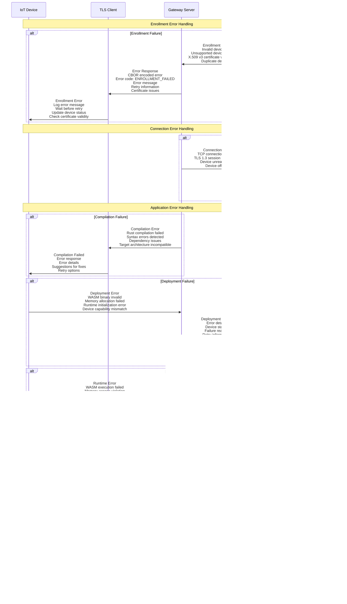

# Sequence Diagrams - Wasmbed Platform

Questo documento contiene tutti i sequence diagram che descrivono i flussi di comunicazione e le interazioni tra i componenti della piattaforma Wasmbed.

## Indice

1. [Device Enrollment](#device-enrollment)
   - [Workflow Completo](#device-enrollment-completo)
   - [Workflow Semplificato](#device-enrollment-semplificato)
   - [Processo di Enrollment](#processo-di-enrollment)
   - [Inizializzazione e Connessione](#inizializzazione-e-connessione)
   - [Heartbeat e Monitoring](#heartbeat-e-monitoring)
2. [Application Deployment](#application-deployment)
   - [Workflow Completo](#application-deployment-completo)
   - [Workflow Semplificato](#application-deployment-semplificato)
   - [Compilazione e Creazione](#compilazione-e-creazione)
   - [Esecuzione su Device](#esecuzione-su-device)
   - [Monitoring e Management](#monitoring-e-management)
3. [Error Handling](#error-handling)

---

## Device Enrollment

### Device Enrollment Completo

### Device Enrollment Semplificato

### Processo di Enrollment

### Inizializzazione e Connessione

### Heartbeat e Monitoring

---

## Application Deployment

### Application Deployment Completo

### Application Deployment Semplificato

### Compilazione e Creazione

### Esecuzione su Device

### Monitoring e Management

---

## Error Handling

