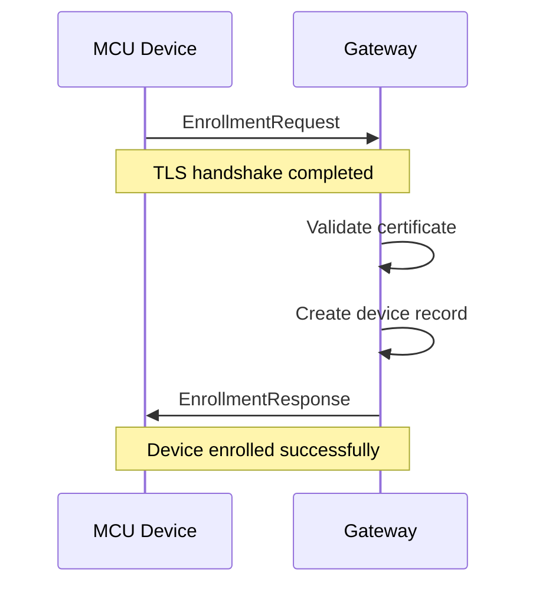
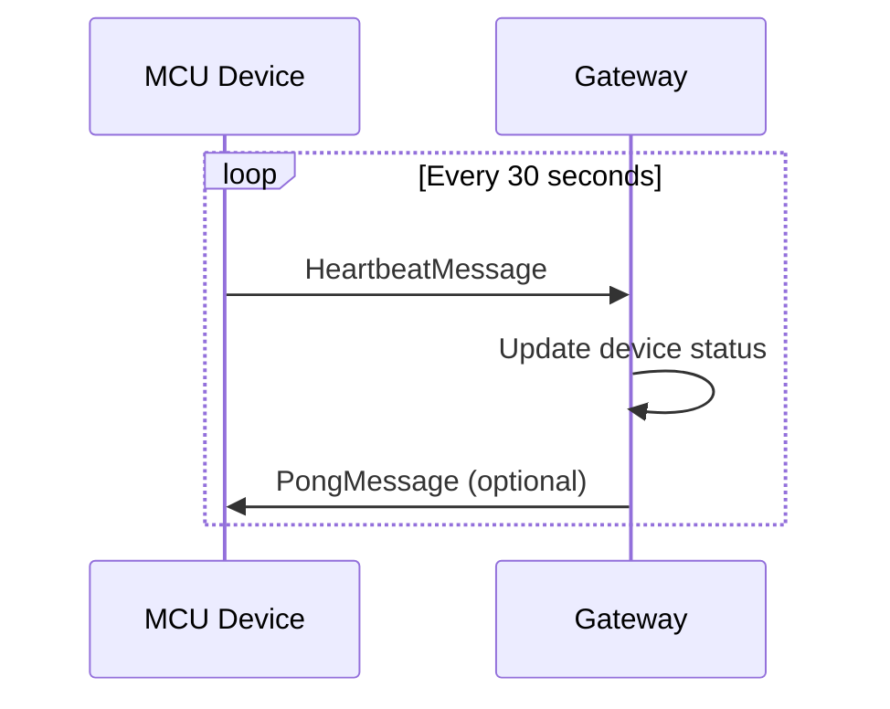
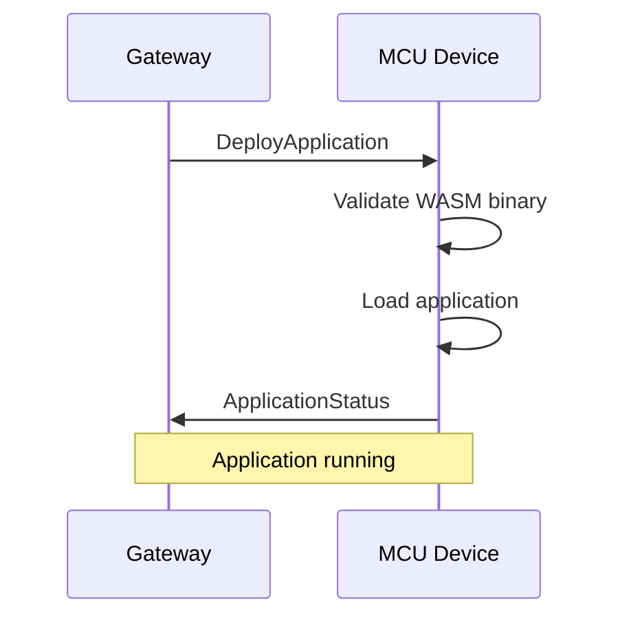

# Protocol Design

## 🎯 Overview

The Wasmbed protocol defines the communication between the Gateway MPU and MCU devices. It uses CBOR (Concise Binary Object Representation) for efficient binary serialization and TLS 1.3 for secure communication.

## 🔧 Protocol Stack

```
┌─────────────────────────────────────┐
│           Application Layer          │
│         Wasmbed Protocol             │
├─────────────────────────────────────┤
│           Transport Layer            │
│              TLS 1.3                 │
├─────────────────────────────────────┤
│           Network Layer              │
│              TCP/IP                  │
└─────────────────────────────────────┘
```

## 📋 Message Format

### Envelope Structure

All messages are wrapped in an envelope that provides metadata and routing information:

```rust
#[derive(Debug, Serialize, Deserialize)]
pub struct Envelope {
    pub message_id: MessageId,        // Unique message identifier
    pub version: ProtocolVersion,    // Protocol version
    pub timestamp: u64,               // Unix timestamp
    pub message: Message,             // Actual message payload
    pub correlation_id: Option<String>, // For request-response correlation
}
```

### Message Types

#### Client Messages (MCU → Gateway)

```rust
#[derive(Debug, Serialize, Deserialize)]
pub enum ClientMessage {
    // Device enrollment
    Enrollment(EnrollmentRequest),
    
    // Heartbeat and status
    Heartbeat(HeartbeatMessage),
    StatusUpdate(StatusUpdateMessage),
    
    // Application management
    ApplicationStatus(ApplicationStatusMessage),
    ApplicationError(ApplicationErrorMessage),
    
    // System messages
    Ping(PingMessage),
    Error(ErrorMessage),
}
```

#### Server Messages (Gateway → MCU)

```rust
#[derive(Debug, Serialize, Deserialize)]
pub enum ServerMessage {
    // Enrollment response
    EnrollmentResponse(EnrollmentResponse),
    
    // Application deployment
    DeployApplication(DeployApplicationMessage),
    StopApplication(StopApplicationMessage),
    
    // System control
    Pong(PongMessage),
    Error(ErrorMessage),
}
```

## 🔄 Message Flow

### 1. Device Enrollment



#### Enrollment Request
```rust
#[derive(Debug, Serialize, Deserialize)]
pub struct EnrollmentRequest {
    pub device_type: String,           // e.g., "hifive1"
    pub capabilities: Vec<String>,     // e.g., ["wasm", "tls"]
    pub public_key: String,            // Base64 encoded public key
    pub firmware_version: String,      // Firmware version
    pub hardware_id: String,           // Unique hardware identifier
}
```

#### Enrollment Response
```rust
#[derive(Debug, Serialize, Deserialize)]
pub struct EnrollmentResponse {
    pub success: bool,
    pub device_id: String,             // Assigned device ID
    pub error_message: Option<String>, // Error details if failed
    pub config: DeviceConfig,           // Device configuration
}
```

### 2. Heartbeat Communication



#### Heartbeat Message
```rust
#[derive(Debug, Serialize, Deserialize)]
pub struct HeartbeatMessage {
    pub device_id: String,
    pub uptime: u64,                   // Device uptime in seconds
    pub memory_usage: u32,              // Current memory usage
    pub cpu_usage: u8,                  // CPU usage percentage
    pub application_count: u8,         // Number of running applications
    pub temperature: Option<i16>,      // Device temperature (optional)
}
```

### 3. Application Deployment



#### Deploy Application Message
```rust
#[derive(Debug, Serialize, Deserialize)]
pub struct DeployApplicationMessage {
    pub application_id: String,
    pub name: String,
    pub wasm_bytes: Vec<u8>,           // WASM binary
    pub config: ApplicationConfig,     // Application configuration
    pub environment_vars: HashMap<String, String>, // Environment variables
}
```

#### Application Configuration
```rust
#[derive(Debug, Serialize, Deserialize)]
pub struct ApplicationConfig {
    pub memory_limit: u32,             // Memory limit in bytes
    pub cpu_time_limit: u32,            // CPU time limit in milliseconds
    pub auto_restart: bool,             // Auto-restart on failure
    pub max_restarts: u8,               // Maximum restart attempts
    pub timeout: u32,                   // Application timeout
}
```

## 🔐 Security Model

### TLS Configuration

```rust
pub struct TlsConfig {
    pub cert_file: String,             // Server certificate path
    pub key_file: String,               // Private key path
    pub ca_file: String,                // CA certificate path
    pub verify_peer: bool,              // Verify client certificates
    pub min_tls_version: TlsVersion,    // Minimum TLS version
}
```

### Certificate Validation

1. **Server Certificate**: Gateway presents certificate to MCU
2. **Client Certificate**: MCU presents certificate to Gateway
3. **CA Validation**: Both sides validate against trusted CA
4. **Certificate Pinning**: Optional certificate fingerprint validation

### Message Integrity

- **TLS Encryption**: All messages encrypted in transit
- **Message Signing**: Optional message signing for integrity
- **Replay Protection**: Timestamp-based replay protection

## 📊 Protocol Statistics

### Message Sizes

| Message Type | Average Size | Max Size |
|--------------|--------------|----------|
| EnrollmentRequest | 512 bytes | 1KB |
| HeartbeatMessage | 128 bytes | 256 bytes |
| DeployApplication | 64KB | 1MB |
| ApplicationStatus | 256 bytes | 512 bytes |

### Performance Characteristics

- **Latency**: < 10ms for heartbeat, < 100ms for deployment
- **Throughput**: 1000+ messages per second per connection
- **Memory Usage**: < 1KB per connection state
- **CPU Usage**: < 1% for protocol processing

## 🔧 Implementation Details

### CBOR Serialization

```rust
// Example CBOR encoding
let enrollment = EnrollmentRequest {
    device_type: "hifive1".to_string(),
    capabilities: vec!["wasm".to_string(), "tls".to_string()],
    public_key: "base64_encoded_key".to_string(),
    firmware_version: "1.0.0".to_string(),
    hardware_id: "hifive1-001".to_string(),
};

let encoded = serde_cbor::to_vec(&enrollment)?;
```

### Message Validation

```rust
pub fn validate_message(message: &Message) -> Result<(), ProtocolError> {
    match message {
        Message::Enrollment(req) => validate_enrollment(req),
        Message::Heartbeat(hb) => validate_heartbeat(hb),
        Message::DeployApplication(deploy) => validate_deployment(deploy),
        _ => Ok(()),
    }
}
```

### Error Handling

```rust
#[derive(Debug, Serialize, Deserialize)]
pub struct ErrorMessage {
    pub error_code: ErrorCode,
    pub error_message: String,
    pub details: Option<Value>,
    pub retry_after: Option<u32>,       // Seconds to wait before retry
}

#[derive(Debug, Serialize, Deserialize)]
pub enum ErrorCode {
    InvalidMessage = 1000,
    AuthenticationFailed = 1001,
    DeviceNotFound = 1002,
    ApplicationNotFound = 1003,
    ResourceExhausted = 1004,
    InternalError = 1005,
}
```

## 🚀 Protocol Versioning

### Version Compatibility

| Protocol Version | Release Date | Breaking Changes |
|------------------|--------------|------------------|
| 1.0.0 | September 2024 | Initial release |
| 1.1.0 | Planned | Application metrics |
| 2.0.0 | Planned | Multi-application support |

### Backward Compatibility

- **Minor Versions**: Backward compatible
- **Major Versions**: May include breaking changes
- **Deprecation**: 6-month deprecation period for removed features

### Version Negotiation

```rust
#[derive(Debug, Serialize, Deserialize)]
pub struct ProtocolVersion {
    pub major: u8,
    pub minor: u8,
    pub patch: u8,
}

// Version negotiation during enrollment
let client_version = ProtocolVersion { major: 1, minor: 0, patch: 0 };
let server_version = ProtocolVersion { major: 1, minor: 1, patch: 0 };
let negotiated_version = negotiate_version(client_version, server_version);
```

## 🔍 Debugging and Monitoring

### Protocol Logging

```rust
// Enable protocol debugging
tracing::info!("Sending enrollment request: {:?}", request);
tracing::debug!("CBOR encoded size: {} bytes", encoded.len());
tracing::warn!("Message validation failed: {}", error);
```

### Message Tracing

```rust
// Add correlation ID for request tracing
let correlation_id = uuid::Uuid::new_v4().to_string();
let envelope = Envelope {
    message_id: MessageId::new(),
    version: ProtocolVersion::current(),
    timestamp: SystemTime::now().duration_since(UNIX_EPOCH)?.as_secs(),
    message: request,
    correlation_id: Some(correlation_id),
};
```

### Performance Monitoring

```rust
// Track protocol metrics
#[derive(Debug)]
pub struct ProtocolMetrics {
    pub messages_sent: u64,
    pub messages_received: u64,
    pub errors: u64,
    pub average_latency: Duration,
    pub throughput: f64,               // messages per second
}
```

## 🧪 Testing

### Unit Tests

```rust
#[cfg(test)]
mod tests {
    use super::*;

    #[test]
    fn test_enrollment_serialization() {
        let request = EnrollmentRequest {
            device_type: "hifive1".to_string(),
            capabilities: vec!["wasm".to_string()],
            public_key: "test_key".to_string(),
            firmware_version: "1.0.0".to_string(),
            hardware_id: "test-001".to_string(),
        };

        let encoded = serde_cbor::to_vec(&request).unwrap();
        let decoded: EnrollmentRequest = serde_cbor::from_slice(&encoded).unwrap();
        
        assert_eq!(request.device_type, decoded.device_type);
    }
}
```

### Integration Tests

```rust
#[tokio::test]
async fn test_enrollment_flow() {
    let (client, server) = create_test_connection().await;
    
    // Send enrollment request
    let request = create_test_enrollment_request();
    client.send_enrollment(request).await.unwrap();
    
    // Verify enrollment response
    let response = server.receive_enrollment_response().await.unwrap();
    assert!(response.success);
}
```

### Performance Tests

```rust
#[tokio::test]
async fn test_heartbeat_performance() {
    let (client, server) = create_test_connection().await;
    
    let start = Instant::now();
    for _ in 0..1000 {
        client.send_heartbeat().await.unwrap();
    }
    let duration = start.elapsed();
    
    let throughput = 1000.0 / duration.as_secs_f64();
    assert!(throughput > 100.0); // 100+ messages per second
}
```

## 📋 Protocol Specification

### Message Format Specification

```
Envelope:
  - message_id: 16 bytes (UUID)
  - version: 3 bytes (major.minor.patch)
  - timestamp: 8 bytes (u64)
  - message: variable length (CBOR encoded)
  - correlation_id: variable length (optional string)

Message Types:
  - EnrollmentRequest: 512 bytes average
  - EnrollmentResponse: 256 bytes average
  - HeartbeatMessage: 128 bytes average
  - DeployApplication: 64KB average
  - ApplicationStatus: 256 bytes average
```

### Error Codes

| Code | Name | Description | Retryable |
|------|------|-------------|-----------|
| 1000 | InvalidMessage | Message format invalid | No |
| 1001 | AuthenticationFailed | TLS authentication failed | No |
| 1002 | DeviceNotFound | Device not registered | No |
| 1003 | ApplicationNotFound | Application not found | No |
| 1004 | ResourceExhausted | Device resources exhausted | Yes |
| 1005 | InternalError | Internal server error | Yes |

### Timeouts and Retries

| Operation | Timeout | Retries | Backoff |
|-----------|---------|---------|---------|
| Enrollment | 30s | 3 | Exponential |
| Heartbeat | 5s | 5 | Linear |
| Deployment | 60s | 2 | Exponential |
| Status Update | 10s | 3 | Exponential |

---

**Last Updated**: September 2024  
**Version**: Protocol v1.0.0  
**Maintainer**: Wasmbed Development Team
