# Architecture Diagrams

## Overview

This document contains comprehensive Mermaid diagrams for the Wasmbed platform architecture, including system overview, component interactions, data flows, and deployment scenarios.

## System Architecture Overview

### High-Level 3-Layer Architecture

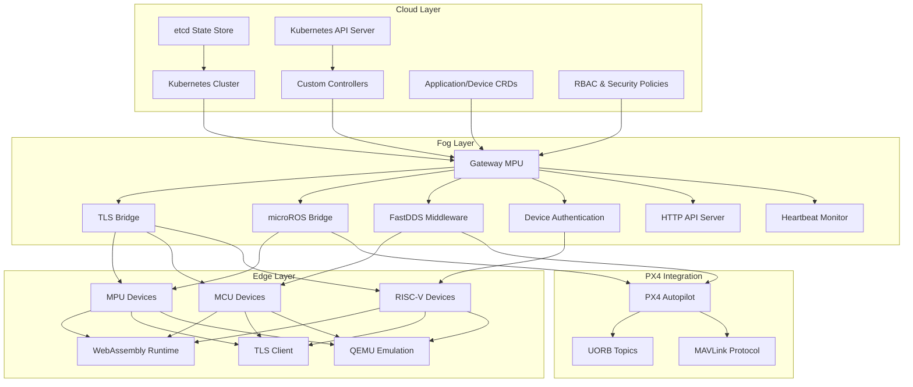

## Component Architecture

### Cloud Layer Components

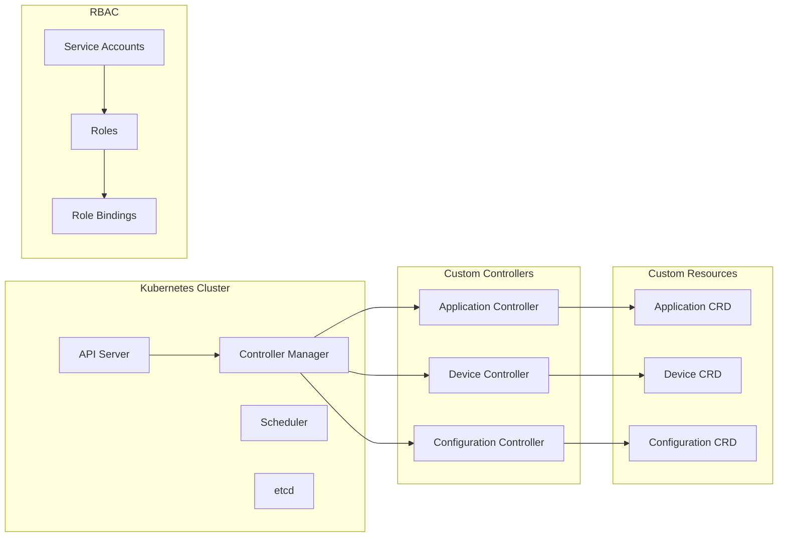

### Fog Layer Components

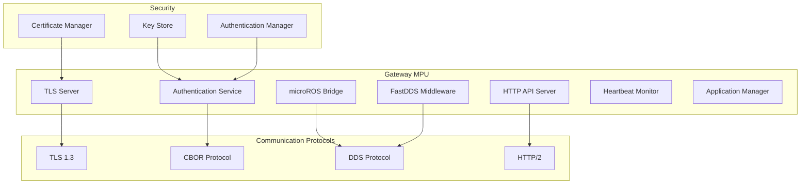

### Edge Layer Components

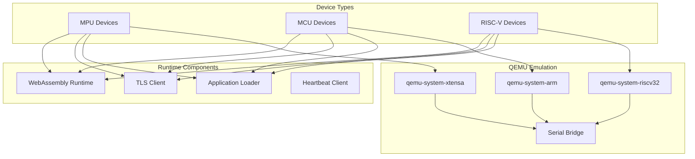

## Communication Flow Architecture

### Complete System Communication Flow

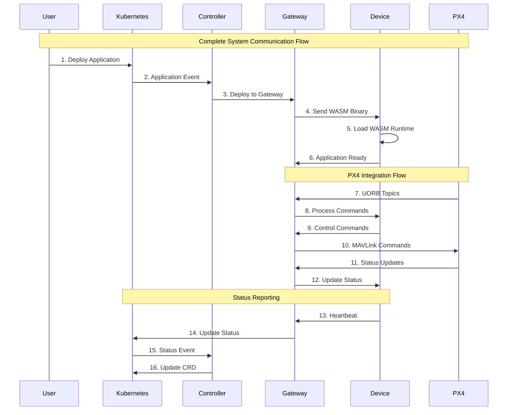

## Security Architecture

### Multi-Layer Security Model

```mermaid
graph TB
    subgraph "Security Layers"
        APP_SEC[Application Security]
        TRANS_SEC[Transport Security]
        NET_SEC[Network Security]
        INFRA_SEC[Infrastructure Security]
    end
    
    subgraph "Application Security"
        WASM_SANDBOX[WASM Sandboxing]
        MEM_PROT[Memory Protection]
        RES_LIMIT[Resource Limits]
        CODE_SIGN[Code Signing]
    end
    
    subgraph "Transport Security"
        TLS_MUTUAL[Mutual TLS]
        CERT_MGMT[Certificate Management]
        KEY_EXCH[Key Exchange]
        MSG_ENC[Message Encryption]
    end
    
    subgraph "Network Security"
        FIREWALL[Firewall Rules]
        NET_POL[Network Policies]
        VPN[VPN Tunnels]
        IDS[Intrusion Detection]
    end
    
    subgraph "Infrastructure Security"
        RBAC_K8S[Kubernetes RBAC]
        POD_SEC[Pod Security]
        SECRET_MGMT[Secret Management]
        AUDIT_LOG[Audit Logging]
    end
    
    APP_SEC --> WASM_SANDBOX
    APP_SEC --> MEM_PROT
    APP_SEC --> RES_LIMIT
    APP_SEC --> CODE_SIGN
    
    TRANS_SEC --> TLS_MUTUAL
    TRANS_SEC --> CERT_MGMT
    TRANS_SEC --> KEY_EXCH
    TRANS_SEC --> MSG_ENC
    
    NET_SEC --> FIREWALL
    NET_SEC --> NET_POL
    NET_SEC --> VPN
    NET_SEC --> IDS
    
    INFRA_SEC --> RBAC_K8S
    INFRA_SEC --> POD_SEC
    INFRA_SEC --> SECRET_MGMT
    INFRA_SEC --> AUDIT_LOG
```

## Data Flow Architecture

### Data Processing Pipeline

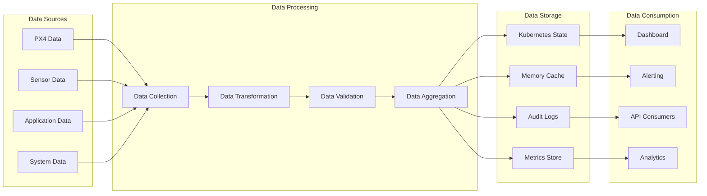

## Component Interaction Matrix

### Component Relationships

```mermaid
graph TB
    subgraph "Component Interactions"
        K8S_API[Kubernetes API]
        CTRL[Controller]
        GW[Gateway]
        DEV[Device]
        PX4[PX4]
    end
    
    K8S_API <--> CTRL
    CTRL <--> GW
    GW <--> DEV
    GW <--> PX4
    DEV <--> PX4
    
    Note over K8S_API,CTRL: CRD Management
    Note over CTRL,GW: Application Deployment
    Note over GW,DEV: Device Communication
    Note over GW,PX4: PX4 Integration
    Note over DEV,PX4: Direct Control
```

## Scalability Architecture

### Horizontal and Vertical Scaling

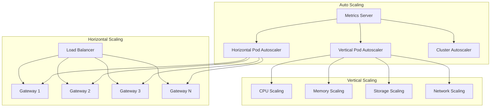

## Deployment Architecture

### Environment Progression

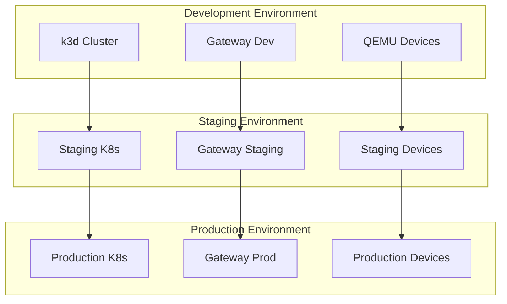

## Monitoring and Observability Architecture

### Complete Monitoring Stack

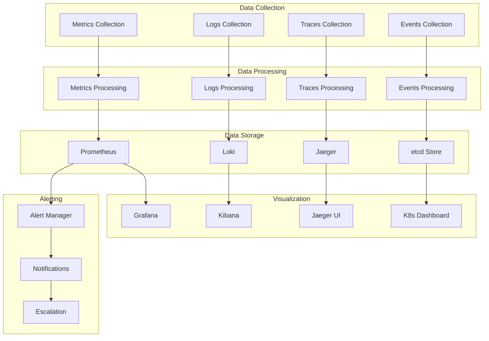

## PX4 Integration Architecture

### PX4 Communication Stack

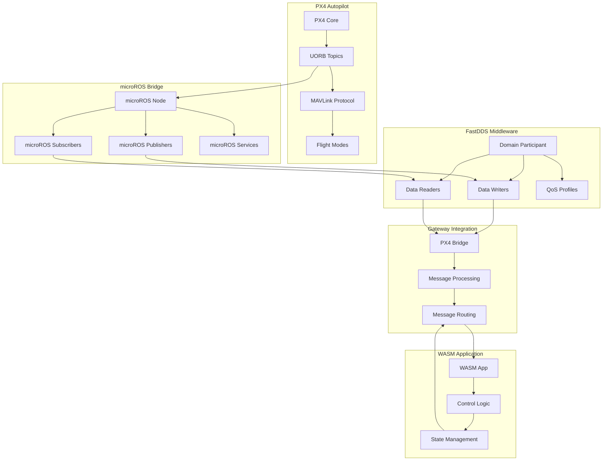

## QEMU Emulation Architecture

### Device Emulation Stack

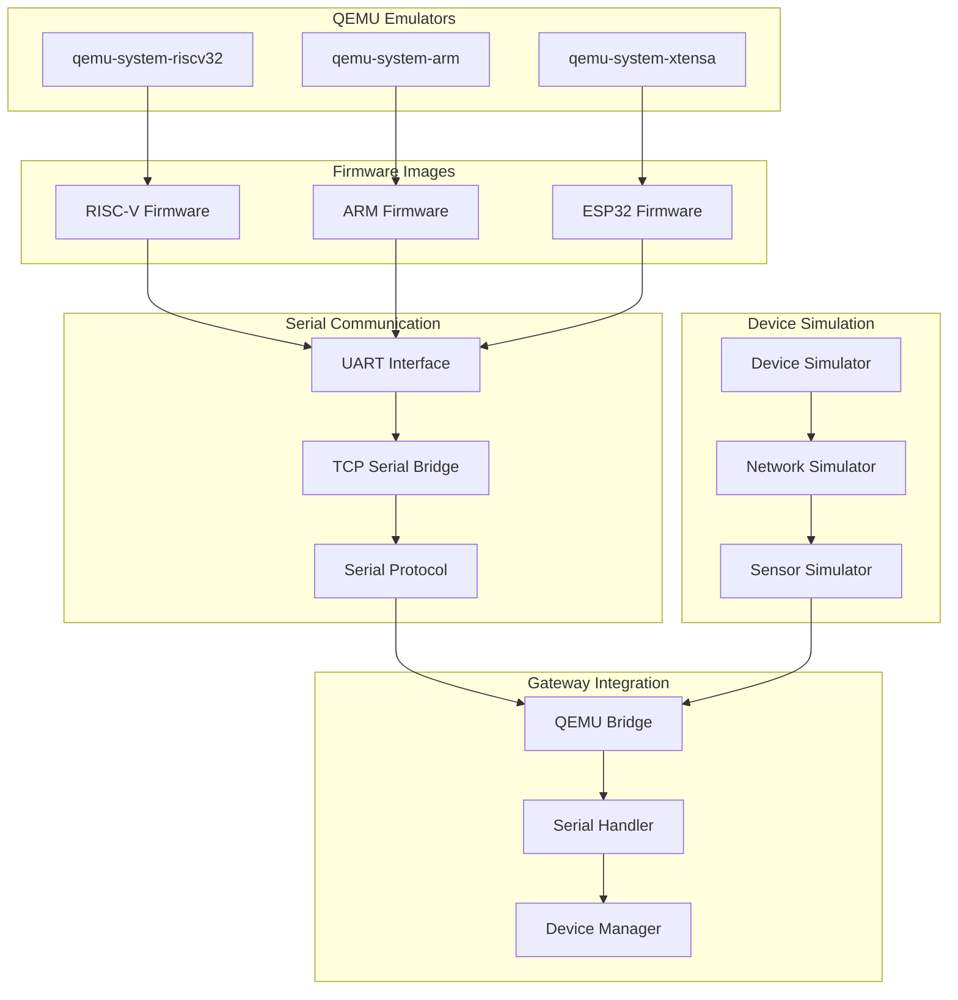

## Network Architecture

### Network Topology

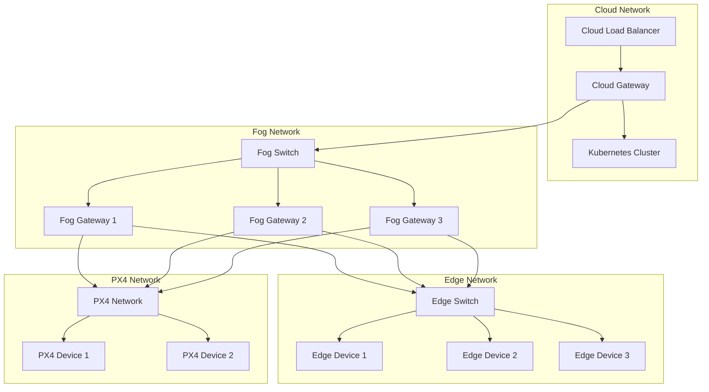

## Performance Architecture

### Performance Optimization Stack

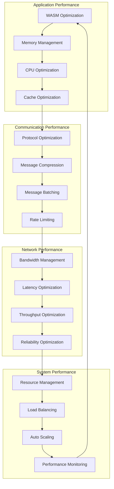
