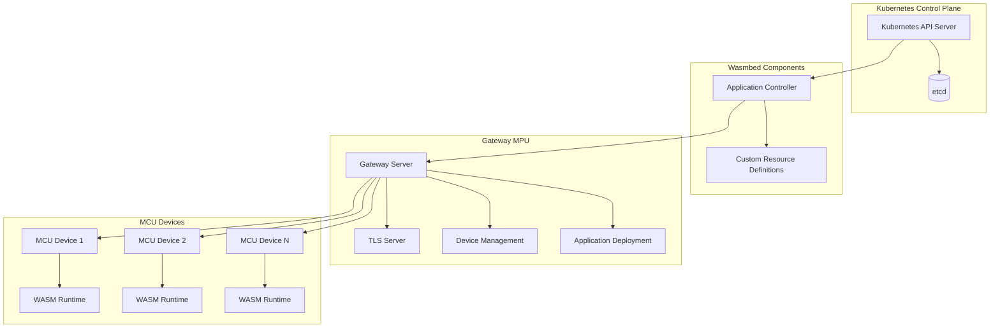

# Wasmbed Platform - Complete Architecture Documentation

##  **Overview**

This document provides a comprehensive overview of the Wasmbed platform architecture, including detailed component descriptions, communication flows, and integration patterns.

##  **System Architecture**

### **High-Level Architecture**



### **Component Details**

#### **1. Kubernetes Control Plane**

The Kubernetes control plane serves as the central orchestration layer:

- **API Server**: Handles all API requests and provides the central interface
- **etcd**: Distributed key-value store for cluster state
- **Scheduler**: Determines where to place workloads
- **Controller Manager**: Runs controller processes

#### **2. Wasmbed Components**

- **Application Controller**: Orchestrates application deployment and lifecycle
- **Device Controller**: Manages device registration and health monitoring
- **Custom Resource Definitions**: Extends Kubernetes with Device and Application resources

#### **3. Gateway MPU**

- **TLS Server**: Secure communication with MCUs
- **Device Management**: Connection and heartbeat management
- **Application Deployment**: Distribution of WASM applications
- **Protocol Handler**: Implementation of the Wasmbed protocol

#### **4. MCU Firmware**

- **WASM Runtime**: WebAssembly application execution
- **Network Stack**: Communication with Gateway
- **Security**: TLS authentication and application isolation

## 🔄 **Communication Flows**

### **Device Enrollment Flow**

1. **MCU Initialization**: MCU boots and initializes firmware
2. **TLS Connection**: Establishes secure connection to Gateway
3. **Enrollment Request**: Sends device capabilities and public key
4. **Device Registration**: Gateway creates Device CRD in Kubernetes
5. **Controller Notification**: Controller processes device registration
6. **Status Update**: Device status updated to "Connected"
7. **Heartbeat Setup**: Regular heartbeat messages established

### **Application Deployment Flow**

1. **Application Creation**: User creates Application CRD
2. **Controller Processing**: Controller reconciles application
3. **Device Selection**: Controller selects target device
4. **Gateway Communication**: Controller sends deployment request
5. **Device Communication**: Gateway forwards to target device
6. **WASM Loading**: Device loads and initializes WASM module
7. **Status Updates**: Application status updated to "Running"

##  **Security Architecture**

### **Authentication**

- **TLS 1.3**: Mutual TLS authentication between all components
- **Certificate-based**: X.509 certificates for all components
- **Key Management**: Automated certificate rotation

### **Authorization**

- **RBAC**: Role-based access control in Kubernetes
- **Network Policies**: Pod-to-pod communication restrictions
- **Resource Limits**: Memory and CPU limits per application

### **Encryption**

- **In Transit**: TLS encryption for all communication
- **At Rest**: Encrypted storage for sensitive data
- **Key Exchange**: ECDHE key exchange for perfect forward secrecy

##  **Performance Characteristics**

### **Latency**

- **Local Network**: < 10ms
- **Wide Area Network**: < 100ms
- **Device Communication**: < 5ms

### **Throughput**

- **Messages per Second**: 1000+
- **Concurrent Devices**: 1000+
- **Concurrent Applications**: 10000+

### **Resource Usage**

- **Memory per Application**: < 4MB
- **CPU per Application**: < 10%
- **Network Bandwidth**: < 1Mbps per device

##  **Scalability Patterns**

### **Horizontal Scaling**

- **Gateway Replicas**: Multiple gateway instances for load distribution
- **Controller Replicas**: Multiple controller instances with leader election
- **Device Distribution**: Load balancing across multiple gateways

### **Vertical Scaling**

- **Resource Limits**: Configurable memory and CPU limits
- **Performance Tuning**: Optimized for specific workloads
- **Caching**: Intelligent caching for frequently accessed data

##  **Configuration Management**

### **Environment Variables**

```bash
# Gateway Configuration
WASMBED_GATEWAY_BIND_ADDR=0.0.0.0:4423
WASMBED_GATEWAY_PRIVATE_KEY=/etc/wasmbed-gateway/certs/server.key
WASMBED_GATEWAY_CERTIFICATE=/etc/wasmbed-gateway/certs/server.der
WASMBED_GATEWAY_CLIENT_CA=/etc/wasmbed-gateway/certs/client-ca.der

# Controller Configuration
WASMBED_CONTROLLER_NAMESPACE=wasmbed
WASMBED_CONTROLLER_LOG_LEVEL=info
WASMBED_CONTROLLER_HEALTH_PORT=8080
```

### **Kubernetes Configuration**

```yaml
# Gateway StatefulSet
apiVersion: apps/v1
kind: StatefulSet
metadata:
  name: wasmbed-gateway
  namespace: wasmbed
spec:
  serviceName: wasmbed-gateway-service
  replicas: 3
  selector:
    matchLabels:
      app: wasmbed-gateway
  template:
    metadata:
      labels:
        app: wasmbed-gateway
    spec:
      serviceAccountName: wasmbed-gateway
      containers:
        - name: wasmbed-gateway
          image: wasmbed-gateway:latest
          imagePullPolicy: Never
          ports:
            - containerPort: 4423
              name: wasmbed-gateway
          volumeMounts:
            - name: wasmbed-certs
              mountPath: /etc/wasmbed-gateway/certs
          env:
            - name: WASMBED_GATEWAY_BIND_ADDR
              value: 0.0.0.0:4423
            - name: WASMBED_GATEWAY_PRIVATE_KEY
              value: /etc/wasmbed-gateway/certs/server.key
            - name: WASMBED_GATEWAY_CERTIFICATE
              value: /etc/wasmbed-gateway/certs/server.der
            - name: WASMBED_GATEWAY_CLIENT_CA
              value: /etc/wasmbed-gateway/certs/client-ca.der
      volumes:
        - name: wasmbed-certs
          hostPath:
            path: /usr/share/wasmbed/resources/dev-certs
```

##  **Monitoring and Observability**

### **Metrics Collection**

- **System Metrics**: CPU, memory, network usage
- **Application Metrics**: Function calls, execution time, errors
- **Device Metrics**: Connection status, heartbeat frequency
- **Gateway Metrics**: Connection count, message throughput

### **Health Checks**

- **Liveness Probes**: Ensure components are running
- **Readiness Probes**: Ensure components are ready to serve traffic
- **Startup Probes**: Ensure components start within timeout

### **Logging**

- **Structured Logging**: JSON-formatted logs with context
- **Log Levels**: Debug, Info, Warn, Error
- **Log Aggregation**: Centralized log collection and analysis

## 🔄 **Deployment Patterns**

### **Blue-Green Deployment**

1. **Blue Environment**: Current production environment
2. **Green Environment**: New version deployment
3. **Traffic Switch**: Gradual traffic migration
4. **Rollback**: Quick rollback to blue environment if needed

### **Canary Deployment**

1. **Canary Release**: Deploy to small subset of devices
2. **Monitoring**: Monitor metrics and errors
3. **Gradual Rollout**: Increase traffic to canary
4. **Full Deployment**: Complete rollout if successful

##  **Development Patterns**

### **Microservices Architecture**

- **Service Separation**: Each component is a separate service
- **API Gateway**: Centralized API management
- **Service Discovery**: Automatic service discovery
- **Load Balancing**: Automatic load balancing

### **Event-Driven Architecture**

- **Event Sourcing**: Store events instead of state
- **CQRS**: Command Query Responsibility Segregation
- **Event Streaming**: Real-time event processing
- **Saga Pattern**: Distributed transaction management

## 📚 **Additional Resources**

- [API Reference](api-reference.md)
- [Deployment Guide](deployment-guide.md)
- [Security Guide](security-guide.md)
- [Troubleshooting Guide](troubleshooting-guide.md)
- [Performance Tuning](performance-tuning.md)
- [Best Practices](best-practices.md)

