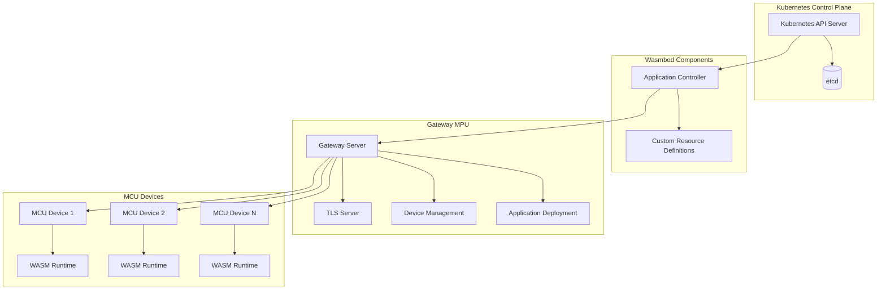
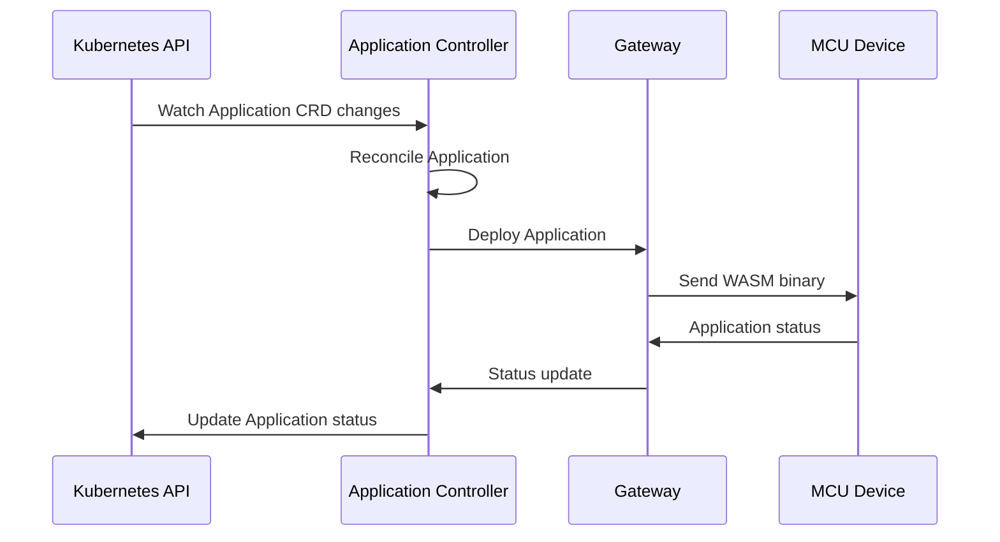
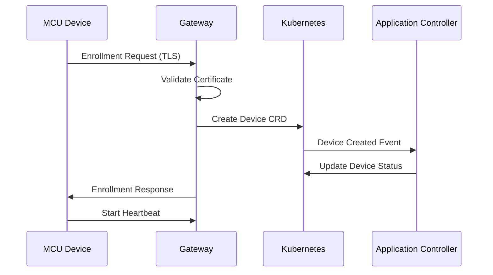
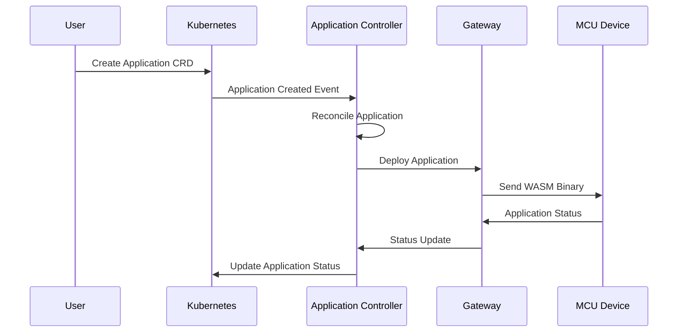
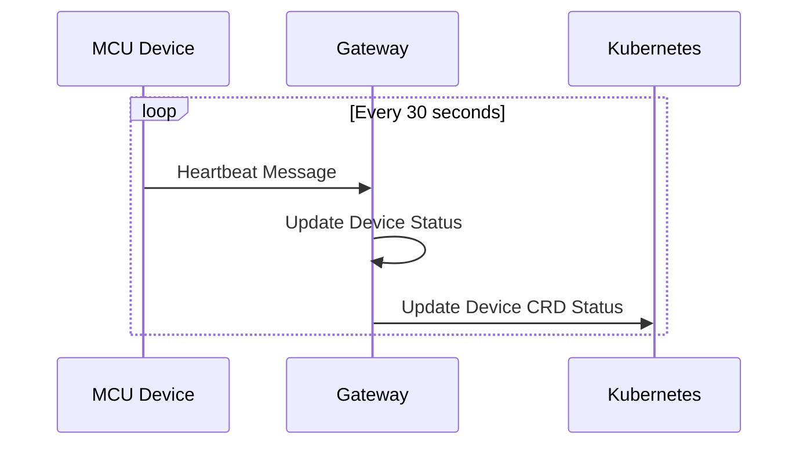
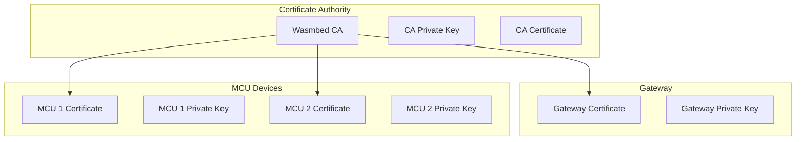
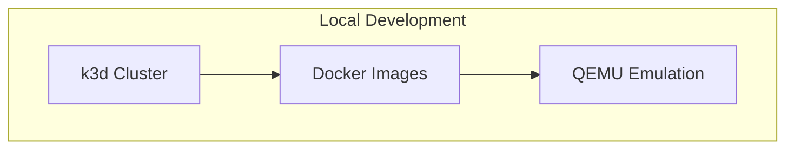
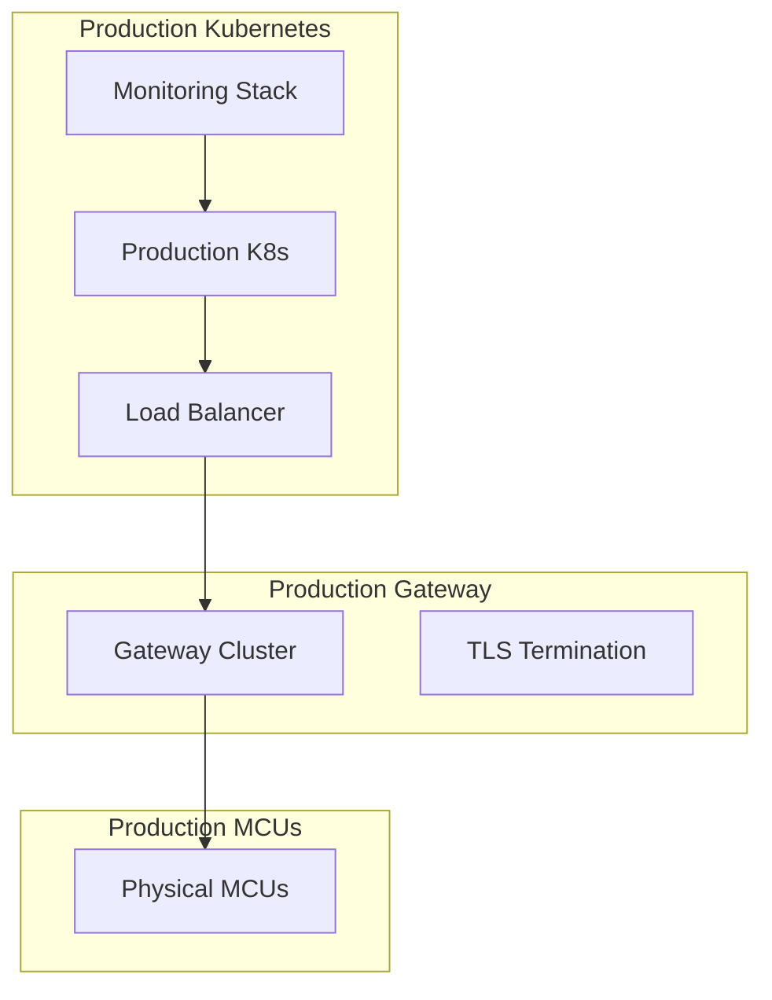

# System Architecture Overview

## 🎯 Introduction

Wasmbed is a distributed IoT device management platform that bridges the gap between Kubernetes orchestration and microcontroller (MCU) devices. This document provides a comprehensive overview of the system architecture, components, and their interactions.

## 🏗️ High-Level Architecture



## 🔧 Core Components

### 1. Kubernetes Control Plane

The Kubernetes control plane serves as the central orchestration layer:

- **API Server**: Handles all API requests and provides the central interface
- **etcd**: Distributed key-value store for cluster state
- **Scheduler**: Determines where to place workloads
- **Controller Manager**: Runs controller processes

#### Custom Resource Definitions (CRDs)

Wasmbed extends Kubernetes with custom resources:

```yaml
# Device CRD
apiVersion: wasmbed.github.io/v1alpha1
kind: Device
metadata:
  name: device-001
spec:
  device_type: "hifive1"
  capabilities: ["wasm", "tls"]
  public_key: "base64_encoded_public_key"
status:
  phase: "Connected"
  last_heartbeat: "2024-09-01T22:00:00Z"
```

```yaml
# Application CRD
apiVersion: wasmbed.github.io/v1alpha1
kind: Application
metadata:
  name: my-wasm-app
spec:
  name: "My WASM Application"
  wasm_bytes: "base64_encoded_wasm_binary"
  target_devices:
    device_names: ["device-001"]
  config:
    memory_limit: 1048576
    cpu_time_limit: 1000
```

### 2. Application Controller

The Application Controller is a Kubernetes controller that manages the lifecycle of WASM applications:

#### Responsibilities
- **Reconciliation**: Continuously monitors Application CRDs and ensures desired state
- **Deployment**: Coordinates application deployment to target devices
- **Status Management**: Updates application status based on device feedback
- **Error Handling**: Implements retry logic and error recovery

#### Architecture
```rust
pub struct ApplicationController {
    client: Client,                    // Kubernetes client
    gateway_client: Arc<GatewayClient>, // Gateway communication
    app_status_cache: Arc<RwLock<BTreeMap<String, ApplicationStatus>>>,
    retry_config: RetryConfig,
}
```

#### Reconciliation Loop


### 3. Gateway MPU

The Gateway acts as a proxy between Kubernetes and MCU devices:

#### Components

**TLS Server**
- Handles secure communication with MCU devices
- Manages TLS handshakes and certificate validation
- Provides encrypted communication channels

**Device Management**
- Maintains device connections and heartbeats
- Tracks device status and capabilities
- Handles device enrollment and authentication

**Application Deployment**
- Distributes WASM applications to target devices
- Manages application lifecycle on devices
- Collects application status and metrics

#### Architecture
```rust
pub struct Gateway {
    tls_server: TlsServer,
    device_manager: DeviceManager,
    app_deployer: ApplicationDeployer,
    config: GatewayConfig,
}
```

### 4. MCU Firmware

The MCU firmware runs on RISC-V microcontrollers:

#### Components

**WASM Runtime**
- Executes WebAssembly applications
- Provides sandboxed execution environment
- Manages application lifecycle

**Network Stack**
- Handles TCP/TLS communication
- Implements the Wasmbed protocol
- Manages connection state

**Security Module**
- Handles TLS authentication
- Manages cryptographic operations
- Provides secure boot capabilities

## 🔄 Data Flow

### 1. Device Enrollment Flow



### 2. Application Deployment Flow



### 3. Heartbeat and Monitoring Flow



## 🔐 Security Architecture

### 1. TLS Communication

All communication between components uses TLS 1.3:

- **Gateway ↔ MCU**: Mutual TLS authentication
- **Controller ↔ Gateway**: TLS for API communication
- **Controller ↔ Kubernetes**: TLS for API communication

### 2. Certificate Management



### 3. Application Isolation

- **WASM Sandbox**: Applications run in isolated WebAssembly environment
- **Memory Protection**: Each application has isolated memory space
- **Resource Limits**: CPU and memory limits enforced per application

## 📊 Performance Characteristics

### Scalability
- **Devices per Gateway**: Up to 1000 concurrent devices
- **Applications per Device**: Up to 10 concurrent applications
- **Controller Performance**: Handles 1000+ applications with continuous reconciliation

### Latency
- **Device Registration**: < 5 seconds
- **Application Deployment**: < 10 seconds
- **Heartbeat Response**: < 100ms

### Resource Usage
- **Gateway Memory**: ~50MB base + 1MB per connected device
- **Controller Memory**: ~100MB base + 10KB per application
- **MCU Memory**: ~1MB firmware + application memory

## 🔧 Configuration

### Gateway Configuration
```yaml
gateway:
  tls:
    cert_file: "/etc/wasmbed/gateway.crt"
    key_file: "/etc/wasmbed/gateway.key"
    ca_file: "/etc/wasmbed/ca.crt"
  
  server:
    host: "0.0.0.0"
    port: 8080
    max_connections: 1000
  
  heartbeat:
    interval: 30
    timeout: 90
```

### Controller Configuration
```yaml
controller:
  reconciliation:
    interval: 30
    max_retries: 3
    backoff_multiplier: 2.0
  
  gateway:
    url: "http://wasmbed-gateway:8080"
    timeout: 30
  
  health:
    port: 8080
    path: "/health"
```

## 🚀 Deployment Architecture

### Development Environment


### Production Environment


## 🔍 Monitoring and Observability

### Metrics
- **Device Metrics**: Connection count, heartbeat latency, error rates
- **Application Metrics**: Deployment success rate, runtime performance
- **Gateway Metrics**: Request latency, connection pool usage
- **Controller Metrics**: Reconciliation frequency, error rates

### Logging
- **Structured Logging**: JSON format with correlation IDs
- **Log Levels**: ERROR, WARN, INFO, DEBUG
- **Log Aggregation**: Centralized log collection and analysis

### Health Checks
- **Gateway Health**: `/health`, `/ready`, `/metrics` endpoints
- **Controller Health**: `/health`, `/ready`, `/metrics` endpoints
- **MCU Health**: Heartbeat status and application health

## 🔄 Lifecycle Management

### Application Lifecycle
1. **Creation**: Application CRD created in Kubernetes
2. **Reconciliation**: Controller processes application
3. **Deployment**: Application deployed to target devices
4. **Running**: Application executes on devices
5. **Monitoring**: Status and metrics collected
6. **Update**: Application updated or scaled
7. **Termination**: Application stopped and cleaned up

### Device Lifecycle
1. **Enrollment**: Device registers with Gateway
2. **Authentication**: TLS handshake and certificate validation
3. **Connection**: Persistent connection established
4. **Heartbeat**: Regular status updates
5. **Application Deployment**: Applications deployed to device
6. **Monitoring**: Device and application status monitored
7. **Disconnection**: Device disconnects or fails

## 🎯 Future Architecture Considerations

### Planned Enhancements
- **Multi-Gateway Support**: Load balancing across multiple gateways
- **Edge Computing**: Local processing capabilities on gateways
- **Application Marketplace**: Centralized application distribution
- **Advanced Security**: Hardware security modules (HSM) integration
- **AI/ML Integration**: Intelligent application placement and optimization

### Scalability Improvements
- **Horizontal Scaling**: Multiple controller instances
- **Database Integration**: Persistent storage for application state
- **Caching Layer**: Redis-based caching for improved performance
- **Message Queues**: Asynchronous processing for high throughput

---

**Last Updated**: September 2024  
**Version**: Wasmbed v0.1.0  
**Maintainer**: Wasmbed Development Team
