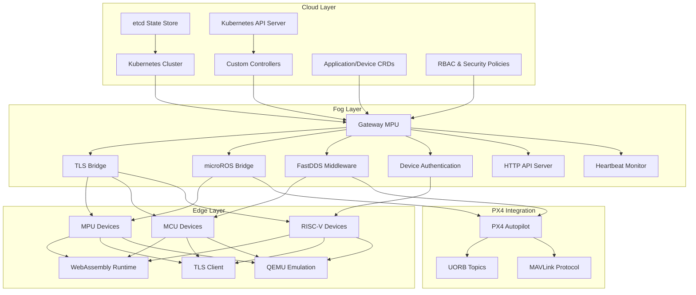
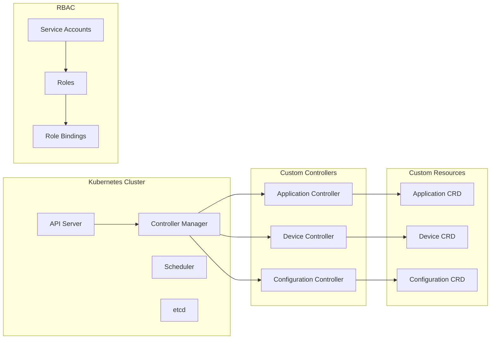
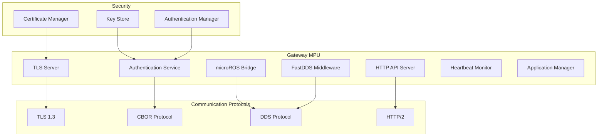
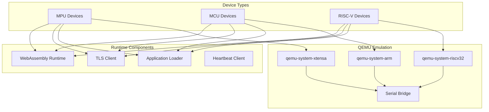

# System Architecture Overview

## Introduction

The Wasmbed platform implements a comprehensive 3-layer architecture designed for secure deployment and execution of WebAssembly applications on industrial robotic systems. The architecture follows cloud-fog-edge principles with Kubernetes orchestration and real-time communication capabilities.

# System Architecture Overview

## Introduction

The Wasmbed platform implements a comprehensive 3-layer architecture designed for secure deployment and execution of WebAssembly applications on industrial robotic systems. The architecture follows cloud-fog-edge principles with Kubernetes orchestration and real-time communication capabilities.

## High-Level Architecture

## Architectural Layers

### Cloud Layer

The cloud layer provides centralized orchestration and management capabilities through Kubernetes.

### Cloud Layer

The cloud layer provides centralized orchestration and management capabilities through Kubernetes.

#### Components

**Kubernetes Cluster**
- Custom Resource Definitions (CRDs) for Applications and Devices
- Controller for application lifecycle management
- RBAC for secure access control
- etcd for state persistence

**Custom Controllers**
- Application Controller: Manages WASM application deployment
- Device Controller: Handles device registration and status
- Reconciliation loops for maintaining desired state

**API Server**
- RESTful API for platform management
- CRD validation and admission control
- Resource versioning and conflict resolution

### Fog Layer

The fog layer consists of gateway MPU devices that bridge cloud orchestration with edge device communication.

### Fog Layer

The fog layer consists of gateway MPU devices that bridge cloud orchestration with edge device communication.

#### Gateway Server

**Core Functionality**
- TLS-secured communication hub
- Device enrollment and authentication
- Application deployment coordination
- Heartbeat monitoring and device status tracking

**Communication Protocols**
- TLS 1.3 with mutual authentication
- CBOR message encoding for efficiency
- HTTP API for management operations
- WebSocket for real-time updates

**Security Features**
- Certificate-based device authentication
- Encrypted communication channels
- Access control and authorization
- Audit logging and monitoring

### Edge Layer

The edge layer encompasses heterogeneous devices running WebAssembly applications.

### Edge Layer

The edge layer encompasses heterogeneous devices running WebAssembly applications.

#### Device Types

**MPU (Microprocessor Unit)**
- Full-featured embedded systems
- Complete operating system support
- Rich communication capabilities
- High-performance WebAssembly execution

**MCU (Microcontroller Unit)**
- Resource-constrained systems
- Real-time operating system support
- Limited communication interfaces
- Optimized WebAssembly runtime

**RISC-V Systems**
- Open-source instruction set architecture
- Customizable processor implementations
- Embedded system integration
- WebAssembly native support

#### WebAssembly Runtime

**no_std Compatibility**
- Minimal standard library dependencies
- Custom allocator implementations
- Embedded system optimizations
- Memory management for constrained environments

**Runtime Features**
- Function call execution
- Memory management and sandboxing
- Import/export interface
- Error handling and recovery

## Communication Architecture

### Inter-Layer Communication

**Cloud to Fog**
- Kubernetes API calls
- Resource updates and notifications
- Configuration management
- Monitoring and telemetry

**Fog to Edge**
- TLS-secured device connections
- Application deployment commands
- Heartbeat and status updates
- Real-time data exchange

### Intra-Layer Communication

**Cloud Layer**
- Kubernetes internal communication
- Controller coordination
- Resource synchronization
- Event propagation

**Fog Layer**
- Gateway clustering and load balancing
- Inter-gateway communication
- Shared state management
- Failover and redundancy

**Edge Layer**
- Device-to-device communication
- Local network protocols
- Real-time data sharing
- Collaborative processing

## Security Architecture

### Authentication and Authorization

**Device Authentication**
- X.509 certificate-based authentication
- Public key infrastructure (PKI)
- Certificate validation and revocation
- Mutual TLS authentication

**User Authentication**
- Role-based access control (RBAC)
- Kubernetes service accounts
- API key management
- Multi-factor authentication support

### Communication Security

**Transport Security**
- TLS 1.3 encryption
- Perfect forward secrecy
- Certificate pinning
- Secure key exchange

**Message Security**
- CBOR message signing
- Integrity verification
- Replay attack prevention
- Confidentiality protection

### Runtime Security

**WebAssembly Sandboxing**
- Memory isolation
- Function call restrictions
- Resource access control
- Execution time limits

**Device Security**
- Secure boot verification
- Firmware integrity checks
- Runtime protection mechanisms
- Hardware security module (HSM) support

## Deployment Architecture

### Kubernetes Integration

**Custom Resource Definitions**
- Application CRD for WASM application management
- Device CRD for edge device registration
- Configuration CRDs for platform settings
- Status CRDs for runtime monitoring

**Controller Architecture**
- Event-driven reconciliation
- State machine implementation
- Error handling and recovery
- Scalability and performance optimization

**Service Mesh Integration**
- Istio or Linkerd integration
- Service discovery and routing
- Load balancing and failover
- Observability and monitoring

### Container Orchestration

**Gateway Deployment**
- StatefulSet for persistent state
- ConfigMap for configuration management
- Secret management for certificates
- Service exposure and load balancing

**Application Deployment**
- DaemonSet for edge device deployment
- Job and CronJob for batch processing
- Pod security policies
- Resource quotas and limits

## Scalability and Performance

### Horizontal Scaling

**Gateway Scaling**
- Multiple gateway instances
- Load balancing and distribution
- Geographic distribution
- Auto-scaling based on load

**Device Scaling**
- Dynamic device registration
- Load distribution across devices
- Resource-aware scheduling
- Performance monitoring

### Vertical Scaling

**Resource Optimization**
- Memory usage optimization
- CPU utilization monitoring
- Storage efficiency
- Network bandwidth management

**Performance Tuning**
- WebAssembly execution optimization
- Communication protocol efficiency
- Caching and buffering strategies
- Latency reduction techniques

## Monitoring and Observability

### Metrics Collection

**System Metrics**
- Resource utilization monitoring
- Performance indicators
- Error rates and success rates
- Latency and throughput measurements

**Application Metrics**
- WebAssembly execution metrics
- Function call statistics
- Memory usage patterns
- Error tracking and analysis

### Logging and Tracing

**Distributed Tracing**
- Request flow tracking
- Performance bottleneck identification
- Error propagation analysis
- Cross-service communication monitoring

**Centralized Logging**
- Structured logging format
- Log aggregation and analysis
- Real-time log streaming
- Historical log retention

## Fault Tolerance and Reliability

### Error Handling

**Graceful Degradation**
- Service availability maintenance
- Partial functionality preservation
- User experience continuity
- Recovery procedures

**Failure Recovery**
- Automatic retry mechanisms
- Circuit breaker patterns
- Fallback strategies
- Disaster recovery procedures

### High Availability

**Redundancy**
- Multiple instance deployment
- Geographic distribution
- Data replication
- Backup and restore procedures

**Health Monitoring**
- Continuous health checks
- Proactive failure detection
- Automated recovery actions
- Alert and notification systems