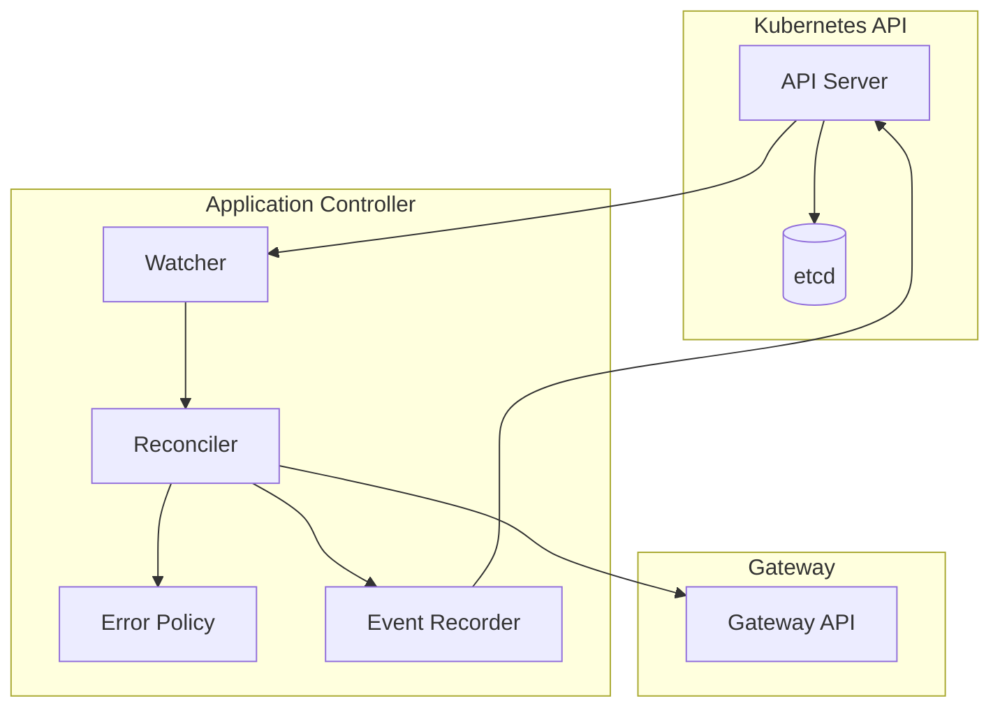
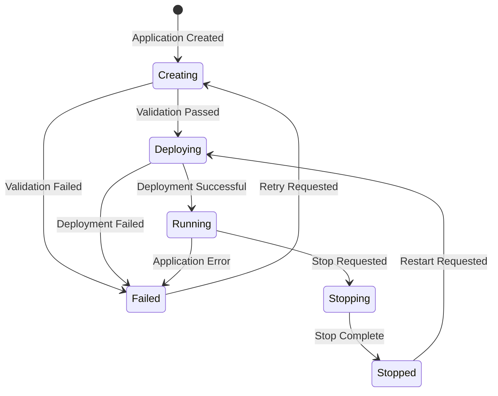

# Controller Implementation

##  Overview

The Wasmbed Application Controller is a Kubernetes controller that manages the lifecycle of WASM applications on MCU devices. It implements continuous reconciliation, health monitoring, and error recovery.

##  Architecture

### Controller Structure

```rust
pub struct ApplicationController {
    client: Client,                                    // Kubernetes client
    gateway_client: Arc<GatewayClient>,               // Gateway communication
    app_status_cache: Arc<RwLock<BTreeMap<String, ApplicationStatus>>>,
    retry_config: RetryConfig,
}
```

### Component Relationships



## 🔄 Reconciliation Loop

### Continuous Reconciliation

The controller implements a continuous reconciliation loop that monitors Application CRDs and ensures the desired state:

```rust
pub async fn reconcile(&self, app: Arc<Application>) -> Result<Action, ControllerError> {
    let app_name = app.name_any();
    let app_namespace = app.namespace().unwrap_or_default();
    
    info!("Reconciling Application {} in namespace {}", app_name, app_namespace);

    // Get current application status
    let current_status = app.status()
        .map(|s| s.phase)
        .unwrap_or(ApplicationPhase::Creating);

    // Handle different phases
    match current_status {
        ApplicationPhase::Creating => {
            self.handle_creating_phase(&app).await?;
            Ok(Action::requeue(Duration::from_secs(5)))
        },
        ApplicationPhase::Deploying => {
            self.handle_deploying_phase(&app).await?;
            Ok(Action::requeue(Duration::from_secs(10)))
        },
        ApplicationPhase::Running => {
            self.handle_running_phase(&app).await?;
            Ok(Action::requeue(Duration::from_secs(30)))
        },
        // ... other phases
    }
}
```

### Phase-Based Processing



##  Implementation Details

### 1. Creating Phase

```rust
async fn handle_creating_phase(&self, app: &Application) -> Result<()> {
    let app_name = app.name_any();
    info!("Handling Creating phase for Application {}", app_name);

    // Validate application specification
    self.validate_application_spec(&app.spec)?;

    // Find target devices from Kubernetes
    let target_devices = self.find_target_devices(&app.spec).await?;
    
    if target_devices.is_empty() {
        self.update_application_status(app, ApplicationPhase::Failed, 
            "No target devices found").await?;
        return Ok(());
    }

    // Update status to Deploying
    self.update_application_status(app, ApplicationPhase::Deploying, 
        "Starting deployment").await?;
    
    Ok(())
}
```

### 2. Deploying Phase

```rust
async fn handle_deploying_phase(&self, app: &Application) -> Result<()> {
    let app_name = app.name_any();
    info!("Handling Deploying phase for Application {}", app_name);

    // Find target devices
    let target_devices = self.find_target_devices(&app.spec).await?;
    
    // Decode WASM bytes
    let wasm_bytes = base64::Engine::decode(
        &base64::engine::general_purpose::STANDARD, 
        &app.spec.wasm_bytes
    ).context("Failed to decode WASM bytes")?;

    // Deploy to each target device with retry logic
    let mut deployed_count = 0;
    let mut failed_count = 0;
    let mut device_statuses = BTreeMap::new();

    for device in target_devices {
        match self.deploy_to_device_with_retry(app, &device, &wasm_bytes).await {
            Ok(_) => {
                deployed_count += 1;
                device_statuses.insert(device.name_any(), 
                    DeviceApplicationStatus {
                        phase: DeviceApplicationPhase::Running,
                        last_updated: Some(chrono::Utc::now().to_rfc3339()),
                        error: None,
                    });
            },
            Err(e) => {
                failed_count += 1;
                device_statuses.insert(device.name_any(), 
                    DeviceApplicationStatus {
                        phase: DeviceApplicationPhase::Failed,
                        last_updated: Some(chrono::Utc::now().to_rfc3339()),
                        error: Some(e.to_string()),
                    });
            }
        }
    }

    // Update application status based on deployment results
    let total_devices = deployed_count + failed_count;
    let phase = if failed_count == 0 {
        ApplicationPhase::Running
    } else if deployed_count == 0 {
        ApplicationPhase::Failed
    } else {
        ApplicationPhase::PartiallyRunning
    };

    let message = format!("Deployed to {}/{} devices", deployed_count, total_devices);
    self.update_application_status_with_devices(app, phase, &message, device_statuses).await?;
    
    Ok(())
}
```

### 3. Running Phase

```rust
async fn handle_running_phase(&self, app: &Application) -> Result<()> {
    let app_name = app.name_any();
    info!("Handling Running phase for Application {}", app_name);

    // Monitor application status on devices
    let target_devices = self.find_target_devices(&app.spec).await?;
    let mut device_statuses = BTreeMap::new();
    let mut running_devices = 0;
    let mut failed_devices = 0;

    for device in target_devices {
        match self.get_device_application_status(app, &device).await {
            Ok(status) => {
                device_statuses.insert(device.name_any(), status.clone());
                match status.phase {
                    DeviceApplicationPhase::Running => running_devices += 1,
                    DeviceApplicationPhase::Failed => failed_devices += 1,
                    _ => {}
                }
            },
            Err(e) => {
                failed_devices += 1;
                device_statuses.insert(device.name_any(), 
                    DeviceApplicationStatus {
                        phase: DeviceApplicationPhase::Failed,
                        last_updated: Some(chrono::Utc::now().to_rfc3339()),
                        error: Some(e.to_string()),
                    });
            }
        }
    }

    // Update application status
    let total_devices = running_devices + failed_devices;
    let phase = if failed_devices == 0 {
        ApplicationPhase::Running
    } else if running_devices == 0 {
        ApplicationPhase::Failed
    } else {
        ApplicationPhase::PartiallyRunning
    };

    let message = format!("Running on {}/{} devices", running_devices, total_devices);
    self.update_application_status_with_devices(app, phase, &message, device_statuses).await?;
    
    Ok(())
}
```

##  Error Handling

### Error Policy

```rust
pub fn error_policy(&self, _app: Arc<Application>, error: &ControllerError, _ctx: Arc<Recorder>) -> Action {
    error!("Reconciliation error: {}", error);
    Action::requeue(Duration::from_secs(30))
}
```

### Retry Configuration

```rust
#[derive(Clone)]
pub struct RetryConfig {
    pub max_retries: u32,
    pub initial_delay: Duration,
    pub max_delay: Duration,
    pub backoff_multiplier: f32,
}

impl Default for RetryConfig {
    fn default() -> Self {
        Self {
            max_retries: 3,
            initial_delay: Duration::from_secs(1),
            max_delay: Duration::from_secs(30),
            backoff_multiplier: 2.0,
        }
    }
}
```

### Retry Logic

```rust
async fn deploy_to_device_with_retry(
    &self, 
    app: &Application, 
    device: &Device, 
    wasm_bytes: &[u8]
) -> Result<()> {
    let mut attempt = 0;
    let mut delay = self.retry_config.initial_delay;

    loop {
        match self.deploy_to_device(app, device, wasm_bytes).await {
            Ok(_) => return Ok(()),
            Err(e) => {
                attempt += 1;
                if attempt >= self.retry_config.max_retries {
                    return Err(e);
                }
                
                warn!("Deployment attempt {} failed: {}. Retrying in {:?}", 
                    attempt, e, delay);
                
                sleep(delay).await;
                delay = min(
                    delay.mul_f32(self.retry_config.backoff_multiplier),
                    self.retry_config.max_delay
                );
            }
        }
    }
}
```

##  Health Monitoring

### Health Endpoints

The controller provides health monitoring endpoints:

```rust
/// Health check endpoint
async fn health_check() -> StatusCode {
    StatusCode::OK
}

/// Readiness check endpoint
async fn readiness_check() -> StatusCode {
    StatusCode::OK
}

/// Metrics endpoint
async fn metrics() -> Json<serde_json::Value> {
    Json(serde_json::json!({
        "status": "healthy",
        "timestamp": chrono::Utc::now().to_rfc3339(),
        "controller": "wasmbed-k8s-controller",
        "version": env!("CARGO_PKG_VERSION")
    }))
}
```

### HTTP Server Setup

```rust
// Set up HTTP server for health checks
let app = Router::new()
    .route("/health", get(health_check))
    .route("/ready", get(readiness_check))
    .route("/metrics", get(metrics));

let addr = SocketAddr::from(([0, 0, 0, 0], 8080));
info!("Starting HTTP server on {}", addr);

// Start HTTP server in background
let server_handle = tokio::spawn(async move {
    let listener = TcpListener::bind(addr).await.unwrap();
    axum::serve(listener, app).await.unwrap();
});
```

##  Metrics and Monitoring

### Controller Metrics

```rust
#[derive(Debug)]
pub struct ControllerMetrics {
    pub applications_reconciled: u64,
    pub reconciliation_errors: u64,
    pub deployment_success_rate: f64,
    pub average_reconciliation_time: Duration,
    pub active_applications: u64,
    pub failed_applications: u64,
}
```

### Event Recording

```rust
// Record events for debugging and monitoring
recorder.publish(Event {
    type_: EventType::Normal,
    reason: "ApplicationReconciled".to_string(),
    note: Some(format!("Application {} reconciled successfully", app_name)),
    action: "Reconcile".to_string(),
    secondary: None,
}).await?;
```

##  Main Function

### Controller Initialization

```rust
#[tokio::main]
async fn main() -> Result<()> {
    // Initialize logging
    tracing_subscriber::fmt::init();

    info!("Starting Wasmbed Application Controller with Continuous Reconciliation...");

    // Create Kubernetes client
    let client = Client::try_default().await?;

    // Gateway URL (in production, this would come from config)
    let gateway_url = std::env::var("WASMBED_GATEWAY_URL")
        .unwrap_or_else(|_| "http://localhost:8080".to_string());

    // Create controller
    let controller = ApplicationController::new(client.clone(), gateway_url);
    let controller = Arc::new(controller);

    // Create API for Applications
    let apps_api: Api<Application> = Api::all(client.clone());

    // Create recorder for events
    let recorder = Recorder::new(client.clone(), "wasmbed-controller".to_string().into());

    // Set up HTTP server for health checks
    let app = Router::new()
        .route("/health", get(health_check))
        .route("/ready", get(readiness_check))
        .route("/metrics", get(metrics));

    let addr = SocketAddr::from(([0, 0, 0, 0], 8080));
    info!("Starting HTTP server on {}", addr);

    // Start HTTP server in background
    let server_handle = tokio::spawn(async move {
        let listener = TcpListener::bind(addr).await.unwrap();
        axum::serve(listener, app).await.unwrap();
    });

    // Create the controller with continuous reconciliation
    let controller_handle = Controller::new(apps_api, watcher::Config::default())
        .shutdown_on_signal()
        .run(
            move |obj, _ctx| {
                let controller = controller.clone();
                async move {
                    controller.reconcile(obj).await
                }
            },
            move |_obj, _err, _ctx| {
                Action::requeue(Duration::from_secs(30))
            },
            Arc::new(recorder),
        )
        .for_each(|res| async move {
            match res {
                Ok(o) => info!("Reconciled {:?}", o),
                Err(e) => warn!("Reconciliation error: {}", e),
            }
        });

    info!("Starting continuous reconciliation...");
    
    // Run both the HTTP server and the controller
    tokio::select! {
        _ = server_handle => {
            info!("HTTP server stopped");
        }
        _ = controller_handle => {
            info!("Controller stopped");
        }
    }

    info!("Application Controller finished");
    Ok(())
}
```

##  Testing

### Unit Tests

```rust
#[cfg(test)]
mod tests {
    use super::*;

    #[tokio::test]
    async fn test_creating_phase_validation() {
        let controller = create_test_controller().await;
        let app = create_test_application();
        
        let result = controller.handle_creating_phase(&app).await;
        assert!(result.is_ok());
    }

    #[tokio::test]
    async fn test_deploying_phase_deployment() {
        let controller = create_test_controller().await;
        let app = create_test_application();
        
        let result = controller.handle_deploying_phase(&app).await;
        assert!(result.is_ok());
    }
}
```

### Integration Tests

```rust
#[tokio::test]
async fn test_full_reconciliation_cycle() {
    let controller = create_test_controller().await;
    let app = Arc::new(create_test_application());
    
    // Test reconciliation
    let result = controller.reconcile(app).await;
    assert!(result.is_ok());
    
    // Verify action
    let action = result.unwrap();
    assert!(matches!(action, Action::Requeue(_)));
}
```

##  Configuration

### Environment Variables

```bash
# Gateway configuration
WASMBED_GATEWAY_URL=http://wasmbed-gateway:8080

# Logging configuration
RUST_LOG=info

# Controller configuration
WASMBED_CONTROLLER_RECONCILIATION_INTERVAL=30
WASMBED_CONTROLLER_MAX_RETRIES=3
WASMBED_CONTROLLER_BACKOFF_MULTIPLIER=2.0
```

### Kubernetes Configuration

```yaml
apiVersion: apps/v1
kind: Deployment
metadata:
  name: wasmbed-k8s-controller
  namespace: wasmbed
spec:
  replicas: 1
  selector:
    matchLabels:
      app: wasmbed-k8s-controller
  template:
    metadata:
      labels:
        app: wasmbed-k8s-controller
    spec:
      serviceAccountName: wasmbed-controller-sa
      containers:
      - name: controller
        image: wasmbed-k8s-controller:latest
        ports:
        - containerPort: 8080
          name: metrics
        env:
        - name: WASMBED_GATEWAY_URL
          value: "http://wasmbed-gateway:8080"
        - name: RUST_LOG
          value: "info"
        resources:
          requests:
            memory: "64Mi"
            cpu: "100m"
          limits:
            memory: "128Mi"
            cpu: "200m"
        livenessProbe:
          httpGet:
            path: /health
            port: 8080
          initialDelaySeconds: 30
          periodSeconds: 10
        readinessProbe:
          httpGet:
            path: /ready
            port: 8080
          initialDelaySeconds: 5
          periodSeconds: 5
```

##  Debugging

### Logging

```rust
// Enable debug logging
tracing::debug!("Processing application: {}", app.name_any());
tracing::info!("Application {} status: {:?}", app.name_any(), status);
tracing::warn!("Deployment failed for device: {}", device.name_any());
tracing::error!("Reconciliation error: {}", error);
```

### Debug Endpoints

```bash
# Check controller health
curl http://localhost:8080/health

# Check readiness
curl http://localhost:8080/ready

# Get metrics
curl http://localhost:8080/metrics

# Check logs
kubectl logs -n wasmbed -l app=wasmbed-k8s-controller -f
```

### Common Issues

1. **Gateway Connection Failed**
   - Check Gateway service is running
   - Verify Gateway URL configuration
   - Check network connectivity

2. **Application Reconciliation Stuck**
   - Check application CRD status
   - Verify target devices exist
   - Check controller logs for errors

3. **High Memory Usage**
   - Monitor application count
   - Check for memory leaks
   - Adjust resource limits

---

**Last Updated**: September 2024  
**Version**: Controller v0.1.0  
**Maintainer**: Wasmbed Development Team
