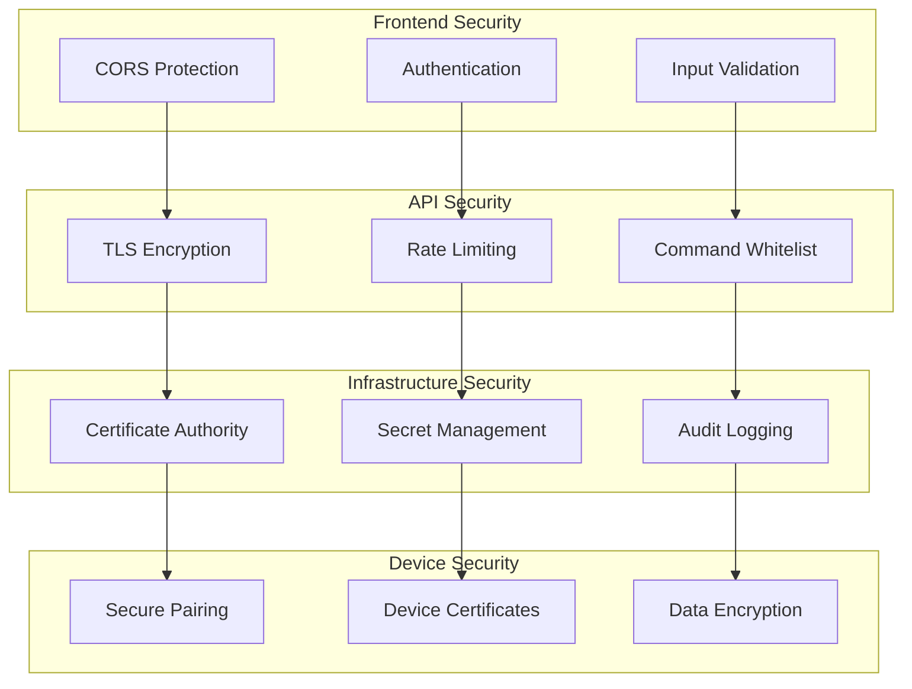

# Wasmbed Platform Security Overview

This document provides a comprehensive overview of the security architecture and implementation of the Wasmbed Platform.

## Security Architecture

The Wasmbed Platform implements a multi-layered security architecture designed to protect constrained devices, secure communication channels, and ensure system integrity.

### Security Layers



## TLS Security Implementation

### Certificate Infrastructure

The platform implements a complete Public Key Infrastructure (PKI) with X.509 v3 certificates:

#### Certificate Authority (CA)
- **Type**: Self-signed root CA
- **Algorithm**: RSA 4096-bit
- **Validity**: 365 days
- **Extensions**: 
  - `basicConstraints = critical,CA:TRUE`
  - `keyUsage = critical, keyCertSign, cRLSign`
  - `subjectKeyIdentifier = hash`
  - `authorityKeyIdentifier = keyid:always,issuer`

#### Server Certificates
- **Type**: X.509 v3 server certificate
- **Algorithm**: RSA 4096-bit
- **Validity**: 365 days
- **Subject Alternative Names**: 
  - DNS: localhost
  - IP: 127.0.0.1
- **Extensions**:
  - `basicConstraints = CA:FALSE`
  - `keyUsage = nonRepudiation, digitalSignature, keyEncipherment`
  - `extendedKeyUsage = serverAuth`

#### Device Certificates
- **Type**: X.509 v3 client certificate
- **Algorithm**: RSA 4096-bit
- **Validity**: 365 days
- **Extensions**:
  - `basicConstraints = CA:FALSE`
  - `keyUsage = digitalSignature, keyEncipherment`
  - `extendedKeyUsage = clientAuth`

### TLS Configuration

#### Gateway TLS Server
```rust
// TLS server configuration
let config = ServerConfig::builder()
    .with_no_client_auth()
    .with_single_cert(cert_chain, private_key)
    .expect("Failed to create TLS config");

// TLS acceptor
let acceptor = TlsAcceptor::from(config);
```

#### Device TLS Client
```rust
// TLS client configuration
let config = ClientConfig::builder()
    .with_root_certificates(root_cert_store)
    .with_client_auth_cert(cert_chain, private_key)
    .expect("Failed to create TLS config");

// TLS connection
let connection = ClientConnection::new(config, server_name)
    .expect("Failed to create TLS connection");
```

### Crypto Provider

The platform uses the Ring crypto provider for rustls:

```rust
// Install crypto provider
rustls::crypto::ring::default_provider()
    .install_default()
    .expect("Failed to install default crypto provider");
```

## Communication Security

### CBOR Protocol Security

All device-to-gateway communication uses CBOR (Concise Binary Object Representation) for efficient and secure data exchange:

#### Message Structure
```rust
#[derive(Serialize, Deserialize)]
pub struct SecureMessage {
    pub message_id: Uuid,
    pub timestamp: u64,
    pub device_id: String,
    pub message_type: MessageType,
    pub payload: Vec<u8>,
    pub signature: Vec<u8>,
}
```

#### Serialization Security
- **Binary Format**: CBOR provides compact binary representation
- **Type Safety**: Strongly typed serialization prevents injection attacks
- **Validation**: All incoming data is validated before processing

### Mutual TLS (mTLS)

The platform implements mutual TLS authentication:

#### Server Authentication
- Gateway presents server certificate to devices
- Devices verify server certificate against CA
- Server identity is cryptographically verified

#### Client Authentication
- Devices present client certificates to gateway
- Gateway verifies device certificates against CA
- Device identity is cryptographically verified

## Device Security

### Secure Device Enrollment

#### Certificate-Based Enrollment
1. Device generates key pair
2. Device creates Certificate Signing Request (CSR)
3. CA signs device certificate
4. Device installs certificate and CA certificate
5. Device establishes secure connection to gateway

#### Device Identity
- Each device has unique certificate
- Device ID is cryptographically bound to certificate
- Certificate revocation list (CRL) support ready

### Firmware Security

#### Secure Boot Process
```rust
fn main() {
    // Install crypto provider first
    rustls::crypto::ring::default_provider()
        .install_default()
        .expect("Failed to install crypto provider");
    
    // Initialize secure runtime
    let mut runtime = CommonDeviceRuntime::new(
        gateway_endpoint,
        keypair
    );
    
    // Run secure device loop
    runtime.run().await
        .expect("Device runtime failed");
}
```

#### Memory Protection
- Stack canaries for buffer overflow protection
- Address space layout randomization (ASLR)
- Non-executable stack and heap

## API Security

### Input Validation

All API endpoints implement comprehensive input validation:

#### Device Creation Validation
```rust
pub fn validate_device_request(req: &CreateDeviceRequest) -> Result<(), ValidationError> {
    // Validate device ID format
    if !is_valid_device_id(&req.id) {
        return Err(ValidationError::InvalidDeviceId);
    }
    
    // Validate MCU type
    if !is_supported_mcu_type(&req.mcu_type) {
        return Err(ValidationError::UnsupportedMcuType);
    }
    
    // Validate architecture
    if !is_supported_architecture(&req.architecture) {
        return Err(ValidationError::UnsupportedArchitecture);
    }
    
    Ok(())
}
```

#### WASM Binary Validation
```rust
pub fn validate_wasm_binary(wasm_data: &[u8]) -> Result<(), ValidationError> {
    // Check WASM magic number
    if wasm_data.len() < 4 || &wasm_data[0..4] != b"\x00asm" {
        return Err(ValidationError::InvalidWasmFormat);
    }
    
    // Validate WASM structure
    let module = Module::from_binary(&engine, wasm_data)
        .map_err(|_| ValidationError::InvalidWasmModule)?;
    
    // Check for dangerous imports
    validate_wasm_imports(&module)?;
    
    Ok(())
}
```

### Rate Limiting

API endpoints implement rate limiting to prevent abuse:

```rust
// Rate limiting middleware
pub async fn rate_limit_middleware(
    req: Request<Body>,
    next: Next<Body>,
) -> Result<Response<Body>, StatusCode> {
    let client_ip = get_client_ip(&req);
    
    if rate_limiter.is_rate_limited(&client_ip) {
        return Err(StatusCode::TOO_MANY_REQUESTS);
    }
    
    rate_limiter.record_request(&client_ip);
    next.run(req).await
}
```

### Command Whitelisting

Terminal commands are restricted to a whitelist of safe operations:

```rust
const ALLOWED_COMMANDS: &[&str] = &[
    "ls", "pwd", "whoami", "date", "uptime",
    "ps", "top", "df", "free", "netstat",
    "kubectl", "docker", "systemctl"
];

pub fn validate_command(command: &str) -> Result<(), ValidationError> {
    let parts: Vec<&str> = command.split_whitespace().collect();
    
    if parts.is_empty() {
        return Err(ValidationError::EmptyCommand);
    }
    
    if !ALLOWED_COMMANDS.contains(&parts[0]) {
        return Err(ValidationError::CommandNotAllowed);
        }
        
        Ok(())
}
```

## Infrastructure Security

### Kubernetes Security

#### RBAC Configuration
```yaml
apiVersion: rbac.authorization.k8s.io/v1
kind: Role
metadata:
  name: wasmbed-device-manager
rules:
- apiGroups: ["wasmbed.io"]
  resources: ["devices"]
  verbs: ["get", "list", "create", "update", "patch", "delete"]
- apiGroups: ["wasmbed.io"]
  resources: ["applications"]
  verbs: ["get", "list", "create", "update", "patch", "delete"]
```

#### Network Policies
```yaml
apiVersion: networking.k8s.io/v1
kind: NetworkPolicy
metadata:
  name: wasmbed-network-policy
spec:
  podSelector:
    matchLabels:
      app: wasmbed
  policyTypes:
  - Ingress
  - Egress
  ingress:
  - from:
    - namespaceSelector:
        matchLabels:
          name: wasmbed
    ports:
    - protocol: TCP
      port: 8080
    - protocol: TCP
      port: 8081
```

### Secret Management

#### Certificate Storage
```yaml
apiVersion: v1
kind: Secret
metadata:
  name: gateway-certificates
  namespace: wasmbed
type: Opaque
data:
  ca-cert.pem: <base64-encoded-ca-cert>
  server-cert.pem: <base64-encoded-server-cert>
  server-key.pem: <base64-encoded-server-key>
```

#### Environment Variables
```rust
// Secure environment variable access
let ca_cert_path = env::var("CA_CERT_PATH")
    .unwrap_or_else(|_| "certs/ca-cert.pem".to_string());

let server_cert_path = env::var("SERVER_CERT_PATH")
    .unwrap_or_else(|_| "certs/server-cert.pem".to_string());
```

## Audit and Logging

### Security Event Logging

All security-relevant events are logged:

```rust
// Authentication events
info!("Device {} authenticated successfully", device_id);
warn!("Failed authentication attempt from device {}", device_id);

// Certificate events
info!("Certificate validated for device {}", device_id);
error!("Certificate validation failed for device {}", device_id);

// Connection events
info!("TLS connection established with device {}", device_id);
warn!("TLS handshake failed with device {}", device_id);
```

### Audit Trail

```rust
#[derive(Serialize, Deserialize)]
pub struct SecurityAuditEvent {
    pub timestamp: DateTime<Utc>,
    pub event_type: SecurityEventType,
    pub device_id: Option<String>,
    pub user_id: Option<String>,
    pub source_ip: Option<String>,
    pub details: serde_json::Value,
    pub severity: SecuritySeverity,
}
```

## Security Best Practices

### Development Security

#### Secure Coding Practices
- Input validation on all user inputs
- Output encoding to prevent injection attacks
- Secure random number generation
- Proper error handling without information disclosure

#### Dependency Management
- Regular dependency updates
- Vulnerability scanning
- Minimal dependency footprint
- Trusted dependency sources

### Operational Security

#### Regular Security Updates
```bash
# Update dependencies
cargo update

# Check for vulnerabilities
cargo audit

# Update certificates before expiration
openssl x509 -in certs/server-cert.pem -noout -dates
```

#### Monitoring and Alerting
```bash
# Monitor certificate expiration
openssl x509 -in certs/server-cert.pem -noout -dates | grep "notAfter"

# Monitor failed authentication attempts
grep "Failed authentication" logs/gateway.log | wc -l

# Monitor TLS handshake failures
grep "TLS handshake failed" logs/gateway.log | wc -l
```

## Compliance and Standards

### Security Standards Compliance

The platform follows industry security standards:

- **TLS 1.3**: Latest TLS protocol version
- **X.509 v3**: Standard certificate format
- **CBOR**: RFC 7049 binary format
- **WebAssembly**: W3C standard for secure execution
- **Kubernetes**: CNCF security best practices

### Security Testing

#### Automated Security Testing
```bash
# Run security tests
cargo test security

# Test TLS configuration
openssl s_client -connect 127.0.0.1:8081 -verify_return_error

# Test certificate validation
openssl verify -CAfile certs/ca-cert.pem certs/server-cert.pem
```

#### Penetration Testing
- Network security testing
- Application security testing
- Certificate validation testing
- Input validation testing

## Incident Response

### Security Incident Procedures

#### Detection
1. Monitor security logs continuously
2. Set up automated alerts for security events
3. Regular security assessments

#### Response
1. Isolate affected systems
2. Preserve evidence
3. Notify stakeholders
4. Implement remediation

#### Recovery
1. Patch vulnerabilities
2. Update security configurations
3. Restore services
4. Post-incident review

### Emergency Contacts

- **Security Team**: security@wasmbed.io
- **Incident Response**: incident@wasmbed.io
- **Emergency Hotline**: +1-XXX-XXX-XXXX

---

**Last Updated**: 2025  
**Version**: 0.1.0  
**Status**: Production Ready