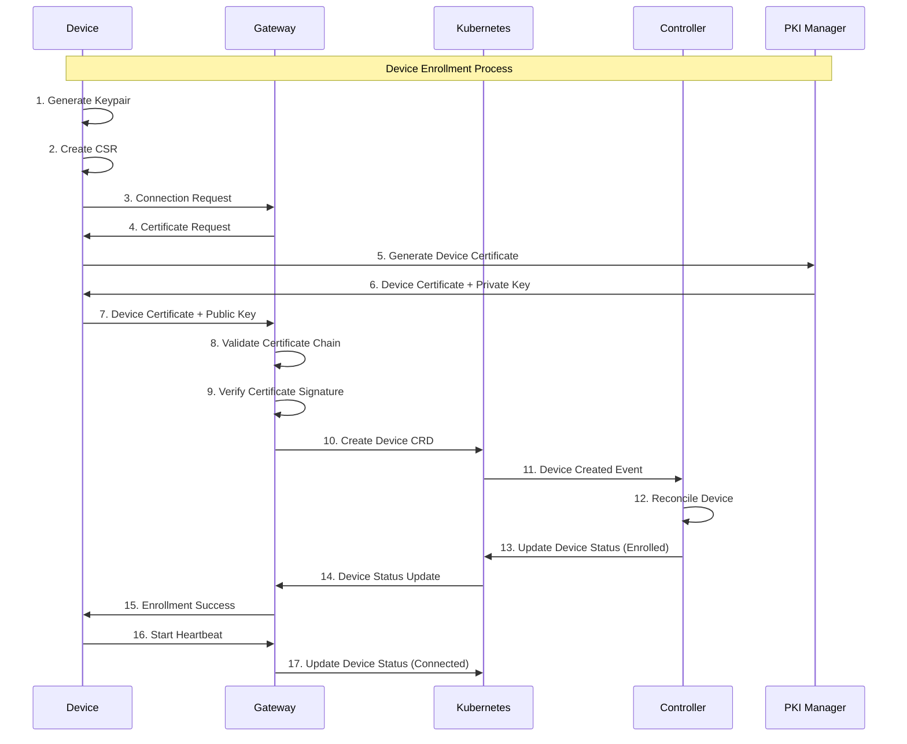
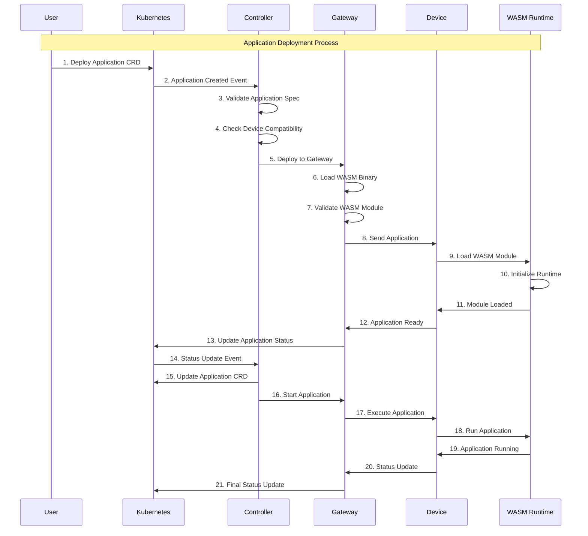
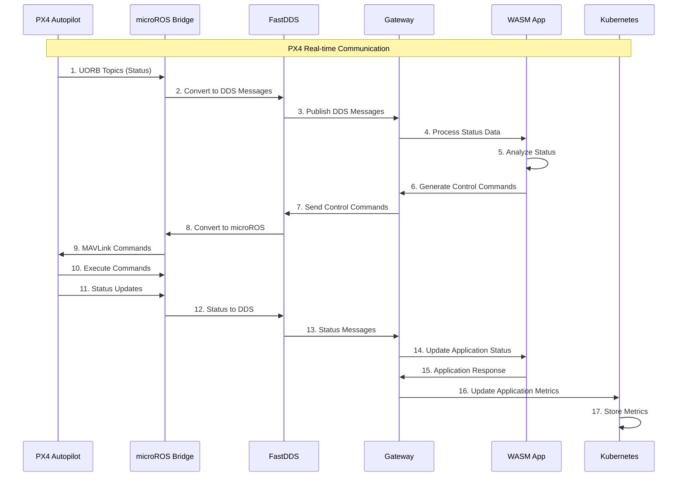
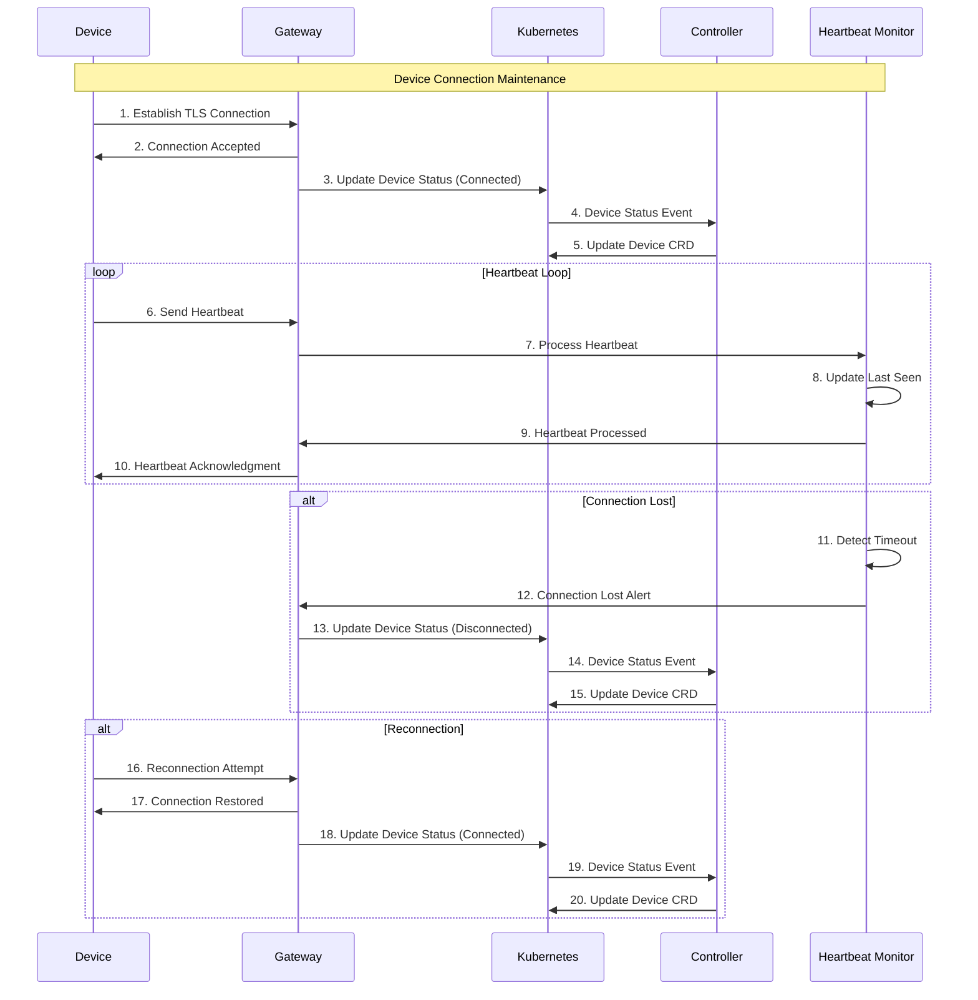

# Workflow Implementation Documentation

## Overview

This document provides comprehensive documentation of all implemented workflows in the Wasmbed platform, including sequence diagrams, implementation details, and current status.

## Device Enrollment Workflow

### Sequence Diagram



### Purpose

The device enrollment workflow enables secure registration of edge devices with the platform, establishing trust relationships through TLS mutual authentication and certificate management.

### Sequence Flow

1. **Device Initialization**
   - Device generates keypair (Ed25519)
   - Device creates certificate signing request (CSR)
   - Device initializes TLS client context

2. **Connection Establishment**
   - Device establishes TCP connection to gateway
   - TLS handshake with mutual authentication
   - Certificate validation and verification

3. **Enrollment Request**
   - Device sends enrollment message (CBOR encoded)
   - Includes device type, capabilities, and public key
   - Gateway validates request format and content

4. **Device Registration**
   - Gateway creates Device CRD in Kubernetes
   - Device status set to "Enrolling"
   - Certificate chain validation

5. **Enrollment Completion**
   - Device status updated to "Enrolled"
   - Gateway sends confirmation message
   - Device begins heartbeat communication

### Implementation Status

**Completed Components**
- Device keypair generation in firmware
- TLS mutual authentication
- CBOR message encoding/decoding
- Device CRD creation and management
- Certificate validation

**Missing Components**
- Device capability discovery
- Enrollment validation enhancements
- Certificate revocation handling

### Code References

- Device enrollment: `crates/wasmbed-firmware-*/src/main.rs`
- Gateway enrollment handling: `crates/wasmbed-gateway/src/main.rs`
- Device CRD: `crates/wasmbed-k8s-resource/src/device.rs`

## Application Deployment Workflow

### Sequence Diagram



### Purpose

The application deployment workflow manages the complete lifecycle of WebAssembly applications from creation to execution on edge devices.

### Sequence Flow

1. **Application Creation**
   - User applies Application manifest via kubectl
   - Kubernetes validates CRD schema
   - Application resource stored in etcd

2. **Controller Notification**
   - Controller receives watch event
   - Reconciliation process initiated
   - Application status set to "Creating"

3. **Device Selection**
   - Controller queries for matching devices
   - Device availability and capability validation
   - Target device selection based on criteria

4. **Deployment Request**
   - Controller sends deployment request to gateway
   - Gateway validates application and device
   - Application status updated to "Deploying"

5. **Application Deployment**
   - Gateway forwards deployment to target device
   - Device receives WASM bytecode
   - WebAssembly runtime initialization

6. **Execution Start**
   - Application status set to "Running"
   - Device begins application execution
   - Monitoring and health checks initiated

### Implementation Status

**Completed Components**
- Application CRD definition and validation
- Controller reconciliation logic
- Gateway deployment coordination
- WebAssembly runtime integration
- Application lifecycle management

**Missing Components**
- Real-time application deployment
- microROS integration for PX4 applications
- Application performance monitoring
- Dynamic scaling capabilities

### Code References

- Application CRD: `crates/wasmbed-k8s-resource/src/application.rs`
- Controller logic: `crates/wasmbed-k8s-controller/src/main.rs`
- Gateway deployment: `crates/wasmbed-gateway/src/main.rs`

## PX4 Communication Workflow

### Sequence Diagram



### Purpose

The PX4 communication workflow enables real-time communication between WebAssembly applications and PX4 autopilot systems through microROS and FastDDS middleware.

### Implementation Status

**Missing Components (Critical)**
- microROS bridge implementation in gateway
- FastDDS middleware integration
- PX4 topic management
- MAVLink protocol support
- Real-time communication optimization

**Required Implementation**
```rust
// microROS Bridge
pub struct MicroRosBridge {
    node: rcl::Node,
    participant: fastdds::DomainParticipant,
    publishers: HashMap<String, Publisher>,
    subscribers: HashMap<String, Subscriber>,
}

// FastDDS Middleware
pub struct FastDdsMiddleware {
    domain_id: u32,
    participant: DomainParticipant,
    transport: UdpTransport,
    qos: QosProfile,
}

// PX4 Communication Bridge
pub struct Px4CommunicationBridge {
    microros_bridge: MicroRosBridge,
    fastdds: FastDdsMiddleware,
    px4_topics: Px4TopicManager,
}
```

## Device Connection Workflow

### Sequence Diagram



### Purpose

The device connection workflow maintains persistent connections between edge devices and the gateway, providing real-time communication and status monitoring.

### Sequence Flow

1. **Connection Initiation**
   - Device establishes TLS connection
   - Mutual authentication performed
   - Connection parameters negotiated

2. **Authentication Phase**
   - Gateway queries device public key
   - Certificate validation performed
   - Device identity verified

3. **Session Establishment**
   - Device status updated to "Connected"
   - Heartbeat monitoring initiated
   - Communication channels established

4. **Heartbeat Communication**
   - Periodic heartbeat messages sent
   - Device status and health information
   - Connection health monitoring

5. **Disconnection Handling**
   - Graceful disconnection procedures
   - Connection timeout detection
   - Device status updates

### Implementation Status

**Completed Components**
- TLS connection establishment
- Device authentication and verification
- Heartbeat monitoring system
- Connection status management
- Timeout detection and handling

**Missing Components**
- Connection pooling and multiplexing
- Advanced heartbeat analytics
- Connection quality monitoring
- Automatic reconnection logic

### Code References

- Device connection: `crates/wasmbed-firmware-*/src/main.rs`
- Gateway connection handling: `crates/wasmbed-gateway/src/main.rs`
- Heartbeat monitoring: `crates/wasmbed-gateway/src/heartbeat.rs`

## PX4 Integration Workflow

### Purpose

The PX4 integration workflow enables real-time communication with PX4 autopilot systems using microROS and FastDDS middleware for drone control applications.

### Sequence Flow

1. **PX4 Application Deployment**
   - PX4-specific application manifest applied
   - microROS bridge initialization
   - FastDDS middleware setup

2. **microROS Node Creation**
   - ROS 2 node initialization
   - Domain participant creation
   - QoS profile configuration

3. **FastDDS Initialization**
   - DDS participant creation
   - Transport configuration (UDP)
   - Serialization setup (CDR)

4. **PX4 Topic Configuration**
   - Input topics for commands (/fmu/in/*)
   - Output topics for status (/fmu/out/*)
   - Publisher and subscriber creation

5. **MAVLink Command Processing**
   - MAVLink command translation
   - microROS message publishing
   - PX4 command delivery

### Implementation Status

**Completed Components**
- PX4 application WASM implementation
- MAVLink command definitions
- PX4 topic specifications
- Basic microROS integration structure

**Missing Components**
- microROS bridge in gateway
- FastDDS middleware implementation
- Real-time PX4 communication
- UORB topic integration
- Performance optimization

### Code References

- PX4 application: `apps/drone-control/px4-integration.wat`
- PX4 integration docs: `docs/integration/px4-integration-detailed.md`
- microROS bridge: Not implemented

## QEMU Emulation Workflow

### Purpose

The QEMU emulation workflow provides realistic emulation of edge devices for development, testing, and demonstration purposes.

### Sequence Flow

1. **QEMU Device Startup**
   - QEMU system emulator launched
   - Device-specific firmware loaded
   - Serial communication established

2. **Firmware Initialization**
   - WebAssembly runtime initialization
   - Network stack configuration
   - TLS client setup

3. **Device Registration**
   - Device connects to gateway
   - Enrollment process initiated
   - Device capabilities reported

4. **Application Execution**
   - WASM applications deployed
   - Runtime execution monitoring
   - Performance metrics collection

5. **Communication Testing**
   - Real serial communication
   - TLS message exchange
   - Heartbeat verification

### Implementation Status

**Completed Components**
- QEMU system emulation (RISC-V, ARM, ESP32)
- Real serial communication
- TLS client implementation
- WebAssembly runtime integration
- Device firmware development

**Missing Components**
- Advanced QEMU networking
- Performance benchmarking
- Multi-device coordination
- Real-time emulation accuracy

### Code References

- RISC-V firmware: `crates/wasmbed-firmware-hifive1-qemu/`
- ESP32 firmware: `crates/wasmbed-firmware-esp32/`
- QEMU bridge: `crates/wasmbed-qemu-serial-bridge/`

## Security Workflow

### Purpose

The security workflow implements comprehensive security measures including authentication, authorization, encryption, and runtime protection.

### Sequence Flow

1. **Certificate Management**
   - CA certificate generation
   - Server certificate creation
   - Client certificate generation
   - Certificate validation

2. **TLS Handshake**
   - Cipher suite negotiation
   - Key exchange and verification
   - Certificate chain validation
   - Session establishment

3. **Authentication**
   - Device identity verification
   - Public key validation
   - Certificate revocation checking
   - Access control enforcement

4. **Authorization**
   - Role-based access control
   - Resource permission checking
   - Operation authorization
   - Audit logging

5. **Runtime Security**
   - WebAssembly sandboxing
   - Memory protection
   - Function call restrictions
   - Resource access control

### Implementation Status

**Completed Components**
- TLS 1.3 implementation
- Certificate generation and management
- Mutual authentication
- WebAssembly sandboxing
- Access control mechanisms

**Missing Components**
- Certificate revocation lists
- Advanced threat detection
- Security monitoring
- Compliance reporting

### Code References

- TLS implementation: `crates/wasmbed-tls-utils/`
- Security policies: `docs/security/`
- Certificate management: `scripts/security/`

## Monitoring and Observability Workflow

### Purpose

The monitoring workflow provides comprehensive observability including metrics collection, logging, tracing, and alerting.

### Sequence Flow

1. **Metrics Collection**
   - System metrics gathering
   - Application performance monitoring
   - Resource utilization tracking
   - Error rate monitoring

2. **Log Aggregation**
   - Structured logging implementation
   - Log collection and forwarding
   - Centralized log storage
   - Log analysis and search

3. **Distributed Tracing**
   - Request flow tracking
   - Performance bottleneck identification
   - Error propagation analysis
   - Cross-service communication monitoring

4. **Alerting**
   - Threshold-based alerting
   - Anomaly detection
   - Notification delivery
   - Escalation procedures

5. **Dashboard and Visualization**
   - Real-time monitoring dashboards
   - Historical data visualization
   - Performance trend analysis
   - Capacity planning

### Implementation Status

**Completed Components**
- Basic logging implementation
- Heartbeat monitoring
- Device status tracking
- Error handling and reporting

**Missing Components**
- Comprehensive metrics collection
- Distributed tracing implementation
- Advanced alerting system
- Monitoring dashboards

### Code References

- Monitoring implementation: `crates/wasmbed-gateway/src/monitoring.rs`
- Logging: `crates/wasmbed-gateway/src/logging.rs`
- Status tracking: `crates/wasmbed-gateway/src/status.rs`